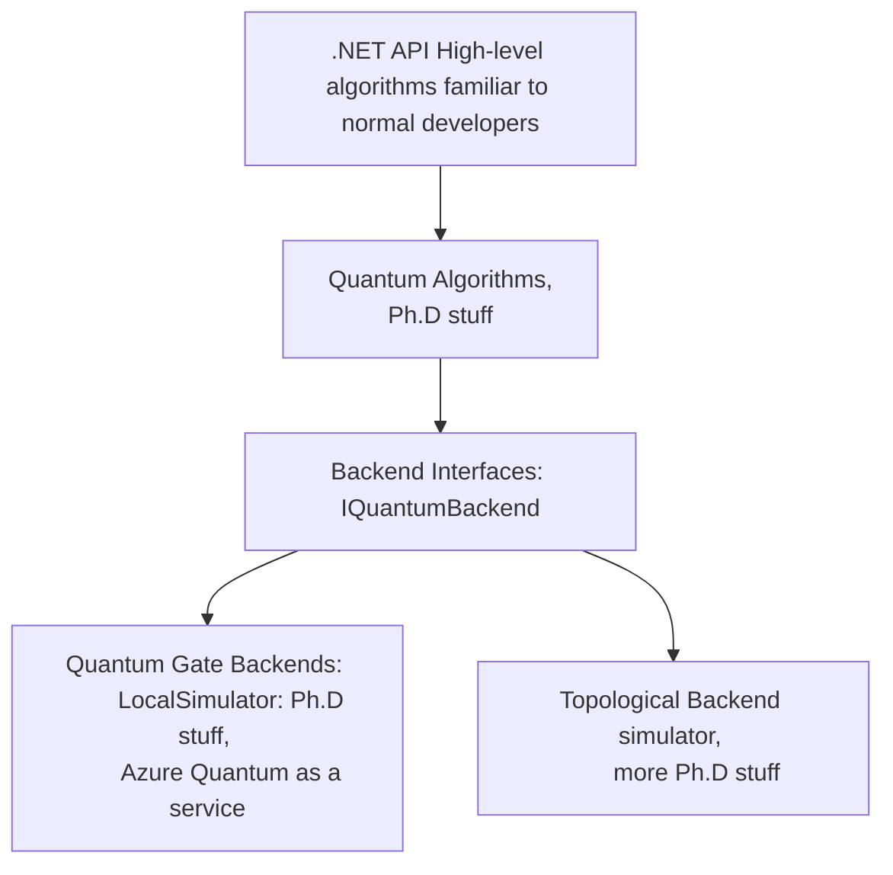

# FSharp.Azure.Quantum

**Quantum-First F# Library** - Solve combinatorial optimization problems using quantum algorithms (QAOA - Quantum Approximate Optimization Algorithm), on a local simulator by default or on cloud backends when you pass one.

[](https://www.nuget.org/packages/FSharp.Azure.Quantum/)
[](LICENSE)


```mermaid
flowchart TD

    %% Top layer
    A[.NET API High-level algorithms familiar to normal developers]

    %% Quantum algorithms
    B[Quantum Algorithms, 
       Ph.D stuff]

    %% Backend interfaces
    C[Backend Interfaces: IQuantumBackend]

    %% Quantum Gate Backends
    D[Quantum Gate Backends: 
        LocalSimulator: Ph.D stuff, 
        Azure Quantum as a service]


    %% Topological Backends
    E[Topological Backend simulator, 
       more Ph.D stuff]

    %% Flow
    A --> B --> C
    C --> D
    C --> E
```

## Table of Contents

- [Status](#status)
- [Quick Start](#quick-start)
  - [Installation](#installation)
  - [F# Computation Expressions](#f-computation-expressions)
  - [C# Fluent API](#c-fluent-api)
- [Problem Builders](#problem-builders)
  - [Graph Coloring](#graph-coloring)
  - [MaxCut](#maxcut)
  - [Knapsack (0/1)](#knapsack-01)
  - [Traveling Salesperson Problem (TSP)](#traveling-salesperson-problem-tsp)
  - [Portfolio Optimization](#portfolio-optimization)
  - [Network Flow](#network-flow)
  - [Task Scheduling](#task-scheduling)
- [Advanced Quantum Builders](#advanced-quantum-builders)
  - [Quantum Tree Search Builder](#quantum-tree-search-builder)
  - [Quantum Constraint Solver Builder](#quantum-constraint-solver-builder)
  - [Quantum Pattern Matcher Builder](#quantum-pattern-matcher-builder)
  - [Quantum Arithmetic Builder](#quantum-arithmetic-builder)
  - [Quantum Period Finder Builder](#quantum-period-finder-builder)
  - [Quantum Phase Estimator Builder](#quantum-phase-estimator-builder)
- [Quantum Machine Learning (QML)](#quantum-machine-learning-qml)
  - [Variational Quantum Classifier (VQC)](#variational-quantum-classifier-vqc)
  - [Quantum Kernel SVM](#quantum-kernel-svm)
- [Business Problem Builders](#business-problem-builders)
  - [Social Network Analyzer](#social-network-analyzer---community-detection--fraud-rings)
  - [Constraint Scheduler](#constraint-scheduler---workforce--resource-allocation)
  - [AutoML](#automl---automated-machine-learning)
  - [Anomaly Detection](#anomaly-detection---security--fraud-detection)
  - [Binary Classification](#binary-classification---fraud-detection)
  - [Predictive Modeling](#predictive-modeling---customer-churn-prediction)
  - [Similarity Search](#similarity-search---product-recommendations)
- [HybridSolver](#hybridsolver---automatic-classicalquantum-routing)
- [Architecture](#architecture)
  - [3-Layer Quantum-Only Architecture](#3-layer-quantum-only-architecture)
  - [D-Wave Quantum Annealer](#d-wave-quantum-annealer)
  - [Azure Quantum Workspace Management](#azure-quantum-workspace-management)
- [OpenQASM 2.0 Support](#openqasm-20-support)
- [Error Mitigation](#error-mitigation)
  - [Zero-Noise Extrapolation (ZNE)](#1%EF%B8%8F⃣-zero-noise-extrapolation-zne)
  - [Probabilistic Error Cancellation (PEC)](#2%EF%B8%8F⃣-probabilistic-error-cancellation-pec)
  - [Readout Error Mitigation (REM)](#3%EF%B8%8F⃣-readout-error-mitigation-rem)
  - [Automatic Strategy Selection](#4%EF%B8%8F⃣-automatic-strategy-selection)
- [QAOA Algorithm Internals](#qaoa-algorithm-internals)
- [Documentation](#documentation)
- [Problem Size Guidelines](#problem-size-guidelines)
- [Design Philosophy](#design-philosophy)
- [Quantum Algorithms](#quantum-algorithms)
  - [Grover's Search Algorithm](#grovers-search-algorithm)
  - [Amplitude Amplification](#amplitude-amplification)
  - [Quantum Fourier Transform (QFT)](#quantum-fourier-transform-qft)
- [Topological Quantum Computing](#topological-quantum-computing)
- [Contributing](#contributing)
- [License](#license)
- [Support](#support)

## Status

**Architecture:** Quantum-First Hybrid Library - Quantum algorithms as primary solvers, with opt-in classical routing (via `HybridSolver` / `QuantumAdvisor`) for small problems where quantum offers no advantage. Quantum solvers never fall back to classical silently — see [Design Philosophy](#design-philosophy).

**Current Version:** 1.4.15 (core) / 0.4.15 (Topological and Braket plugins) — D-Wave Support + Quantum Machine Learning + Business Builders + compilation/hardware tooling (QIR, resource estimation, qubit routing, noise-aware routing)

**Current Features:**
- Multiple Backends: LocalBackend (simulation), NoisyLocalBackend (density-matrix noise), Azure Quantum (IonQ, Rigetti, Quantinuum, Atom Computing, IQM), D-Wave quantum annealers (1200-5640 qubits), AWS Braket (separate plugin)
- Cloud execution: the QAOA solvers, UCCSD-VQE and QPE chemistry, Grover and its builders, amplitude amplification, QFT, QPE, Shor, HHL, quantum arithmetic, ADAPT-VQE/ADAPT-QAOA, QML, quantum Monte Carlo pricing and risk, `Primitives` and the textbook protocols (Bell, teleportation, superdense coding, Deutsch-Jozsa, Bernstein-Vazirani, Simon, BB84, E91, bit- and phase-flip codes) build complete circuits and submit them as whole-circuit jobs, transpiled to each provider's native gates. Every job is billed; a `JobBudget` caps how many a run may submit
- Topological Quantum Computing: Anyon braiding simulator (Ising, Fibonacci & SU(2)_k anyons) with error correction (toric code, surface codes, anyonic charge correction) - Microsoft Majorana architecture
- Quantum Machine Learning: VQC, Quantum Kernel SVM, Feature Maps, Variational Forms, AutoML
- Business Problem Builders: Social Network Analysis, Constraint Scheduling, AutoML, Anomaly Detection, Binary Classification, Predictive Modeling, Similarity Search
- OpenQASM 2.0: Import/export compatibility with IBM Qiskit, Amazon Braket, Google Cirq
- QAOA Implementation: Quantum Approximate Optimization Algorithm with advanced parameter optimization
- 7 Quantum Optimization Builders: Graph Coloring, MaxCut, Knapsack, TSP, Portfolio, Network Flow, Task Scheduling
- 6 Advanced Builders: Quantum Arithmetic, Cryptographic Analysis (Shor's), Phase Estimation (QFT/QPE-based); Tree Search, Constraint Solver, Pattern Matcher (Grover-based)
- VQE Implementation: Variational Quantum Eigensolver for molecular ground state energies (quantum chemistry), plus ground-state energies by quantum phase estimation (`GroundStateMethod.QPE`)
- Error Mitigation: ZNE (typically 30-50% error reduction), PEC (typically 50-80% error reduction), REM (typically 50-90% readout error reduction), strategy selection. The percentages are typical ranges reported in the literature, not guarantees.
- F# Computation Expressions: Idiomatic, type-safe problem specification with builders
- C# Interop: Fluent API extensions for C# developers
- Circuit Building: Low-level quantum circuit construction and optimization possible

---

## Quick Start

### Installation

```bash
dotnet add package FSharp.Azure.Quantum
```

In an F# script (`.fsx`), reference the package instead; `dotnet add package` does not reach scripts:

```fsharp
#r "nuget: FSharp.Azure.Quantum"
```

The [examples](https://github.com/Thorium/FSharp.Azure.Quantum/tree/main/examples) do this already:
download the `examples` folder and run any script with `dotnet fsi <script>.fsx`, with no build of this
repository needed. See [Running Examples](https://github.com/Thorium/FSharp.Azure.Quantum/blob/main/examples/README.md#running-examples).

### F# Computation Expressions

```fsharp
open FSharp.Azure.Quantum
open FSharp.Azure.Quantum.GraphColoring

// Graph Coloring: Register Allocation
let problem = graphColoring {
    node "R1" ["R2"; "R3"]
    node "R2" ["R1"; "R4"]
    node "R3" ["R1"; "R4"]
    node "R4" ["R2"; "R3"]
    colors ["EAX"; "EBX"; "ECX"; "EDX"]
}

// Solve using quantum optimization (QAOA)
match GraphColoring.solve problem 4 None with
| Ok solution ->
    printfn "Colors used: %d" solution.ColorsUsed
    solution.Assignments 
    |> Map.iter (fun node color -> printfn "%s → %s" node color)
| Error err -> 
    printfn "Error: %s" err.Message
```

### C# Fluent API

```csharp
using FSharp.Azure.Quantum;
using static FSharp.Azure.Quantum.CSharpBuilders;

// MaxCut: Circuit Partitioning
var vertices = new[] { "A", "B", "C", "D" };
var edges = new[] {
    (source: "A", target: "B", weight: 1.0),
    (source: "B", target: "C", weight: 2.0),
    (source: "C", target: "D", weight: 1.0),
    (source: "D", target: "A", weight: 1.0)
};

var problem = MaxCutProblem(vertices, edges);
var result = MaxCut.solve(problem, null);

if (result.IsOk) {
    var solution = result.ResultValue;
    Console.WriteLine($"Cut Value: {solution.CutValue}");
    Console.WriteLine($"Partition S: {string.Join(", ", solution.PartitionS)}");
    Console.WriteLine($"Partition T: {string.Join(", ", solution.PartitionT)}");
}
```

**What happens:**
1. Computation expression builds graph coloring problem
2. `GraphColoring.solve` calls `QuantumGraphColoringSolver` internally
3. QAOA quantum algorithm encodes problem as QUBO (Quadratic Unconstrained Binary Optimization)
4. LocalBackend simulates quantum circuit (memory-derived width)
5. Returns color assignments with validation

---

## Problem Builders

**Optimization Builders using QAOA:**

### Graph Coloring

**Use Case:** Register allocation, frequency assignment, exam scheduling

```fsharp
open FSharp.Azure.Quantum
open FSharp.Azure.Quantum.GraphColoring

let problem = graphColoring {
    node "Task1" ["Task2"; "Task3"]
    node "Task2" ["Task1"; "Task4"]
    node "Task3" ["Task1"; "Task4"]
    node "Task4" ["Task2"; "Task3"]
    colors ["Slot A"; "Slot B"; "Slot C"]
    objective MinimizeColors
}

match GraphColoring.solve problem 3 None with
| Ok solution ->
    printfn "Valid coloring: %b" solution.IsValid
    printfn "Colors used: %d/%d" solution.ColorsUsed 3
    printfn "Conflicts: %d" solution.ConflictCount
| Error err -> printfn "Error: %s" err.Message
```

### MaxCut

**Use Case:** Circuit design, community detection, load balancing

[](https://github.com/Thorium/FSharp.Azure.Quantum/blob/main/examples/MaxCut/AdaptQaoaMaxCut.fsx)

```fsharp
let vertices = ["A"; "B"; "C"; "D"]
let edges = [
    ("A", "B", 1.0)
    ("B", "C", 2.0)
    ("C", "D", 1.0)
    ("D", "A", 1.0)
]

let problem = MaxCut.createProblem vertices edges

match MaxCut.solve problem None with
| Ok solution ->
    printfn "Partition S: %A" solution.PartitionS
    printfn "Partition T: %A" solution.PartitionT
    printfn "Cut value: %.2f" solution.CutValue
| Error err -> printfn "Error: %s" err.Message
```

### Knapsack (0/1)

**Use Case:** Resource allocation, portfolio selection, cargo loading

```fsharp
let items = [
    ("laptop", 3.0, 1000.0)   // (id, weight, value)
    ("phone", 0.5, 500.0)
    ("tablet", 1.5, 700.0)
    ("monitor", 2.0, 600.0)
]

let problem = Knapsack.createProblem items 5.0  // capacity = 5.0

match Knapsack.solve problem None with
| Ok solution ->
    printfn "Total value: $%.2f" solution.TotalValue
    printfn "Total weight: %.2f/%.2f" solution.TotalWeight problem.Capacity
    printfn "Items: %A" (solution.SelectedItems |> List.map (fun i -> i.Id))
| Error err -> printfn "Error: %s" err.Message
```

### Traveling Salesperson Problem (TSP)

**Use Case:** Route optimization, delivery planning, logistics

[](https://github.com/Thorium/FSharp.Azure.Quantum/blob/main/examples/DeliveryRouting/DeliveryRouting.fsx)

```fsharp
let cities = [
    ("Seattle", 0.0, 0.0)
    ("Portland", 1.0, 0.5)
    ("San Francisco", 2.0, 1.5)
    ("Los Angeles", 3.0, 3.0)
]

let problem = TSP.createProblem cities

match TSP.solve problem None with
| Ok tour ->
    printfn "Optimal route: %s" (String.concat " → " tour.Cities)
    printfn "Total distance: %.2f" tour.TotalDistance
| Error err -> printfn "Error: %s" err.Message
```

### Portfolio Optimization

**Use Case:** Investment allocation, asset selection, risk management

```fsharp
let assets = [
    ("AAPL", 0.12, 0.15, 150.0)  // (symbol, return, risk, price)
    ("GOOGL", 0.10, 0.12, 2800.0)
    ("MSFT", 0.11, 0.14, 350.0)
]

let problem = Portfolio.createProblem assets 10000.0  // budget

match Portfolio.solve problem None with
| Ok allocation ->
    printfn "Portfolio value: $%.2f" allocation.TotalValue
    printfn "Expected return: %.2f%%" (allocation.ExpectedReturn * 100.0)
    printfn "Risk: %.2f" allocation.Risk
    
    allocation.Allocations 
    |> List.iter (fun (symbol, shares, value) ->
        printfn "  %s: %.2f shares ($%.2f)" symbol shares value)
| Error err -> printfn "Error: %s" err.Message
```

Without a covariance the assets are treated as independent: risk = sqrt(Σ (wᵢσᵢ)²). Give the covariance (or a correlation matrix, scaled by each asset's risk) for mean-variance with correlations: the QAOA objective includes the covariance terms and the reported risk is sqrt(wᵀΣw).

```fsharp
let correlation = array2D [ [ 1.0; 0.6; 0.7 ]; [ 0.6; 1.0; 0.8 ]; [ 0.7; 0.8; 1.0 ] ]

match Portfolio.createProblemWithCorrelation assets 10000.0 correlation with
| Ok correlated ->
    match Portfolio.solve correlated None with
    | Ok allocation -> printfn "Risk with correlations: %.2f" allocation.Risk
    | Error err -> printfn "Error: %s" err.Message
| Error err -> printfn "Invalid correlation matrix: %s" err.Message
```

A covariance that is not square, not one row per asset, not symmetric or not positive semidefinite gives a `ValidationError`. `Portfolio.createProblemWithCovariance assets budget covariance` takes the covariance directly.

### Network Flow

**Use Case:** Supply chain optimization, logistics, distribution planning

[](https://github.com/Thorium/FSharp.Azure.Quantum/tree/main/examples/SupplyChain/NetworkFlowOptimization)

```fsharp
open FSharp.Azure.Quantum

let nodes = [
    NetworkFlow.createSource "Factory" 100 100   // id, supply, capacity
    NetworkFlow.createIntermediate "Warehouse" 80
    NetworkFlow.createSink "Store1" 40           // id, demand
    NetworkFlow.createSink "Store2" 60
]

let routes = [
    NetworkFlow.createRoute "Factory" "Warehouse" 5.0   // from, to, cost
    NetworkFlow.createRoute "Warehouse" "Store1" 3.0
    NetworkFlow.createRoute "Warehouse" "Store2" 4.0
]

let problem = NetworkFlow.createProblem nodes routes

// Pass Some backend to run on quantum hardware/simulator; None uses the default.
match NetworkFlow.solve problem None with
| Ok flow ->
    printfn "Total cost: $%.2f" flow.TotalCost
    printfn "Fill rate: %.1f%%" (flow.FillRate * 100.0)
| Error err -> printfn "Error: %A" err
```

### Task Scheduling

**Use Case:** Manufacturing workflows, project management, resource allocation with dependencies

```fsharp
open FSharp.Azure.Quantum
open FSharp.Azure.Quantum.TaskScheduling
open FSharp.Azure.Quantum.Core.BackendAbstraction
open FSharp.Azure.Quantum.Backends.LocalBackend

// Define tasks with dependencies (durations and deadlines are TimeSpan values)
let taskA : ScheduledTask<unit> = scheduledTask {
    taskId "TaskA"
    duration (hours 2.0)
    priority 10.0
}

let taskB : ScheduledTask<unit> = scheduledTask {
    taskId "TaskB"
    duration (hours 1.5)
    after "TaskA"  // Dependency
    requires "Worker" 2.0
    deadline (minutes 240.0)
}

let taskC : ScheduledTask<unit> = scheduledTask {
    taskId "TaskC"
    duration (minutes 30.0)
    after "TaskA"
    requires "Machine" 1.0
}

// Define resources
let worker : Resource<unit> = resource {
    resourceId "Worker"
    capacity 3.0
}

let machine : Resource<unit> = resource {
    resourceId "Machine"
    capacity 2.0
}

// Build scheduling problem
let problem = scheduling {
    tasks [taskA; taskB; taskC]
    resources [worker; machine]
    objective MinimizeMakespan
    timeHorizon (hours 4.0)   // Keep close to the expected makespan; it sets the time-slot grid
}

// Solve with a quantum backend (qubits = tasks x time slots)
let backend = LocalBackend() :> IQuantumBackend
match solveQuantum backend problem |> Async.RunSynchronously with
| Ok solution ->
    printfn "Makespan: %.2f hours" solution.Makespan.TotalHours
    solution.Assignments
    |> List.iter (fun assignment ->
        printfn "%s: starts %O, ends %O"
            assignment.TaskId assignment.StartTime assignment.EndTime)
| Error err -> printfn "Error: %s" err.Message
```

**Features:**
- Dependency Management - Precedence constraints (task A before task B)
- Resource Constraints - Limited workers, machines, budget
- Quantum Optimization - QAOA for resource-constrained scheduling (`solveQuantum`)
- Classical scheduler - `ClassicalSolver.solve` for dependency-only problems (ignores resource capacity)
- Gantt Chart Export - `exportGanttChart solution "schedule.txt"`

**API Documentation:** [TaskScheduling-API.md](docs/TaskScheduling-API.md)

**Examples:** 
- [JobScheduling](examples/JobScheduling/) - Manufacturing workflow scheduling

---

## Advanced Quantum Builders

**High-level builders for specialized quantum algorithms using computation expression syntax.**

Beyond the optimization builders, the library provides six advanced builders for specialized quantum computing tasks:

### Quantum Tree Search Builder

**Use Case:** Graph traversal, decision trees, game tree exploration

```fsharp
open FSharp.Azure.Quantum

// Search a decision tree with Grover search (quantum search speedup)
let searchProblem = QuantumTreeSearch.quantumTreeSearch {
    initialState [0]                                        // Root state
    maxDepth 5                                              // Tree depth
    branchingFactor 3                                       // Children per node
    evaluateWith (fun state -> float (List.sum state))     // Score a state
    generateMovesWith (fun state -> [ for c in 1..3 -> state @ [c] ])  // Expand a node
}

match QuantumTreeSearch.solve searchProblem with
| Ok result ->
    printfn "Best move: %d" result.BestMove
    printfn "Score: %.4f" result.Score
    printfn "Paths explored: %d" result.PathsExplored
    printfn "Quantum advantage: %b" result.QuantumAdvantage
| Error err ->
    printfn "Error: %A" err
```

**Features:**
- Grover search over tree paths
- Amplitude amplification for target finding
- F# computation expression: `QuantumTreeSearch.quantumTreeSearch { }`
- Applications: Game AI, route planning, decision analysis

---

### Quantum Constraint Solver Builder

**Use Case:** SAT solving, constraint satisfaction problems, logic puzzles

```fsharp
open FSharp.Azure.Quantum

// Solve a constraint-satisfaction problem (here: a 3-variable "all different")
let satProblem = QuantumConstraintSolver.constraintSolver {
    searchSpace 3                          // Number of variables (indices 0..2)
    domain [0; 1; 2]                       // Value each variable may take
    satisfies (fun assignment ->           // True when all constraints hold
        assignment.[0] <> assignment.[1] &&
        assignment.[1] <> assignment.[2] &&
        assignment.[0] <> assignment.[2])
}

match QuantumConstraintSolver.solve satProblem with
| Ok solution ->
    printfn "Satisfying assignment:"
    solution.Assignment
    |> Map.iter (fun var value -> printfn "  var%d = %A" var value)
    printfn "All constraints satisfied: %b" solution.AllConstraintsSatisfied
    printfn "Success probability: %.2f%%" (solution.SuccessProbability * 100.0)
| Error err ->
    printfn "Error: %A" err
```

**Features:**
- Grover-based constraint satisfaction
- Constraints given as ordinary F# predicates (`satisfies`)
- F# computation expression: `QuantumConstraintSolver.constraintSolver { }`
- Applications: Circuit verification, scheduling, logic puzzles

---

### Quantum Pattern Matcher Builder

**Use Case:** String matching, DNA sequence alignment, anomaly detection

```fsharp
open FSharp.Azure.Quantum

// Find the items matching a predicate, with quantum search speedup (Grover)
let matchProblem = QuantumPatternMatcher.patternMatcher {
    searchSpace [1; 2; 3; 4; 5; 6; 7; 8]   // Candidate items
    matchPattern (fun x -> x % 3 = 0)      // Pattern: multiples of 3
    findTop 2                              // Return up to 2 matches
}

match QuantumPatternMatcher.solve matchProblem with
| Ok result ->
    printfn "Matches found: %A" result.Matches
    printfn "Search space size: %d" result.SearchSpaceSize
    printfn "Success probability: %.2f%%" (result.SuccessProbability * 100.0)
| Error err ->
    printfn "Error: %A" err
```

**Features:**
- Grover search for items matching a predicate
- Return the top matches (`findTop`)
- F# computation expression: `QuantumPatternMatcher.patternMatcher { }`
- Applications: Bioinformatics, data mining, signal processing

---

### Quantum Arithmetic Builder

**Use Case:** Cryptographic operations, RSA encryption, modular arithmetic

```fsharp
open FSharp.Azure.Quantum

// Quantum integer addition: 15 + 27
let addProblem = QuantumArithmeticOps.quantumArithmetic {
    operands 15 27
    operation QuantumArithmeticOps.Add
    qubits 10
}

// The CE returns a validated Result<ArithmeticOperation, _>; bind, then execute.
match addProblem with
| Ok op ->
    match QuantumArithmeticOps.execute op with
    | Ok result ->
        printfn "Result: %d" result.Value
        printfn "Gates used: %d" result.GateCount
        printfn "Circuit depth: %d" result.CircuitDepth
        printfn "Modular: %b" result.IsModular
    | Error err -> printfn "Error: %A" err
| Error err -> printfn "Error: %A" err

// Modular exponentiation for RSA: 5^3 mod 33
let rsaProblem = QuantumArithmeticOps.quantumArithmetic {
    operands 5 3                                // base = 5, exponent = 3
    operation QuantumArithmeticOps.ModularExponentiate
    modulus 33                                  // RSA modulus
    qubits 12
}
```

**Features:**
- Quantum arithmetic operations (Add, Subtract, Multiply, ModularExponentiate)
- QFT-based carry propagation
- F# computation expression: `QuantumArithmeticOps.quantumArithmetic { }`
- Applications: Cryptography, financial calculations, scientific computing

---

### Quantum Period Finder Builder

**Use Case:** Shor's algorithm, cryptanalysis, order finding

```fsharp
open FSharp.Azure.Quantum

// Find the period of a modular function (core of Shor's algorithm)
let shorsProblem = QuantumPeriodFinder.periodFinder {
    number 15                   // Composite to factor
    chosenBase 7                // Coprime base
    precision 12                // QPE precision bits
    maxAttempts 10              // Probabilistic retries
}

// The CE returns a validated Result<PeriodFinderProblem, _>; bind, then solve.
match shorsProblem with
| Ok problem ->
    match QuantumPeriodFinder.solve problem with
    | Ok result ->
        printfn "Period found: %d" result.Period
        match result.Factors with
        | Some (p, q) ->
            printfn "Factors: %d x %d = %d" p q (p * q)
            printfn "RSA modulus factored!"
        | None ->
            printfn "Retry with a different base (probabilistic)"
    | Error err -> printfn "Error: %A" err
| Error err -> printfn "Error: %A" err
```

**Features:**
- Quantum Period Finding (QPF) for Shor's algorithm
- Quantum Phase Estimation (QPE) integration
- `FactorSource` says how the factors were found: `QuantumPeriodFinding` (from the measured period) or `ClassicalPreprocessing` (N even, or the base shares a factor with N, so no circuit ran)
- F# computation expression: `QuantumPeriodFinder.periodFinder { }`
- Applications: Cryptanalysis, number theory, discrete logarithm

---

### Quantum Phase Estimator Builder

**Use Case:** Eigenvalue estimation, quantum chemistry, VQE enhancement

```fsharp
open System
open FSharp.Azure.Quantum
// UnitaryOperator (RotationZ, PhaseGate, ...)
open FSharp.Azure.Quantum.Algorithms.QPE

// Estimate the eigenphase of a unitary operator
let qpeProblem = QuantumPhaseEstimator.phaseEstimator {
    unitary (RotationZ (Math.PI / 4.0))   // Operator U
    precision 16                          // 16-bit phase precision
    targetQubits 1
}

// The CE returns a validated Result<PhaseEstimatorProblem, _>; bind, then estimate.
match qpeProblem with
| Ok problem ->
    match QuantumPhaseEstimator.estimate problem with
    | Ok result ->
        printfn "Estimated phase: %.6f" result.Phase
        printfn "Eigenvalue: %A" result.Eigenvalue
        printfn "Measurement outcome: %d" result.MeasurementOutcome
        printfn "Eigenphase angle: %.4f rad" (result.Phase * 2.0 * Math.PI)
    | Error err -> printfn "Error: %A" err
| Error err -> printfn "Error: %A" err
```

**Features:**
- Quantum Phase Estimation (QPE) with arbitrary precision
- Inverse QFT for phase readout
- F# computation expression: `QuantumPhaseEstimator.phaseEstimator { }`
- Applications: Quantum chemistry (VQE), linear systems, machine learning

---

### Advanced Builder Features

**Common Capabilities:**
- Computation Expression Syntax - Idiomatic F# DSL for all builders
- Backend Switching - LocalBackend (simulation) or Cloud (IonQ, Rigetti, Quantinuum, Atom Computing, IQM): on a cloud backend each run is submitted as one whole-circuit job, and the results come from measured shots
- Type Safety - F# type system prevents invalid quantum circuits
- C# Interop - Fluent API extensions for all builders
- Circuit Export - Export to OpenQASM 2.0 for cross-platform execution
- Error Handling - Comprehensive validation and error messages

**Current Status:** 
- Educational/Research Focus - Suitable for algorithm learning and prototyping
- NISQ Limitations - Toy problems only (about 20 qubits) on current hardware and the local simulator
- Production-Quality Code - Well-tested, documented, and production-quality implementation
- Hardware Bottleneck - Waiting for fault-tolerant quantum computers for real-world scale

**Use Cases by Builder:**

| Builder | Primary Application | Underlying Algorithm | Theoretical Speedup |
|---------|-------------------|-------------------|-------------------|
| **Tree Search** | Game AI, Route Planning | Grover search over paths | O(√N) |
| **Constraint Solver** | SAT, Logic Puzzles | Grover search over assignments | O(√2^n) |
| **Pattern Matcher** | DNA Alignment, Data Mining | Grover search over candidates | O(√N) |
| **Arithmetic** | Cryptography, RSA | QFT-based arithmetic | None on its own (QFT-based adders are the building block of Shor's modular exponentiation) |
| **Period Finder** | Shor's Algorithm, Cryptanalysis | Quantum phase estimation | Exponential |
| **Phase Estimator** | Quantum Chemistry, VQE | Quantum phase estimation | Polynomial |

**Recommendation:**
- Use for **learning quantum algorithms** and understanding quantum advantage
- Use for **prototyping** future quantum applications
- For **production optimization**, use the [7 problem builders](#problem-builders) instead

---

### C# API for Advanced Builders

All advanced builders have C#-friendly fluent APIs:

```csharp
using System;
using FSharp.Azure.Quantum;
using static FSharp.Azure.Quantum.CSharpBuilders;

// Tree Search: initial state, scoring function, and move generator
var treeSearch = QuantumTreeSearch(
    initialState: 0,
    evaluator: x => (double)x,
    moveGenerator: x => new[] { x + 1, x + 2 });
var searchResult = SolveTreeSearch(treeSearch);

// Constraint Solver: number of variables, domain, and a constraint predicate
var satProblem = QuantumConstraintSolver(
    searchSpaceSize: 3,
    domain: new[] { 0, 1 },
    singleConstraint: assignment => assignment[0] != assignment[1]);
var satResult = SolveConstraints(satProblem);

// Pattern Matcher: candidate configurations and a match predicate
var pattern = QuantumPatternMatcher(
    configurations: new[] { 1, 2, 3, 4, 5, 6, 7, 8 },
    pattern: x => x % 3 == 0);
var matchResult = SolvePatternMatch(pattern);

// Arithmetic: build an operation, then execute it
var add = Add(15, 27);
var addResult = ExecuteArithmetic(add);

var rsa = ModularExponentiate(baseValue: 5, exponent: 3, modulus: 33);
var rsaResult = ExecuteArithmetic(rsa);

// Period Finder (Shor's): the factory returns a Result; unwrap before executing
var shors = FactorInteger(15, precision: 12);
if (shors.IsOk)
{
    var factorResult = ExecutePeriodFinder(shors.ResultValue);
}

// Phase Estimator: EstimateRotationZ also returns a Result
var qpe = EstimateRotationZ(Math.PI / 4.0, precision: 16);
if (qpe.IsOk)
{
    var phaseResult = ExecutePhaseEstimator(qpe.ResultValue);
}
```

**Current Status:** Educational/research focus - Demonstrates quantum algorithms, but current hardware is insufficient for real-world sizes (fault-tolerant hardware needed)

---

### Library Scope & Focus

**Primary Focus: QAOA-Based Combinatorial Optimization**

This library is designed for QAOA-based combinatorial optimization:
- ✅ 7 optimization problem builders (Graph Coloring, MaxCut, TSP, Knapsack, Portfolio, Network Flow, Task Scheduling)
- ✅ QAOA implementation with automatic parameter tuning
- ✅ Error mitigation for noisy hardware (ZNE, PEC, REM)
- ✅ Production-ready solvers with cloud backend integration (local simulator by default)

**Secondary Focus: Quantum Algorithm Education & Research**

The `Algorithms/` directory contains foundational quantum algorithms for learning:
- ✅ Grover's Search (quantum search, O(√N) speedup)
- ✅ Amplitude Amplification (generalization of Grover)
- ✅ Quantum Fourier Transform (O(n²) gates vs O(n·2^n) for the classical FFT)

**Why F# for Quantum?**
- Type-safe quantum circuit construction
- Functional programming matches quantum mathematics
- Interop with .NET ecosystem (C#, Azure, ML.NET)
- Higher level abstraction than Python (Qiskit) and Q#: problem builders and computation expressions instead of hand-built circuits

---

## Quantum Machine Learning (QML)

**Apply quantum computing to machine learning problems with variational quantum circuits and quantum kernels.**

### Variational Quantum Classifier (VQC)

Train quantum neural networks for classification tasks:

```fsharp
open FSharp.Azure.Quantum.Core.BackendAbstraction
open FSharp.Azure.Quantum.Backends.LocalBackend
open FSharp.Azure.Quantum.MachineLearning

// Setup backend and architecture
let backend = LocalBackend() :> IQuantumBackend
let featureMap = AngleEncoding
let variationalForm = RealAmplitudes 2  // 2 layers

// Prepare training data (features and labels as separate arrays)
let trainFeatures = [|
    [| 0.1; 0.2 |]
    [| 0.9; 0.8 |]
    [| 0.3; 0.1 |]
    [| 0.8; 0.9 |]
|]
let trainLabels = [| 0; 1; 0; 1 |]

// Configure training (start from the defaults and override what you need)
let config : VQC.TrainingConfig = {
    VQC.defaultConfig with
        LearningRate = 0.1
        MaxEpochs = 100
        ConvergenceThreshold = 0.001
        Shots = 1000
        Verbose = false
        Optimizer = VQC.SGD
}

// Initialize parameters (one qubit per feature)
let numQubits = trainFeatures.[0].Length
let initialParams = VariationalForms.randomParameters variationalForm numQubits (Some 42)

// Train the classifier
match VQC.train backend featureMap variationalForm initialParams trainFeatures trainLabels config with
| Ok result ->
    // Make predictions
    let testPoint = [| 0.5; 0.5 |]
    match VQC.predict backend featureMap variationalForm result.Parameters testPoint 1000 with
    | Ok prediction ->
        printfn "Prediction: %d (probability: %.2f%%)" 
            prediction.Label (prediction.Probability * 100.0)
    | Error err -> printfn "Error: %s" err.Message
| Error err -> printfn "Training failed: %s" err.Message
```

### Quantum Kernel SVM

Use quantum feature spaces for support vector machines:

```fsharp
open FSharp.Azure.Quantum.Core.BackendAbstraction
open FSharp.Azure.Quantum.Backends.LocalBackend
open FSharp.Azure.Quantum.MachineLearning

// Setup backend and quantum feature map
let backend = LocalBackend() :> IQuantumBackend
let featureMap = ZZFeatureMap 2  // Depth-2 entangling feature map

// Training data
let trainData = [| [| 0.1; 0.2 |]; [| 0.9; 0.8 |]; [| 0.3; 0.1 |]; [| 0.8; 0.9 |] |]
let trainLabels = [| 0; 1; 0; 1 |]

// SVM configuration
let config : QuantumKernelSVM.SVMConfig = {
    QuantumKernelSVM.defaultConfig with
        C = 1.0
        Tolerance = 1e-3
        MaxIterations = 100
        Verbose = false
}

// Train SVM with quantum kernel
match QuantumKernelSVM.train backend featureMap trainData trainLabels config 1000 with
| Ok model ->
    // Evaluate on test data
    let testData = [| [| 0.5; 0.5 |]; [| 0.2; 0.8 |] |]
    let testLabels = [| 0; 1 |]
    
    match QuantumKernelSVM.evaluate backend model testData testLabels 1000 with
    | Ok accuracy -> printfn "Test accuracy: %.2f%%" (accuracy * 100.0)
    | Error err -> printfn "Evaluation error: %s" err.Message
| Error err -> printfn "Training error: %s" err.Message
```

**QML Features:**
- VQC - Variational quantum circuits for supervised learning
- Quantum Kernels - Leverage quantum feature spaces in SVMs
- Feature Maps - ZZFeatureMap, PauliFeatureMap for encoding classical data
- Variational Forms - RealAmplitudes, EfficientSU2 ansatz circuits
- Adam Optimizer - Gradient-based training with momentum
- Model Serialization - Save/load trained models
- Data Preprocessing - Normalization, encoding, splits

The same code runs on a cloud backend: every forward pass and every kernel entry is one circuit submitted with `ExecuteToState`, so training is many billed jobs (a kernel matrix of n samples is n(n+1)/2 circuits). Kernel matrices keep at most `QuantumKernel.MaxConcurrentSampledJobs` (8) circuits in flight on a cloud backend; cap the total with a `JobBudget`.

**Examples:** 
- `examples/QML/VQCExample.fsx` - Complete VQC training pipeline
- `examples/QML/FeatureMapExample.fsx` - Feature encoding demonstrations
- `examples/QML/VariationalFormExample.fsx` - Ansatz circuit exploration

---

## Business Problem Builders

**High-level APIs for common business applications powered by quantum algorithms (Grover's search) and quantum machine learning.**

### Social Network Analyzer - Community Detection & Fraud Rings

**Use Grover's algorithm to find tight-knit communities (cliques) in social networks for marketing, fraud detection, and team analysis.**

```fsharp
open FSharp.Azure.Quantum.Business
open FSharp.Azure.Quantum.Core.BackendAbstraction
open FSharp.Azure.Quantum.Backends.LocalBackend

// Define social network
let network = SocialNetworkAnalyzer.socialNetwork {
    // Add people
    people ["Alice"; "Bob"; "Carol"; "Dave"; "Eve"; "Frank"]
    
    // Define connections (friendships, transactions, communications)
    connections [
        ("Alice", "Bob")
        ("Bob", "Carol")
        ("Carol", "Alice")     // Triangle: potential community
        
        ("Dave", "Eve")
        ("Eve", "Frank")
        ("Frank", "Dave")      // Another triangle
        
        ("Carol", "Dave")      // Bridge between communities
    ]
    
    // Find communities of at least 3 people
    findCommunities 3
    
    // Backend is optional; the local simulator is used when omitted
    backend (LocalBackend() :> IQuantumBackend)
    shots 1000
}

match network with
| Ok result ->
    printfn "Communities found: %d" result.Communities.Length
    
    for comm in result.Communities do
        printfn "Community: %A" comm.Members
        printfn "  Strength: %.0f%% connected" (comm.Strength * 100.0)
        printfn "  Internal connections: %d" comm.InternalConnections
| Error err -> printfn "Error: %A" err
```

**Business Use Cases:**
- **Marketing**: Identify influencer groups for targeted campaigns
- **Fraud Detection**: Detect fraud rings through circular transaction patterns
- **HR Analytics**: Analyze team collaboration and communication networks
- **Healthcare**: Track disease outbreak clusters and contact tracing
- **Security**: Find coordinated bot networks or insider threat groups

**Quantum Advantage:**
- Classical clique finding: O(2^n) exponential time complexity
- Grover's algorithm: O(√(2^n)) quadratic speedup (theoretical; about √(2^n) oracle queries)

**How it works:**
- Clique search is encoded as a Grover search over subsets of people (`useQaoa` switches to a QAOA formulation where supported)
- Networks of up to 100 people are accepted; the qubit budget of the backend is the practical limit

**Features:**
- F# computation expression: `socialNetwork { }`
- Quantum backend support (LocalBackend by default, or any gate-based cloud backend: every Grover or QAOA circuit is submitted as one whole-circuit job)
- Configurable shots for measurement accuracy
- Community strength metrics (connectivity percentage)

**Example:** `examples/GraphAnalytics/SocialNetworkAnalyzer_Example.fsx`

---

### Constraint Scheduler - Workforce & Resource Allocation

**Use quantum optimization (Max-SAT and Weighted Graph Coloring) to solve scheduling problems with hard and soft constraints.**

```fsharp
open FSharp.Azure.Quantum.Business
open FSharp.Azure.Quantum.Core.BackendAbstraction
open FSharp.Azure.Quantum.Backends.LocalBackend

// Workforce scheduling with constraints
let schedule = ConstraintScheduler.constraintScheduler {
    // Define shifts to cover
    task "Morning"
    task "Afternoon"
    task "Evening"
    task "Night"
    
    // Available workers with hourly rates
    resource "Alice" 25.0   // Senior: $25/hour
    resource "Bob" 15.0     // Junior: $15/hour
    resource "Carol" 20.0   // Mid-level: $20/hour
    resource "Dave" 15.0    // Junior: $15/hour
    
    // Hard constraints (MUST be satisfied)
    conflict "Morning" "Afternoon"     // Can't work consecutive shifts
    conflict "Afternoon" "Evening"
    conflict "Evening" "Night"
    
    // Soft constraints (preferences with weights)
    prefer "Morning" "Alice" 10.0      // Alice prefers morning
    prefer "Afternoon" "Carol" 8.0     // Carol prefers afternoon
    prefer "Night" "Dave" 9.0          // Dave prefers night
    
    // Optimization goal
    optimizeFor ConstraintScheduler.MinimizeCost
    maxBudget 100.0
    
    // Backend is optional; the local simulator is used when omitted
    backend (LocalBackend() :> IQuantumBackend)
    shots 1500
}

match schedule with
| Ok result ->
    match result.BestSchedule with
    | Some sched ->
        printfn "Optimal Shift Assignments:"
        for assignment in sched.Assignments do
            printfn "  %s → %s ($%.2f/hour)" 
                assignment.Task 
                assignment.Resource 
                assignment.Cost
        
        printfn "\nTotal Cost: $%.2f" sched.TotalCost
        printfn "Constraints Satisfied: %d / %d hard, %d / %d soft" 
            sched.HardConstraintsSatisfied 
            sched.TotalHardConstraints
            sched.SoftConstraintsSatisfied 
            sched.TotalSoftConstraints
        printfn "Feasible: %b" sched.IsFeasible
    | None ->
        printfn "No feasible schedule found"
| Error err -> printfn "Error: %A" err
```

**Business Use Cases:**
- **Workforce Management**: Employee shift scheduling with availability constraints
- **Cloud Computing**: VM allocation to minimize costs while meeting SLAs
- **Manufacturing**: Production task assignment with equipment constraints
- **Logistics**: Delivery route optimization with time windows
- **Project Management**: Task assignment with dependencies and deadlines

**Quantum Advantage:**
- Classical constraint solving: NP-hard (exponential time)
- Quantum optimization: Quadratic speedup with Grover search (theoretical)

**Optimization Goals:**
- `MinimizeCost`: Uses Weighted Graph Coloring oracle (QAOA bin packing when resources have capacities)
- `MaximizeSatisfaction`: Uses Max-SAT oracle for constraint satisfaction
- `Balanced`: Combines both cost and satisfaction criteria

**Constraint Types:**
- **Hard Constraints** (must satisfy): `conflict`, `require`. `precedence` is rejected with an error: this scheduler assigns tasks to resources and has no time dimension (use [Task Scheduling](#task-scheduling) for ordering).
- **Soft Constraints** (preferences): `prefer` with configurable weights
- **Budget Constraints**: `maxBudget` for cost optimization

**Features:**
- F# computation expression: `constraintScheduler { }`
- Dual oracle support (Max-SAT and Weighted Graph Coloring)
- Quantum backend support (LocalBackend by default, or any gate-based cloud backend: every Grover or QAOA circuit is submitted as one whole-circuit job)
- Configurable shots for accuracy vs. speed tradeoff
- Up to 50 tasks accepted; when the quantum search finds no schedule, `BestSchedule` is `None` (no classical search runs in its place)
- Detailed constraint satisfaction metrics

**Example:** `examples/JobScheduling/ConstraintScheduler_Example.fsx`

---

### AutoML - Automated Machine Learning

```fsharp
open FSharp.Azure.Quantum.Business

// Training data: each sample is a float array of features, with a numeric label
let features = [| [| 0.1; 0.2 |]; [| 0.9; 0.8 |]; [| 0.2; 0.1 |]; [| 0.8; 0.9 |] |]
let labels   = [| 0.0; 1.0; 0.0; 1.0 |]

// The CE runs the automated model search and returns Result<AutoMLResult, _>
let automlResult =
    AutoML.autoML {
        trainWith features labels
        tryBinaryClassification true
        maxTrials 20
        validationSplit 0.2
    }

match automlResult with
| Ok result ->
    printfn "Best model: %s (validation score %.2f%%)" result.BestModelType (result.Score * 100.0)
    printfn "Best architecture: %A" result.BestArchitecture

    // Use the best model for a prediction
    match AutoML.predict [| 0.85; 0.85 |] result with
    | Ok prediction -> printfn "Prediction: %A" prediction
    | Error err -> printfn "Error: %A" err
| Error err -> printfn "Error: %A" err
```

### Anomaly Detection - Security & Fraud Detection

```fsharp
open FSharp.Azure.Quantum.Business

// Train on NORMAL examples only (one-class anomaly detection).
// Each sample is a float array of features (packet size, duration, failed logins).
let normalTraffic =
    [| [| 0.10; 0.20; 0.0 |]
       [| 0.15; 0.25; 0.0 |]
       [| 0.12; 0.18; 0.1 |] |]

// The CE trains the detector and returns Result<Detector, _>
let detectorResult =
    AnomalyDetector.anomalyDetection {
        trainOnNormalData normalTraffic
        sensitivity AnomalyDetector.High
        contaminationRate 0.05
    }

match detectorResult with
| Ok detector ->
    // Score a new sample against the trained detector
    let sample = [| 0.9; 0.95; 0.8 |]
    match AnomalyDetector.check sample detector with
    | Ok result ->
        printfn "Anomaly: %b (score %.3f)" result.IsAnomaly result.AnomalyScore
    | Error err -> printfn "Error: %A" err
| Error err -> printfn "Error: %A" err
```

### Binary Classification - Fraud Detection

```fsharp
open FSharp.Azure.Quantum.Business

// Labeled transactions: features as float arrays, labels 0 = legitimate, 1 = fraud
let trainX = [| [| 0.1; 0.2 |]; [| 0.9; 0.8 |]; [| 0.2; 0.1 |]; [| 0.85; 0.9 |] |]
let trainY = [| 0; 1; 0; 1 |]

// The CE trains the classifier and returns Result<Classifier, _>
let classifierResult =
    BinaryClassifier.binaryClassification {
        trainWith trainX trainY
        architecture BinaryClassifier.Hybrid   // Quantum feature map + classical SVM
        maxEpochs 50
    }

match classifierResult with
| Ok model ->
    // Evaluate on held-out data (features, labels, classifier)
    let testX = [| [| 0.15; 0.2 |]; [| 0.8; 0.85 |] |]
    let testY = [| 0; 1 |]
    match BinaryClassifier.evaluate testX testY model with
    | Ok metrics ->
        printfn "Precision: %.2f%%" (metrics.Precision * 100.0)
        printfn "Recall: %.2f%%" (metrics.Recall * 100.0)
        printfn "F1 Score: %.2f" metrics.F1Score
    | Error err -> printfn "Error: %A" err

    // Classify a new sample
    match BinaryClassifier.predict [| 0.82; 0.88 |] model with
    | Ok prediction ->
        printfn "Label: %d (%.2f%% confidence)" prediction.Label (prediction.Confidence * 100.0)
    | Error err -> printfn "Error: %A" err
| Error err -> printfn "Training failed: %A" err
```

### Predictive Modeling - Customer Churn Prediction

```fsharp
open FSharp.Azure.Quantum.Business

// Historical customers: features (e.g. tenure, monthly charges), target = churn score
let history = [| [| 12.0; 50.0 |]; [| 1.0; 90.0 |]; [| 24.0; 40.0 |]; [| 2.0; 95.0 |] |]
let targets = [| 0.0; 1.0; 0.0; 1.0 |]

// The CE trains the model and returns Result<Model, _>
let modelResult =
    PredictiveModel.predictiveModel {
        trainWith history targets
        problemType PredictiveModel.Regression
        architecture PredictiveModel.Hybrid
        maxEpochs 50
    }

match modelResult with
| Ok model ->
    // Score an active customer (backend / shots optional -> None None uses defaults)
    match PredictiveModel.predict [| 3.0; 92.0 |] model None None with
    | Ok prediction -> printfn "Predicted churn score: %.3f" prediction.Value
    | Error err -> printfn "Error: %A" err
| Error err -> printfn "Error: %A" err
```

### Similarity Search - Product Recommendations

Build a `SearchIndex` from a catalog with `similaritySearch { ... }`, then rank
neighbours with `SimilaritySearch.findSimilar queryItem queryFeatures topN index`
(returns `QuantumResult<SearchResults<'T>>`).

▶ Full runnable example: [`examples/SimilaritySearch/ProductRecommendations.fsx`](examples/SimilaritySearch/ProductRecommendations.fsx)

**Business Builder Features:**
- Social Network Analyzer - Community detection, fraud rings, influencer identification (Grover's algorithm)
- Constraint Scheduler - Workforce scheduling, resource allocation with constraints (Max-SAT & Graph Coloring)
- AutoML - Automated model and architecture search with hyperparameter trials
- Anomaly Detection - Outlier detection for security, fraud, quality control
- Binary Classification - Two-class problems (fraud, spam, churn)
- Predictive Modeling - Regression and multi-class prediction (demand, churn)
- Similarity Search - Recommendations, semantic search, clustering
- Quantum-Enhanced - Uses Grover's search, quantum kernels, and feature maps
- Ready for Production - Model serialization, evaluation metrics, validation

**Examples:**
- `examples/GraphAnalytics/SocialNetworkAnalyzer_Example.fsx` - Community detection and fraud ring identification
- `examples/JobScheduling/ConstraintScheduler_Example.fsx` - Workforce and resource scheduling
- `examples/AutoML/QuickPrototyping.fsx` - Complete AutoML pipeline
- `examples/AnomalyDetection/SecurityThreatDetection.fsx` - Network security monitoring
- `examples/BinaryClassification/FraudDetection.fsx` - Transaction fraud detection
- `examples/PredictiveModeling/CustomerChurnPrediction.fsx` - Churn prediction
- `examples/SimilaritySearch/ProductRecommendations.fsx` - E-commerce recommendations

---

## HybridSolver - Automatic Classical/Quantum Routing

**Smart solver that automatically chooses between classical and quantum execution based on problem analysis.**

The HybridSolver provides a unified API that:
- Analyzes problem size (`ProblemAnalysis`)
- Estimates quantum advantage potential (`QuantumAdvisor`: estimated speedup and classical/quantum solving times)
- Routes to a classical solver (fast, free) or to a quantum solver on the backend you pass
- Records the reasoning for its choice in the result
- Accepts an optional budget (USD) that sends a problem back to the classical solver when the estimated quantum cost exceeds it

**Decision Framework** (`QuantumAdvisor.defaultThresholds`):
- Small problems (below 50 variables) → classical solver (milliseconds, $0)
- Large problems (50 variables or more) → quantum solver (seconds to minutes, provider pricing), **only** if you passed a backend (the `...WithBackend` functions) and the estimated cost is within the budget; otherwise the classical solver runs and `Reasoning` says why
- Automatic cost guards and recommendations: the cost of a QAOA run is estimated with `CostEstimation` from the backend name (IonQ: $12.42 base per job, $97.50 with error mitigation, plus per-gate-per-shot charges; Rigetti: $0.02 per 10 ms of QPU time; Quantinuum: subscription-priced; simulators: free). For the one-layer, 1000-shot QAOA circuit HybridSolver prices, a 10-variable problem estimates at about $60 on IonQ and a 50-variable problem at about $1,230, so set a budget before routing large problems to paid hardware.
- `forceMethod = Some Classical` / `Some Quantum` bypasses the advisor (forced quantum uses the given backend, or a new LocalBackend)

### Supported Problems

The HybridSolver supports five optimization problems: TSP, Portfolio, MaxCut, Knapsack and Graph Coloring. MaxCut, Knapsack and Graph Coloring take the solver-level problem records from `FSharp.Azure.Quantum.Quantum`.

```fsharp
open FSharp.Azure.Quantum
open FSharp.Azure.Quantum.Quantum
open FSharp.Azure.Quantum.Classical
open FSharp.Azure.Quantum.Core.BackendAbstraction
open FSharp.Azure.Quantum.Backends.LocalBackend

// TSP with automatic routing
let distances = array2D [[0.0; 10.0; 15.0]; 
                          [10.0; 0.0; 20.0]; 
                          [15.0; 20.0; 0.0]]

match HybridSolver.solveTsp distances None None None with
| Ok solution ->
    printfn "Method used: %A" solution.Method           // Classical or Quantum
    printfn "Reasoning: %s" solution.Reasoning          // Why this method?
    printfn "Time: %.2f ms" solution.ElapsedMs
    printfn "Tour: %A" solution.Result.Tour
    printfn "Length: %.2f" solution.Result.TourLength
| Error err -> printfn "Error: %s" err.Message

// MaxCut: convert the builder problem to the solver-level record
let maxCutProblem = MaxCut.createProblem ["A"; "B"; "C"; "D"] [("A", "B", 1.0); ("B", "C", 2.0); ("C", "D", 1.0)]
let hybridMaxCut : QuantumMaxCutSolver.MaxCutProblem =
    { Vertices = maxCutProblem.Vertices; Edges = maxCutProblem.Edges }

// Pass a backend so that large problems can run on it; budget = Some 50.0 USD
let backend = LocalBackend() :> IQuantumBackend
match HybridSolver.solveMaxCutWithBackend hybridMaxCut (Some 50.0) None None (Some backend) with
| Ok solution ->
    printfn "Method: %A" solution.Method
    printfn "Cut Value: %.2f" solution.Result.CutValue
    match solution.Recommendation with
    | Some recommendation -> printfn "Advisor: %s" recommendation.Reasoning
    | None -> ()
| Error err -> printfn "Error: %s" err.Message

// Knapsack
let knapsack = Knapsack.createProblem [("laptop", 3.0, 1000.0); ("phone", 0.5, 500.0); ("tablet", 1.5, 700.0)] 4.0
let knapsackProblem : QuantumKnapsackSolver.KnapsackProblem =
    { Items = knapsack.Items; Capacity = knapsack.Capacity }

match HybridSolver.solveKnapsack knapsackProblem None None None with
| Ok solution ->
    printfn "Total Value: %.2f" solution.Result.TotalValue
    printfn "Items: %A" (solution.Result.SelectedItems |> List.map (fun i -> i.Id))
| Error err -> printfn "Error: %s" err.Message

// Graph Coloring
let graphProblem : QuantumGraphColoringSolver.GraphColoringProblem = {
    Vertices = ["R1"; "R2"; "R3"]
    Edges = [ GraphOptimization.edge "R1" "R2" 1.0; GraphOptimization.edge "R2" "R3" 1.0 ]
    NumColors = 3
    FixedColors = Map.empty
}

match HybridSolver.solveGraphColoring graphProblem 3 None None None with
| Ok solution ->
    printfn "Colors Used: %d/3" solution.Result.ColorsUsed
    printfn "Valid: %b" solution.Result.IsValid
| Error err -> printfn "Error: %s" err.Message

// Portfolio Optimization
let assets : PortfolioSolver.Asset list = [
    { Symbol = "AAPL"; ExpectedReturn = 0.12; Risk = 0.15; Price = 150.0 }
    { Symbol = "MSFT"; ExpectedReturn = 0.11; Risk = 0.14; Price = 350.0 }
]
let constraints : PortfolioSolver.Constraints = { Budget = 10000.0; MinHolding = 0.0; MaxHolding = 6000.0 }

match HybridSolver.solvePortfolio assets constraints None None None with
| Ok solution ->
    printfn "Portfolio Value: $%.2f" solution.Result.TotalValue
    printfn "Expected Return: %.2f%%" (solution.Result.ExpectedReturn * 100.0)
| Error err -> printfn "Error: %s" err.Message

// With a covariance matrix (validated) both paths report risk as sqrt(wᵀΣw)
let covariance = array2D [ [ 0.0225; 0.0126 ]; [ 0.0126; 0.0196 ] ]

match HybridSolver.solvePortfolioWithCovariance assets covariance constraints None None None None with
| Ok solution -> printfn "Risk: %.2f%%" (solution.Result.Risk * 100.0)
| Error err -> printfn "Error: %s" err.Message
```

### Features

- Unified API: Single function call for any problem size
- Smart Routing: Automatic classical/quantum decision (`QuantumAdvisor` recommendation, applied when a backend is supplied)
- Cost Guards: the `budget` argument (USD) prevents runaway quantum costs by keeping expensive runs classical
- Transparent Reasoning: `Solution.Reasoning` explains why each method was chosen
- Quantum Advisor: `Solution.Recommendation` carries the advisor's recommendation, confidence and estimated speedup
- Forced method: `Some HybridSolver.Classical` / `Some HybridSolver.Quantum`

### When to Use HybridSolver vs Direct Builders

**Use HybridSolver when:**
- Problem size varies (sometimes small, sometimes large)
- You want automatic cost optimization (small problems solved classically for free, a budget guard on quantum cost)
- You're prototyping and unsure which approach is better

**Use Direct Builders when:**
- You always want quantum (for research/learning)
- The problem fits the backend's qubit budget (LocalBackend: memory-derived, about 20 qubits for QAOA by default)
- You need fine-grained control over backend configuration
- You're integrating with specific QAOA parameter tuning

**Location:** `src/FSharp.Azure.Quantum/Solvers/Hybrid/HybridSolver.fs`  
**Status:** Recommended for production deployments

---

## Architecture

### Intent-First Algorithms (Backend-Aware Planning)

Some algorithms (notably Grover-family building blocks such as **Amplitude Amplification**) are implemented as **intent → plan → execute** rather than as a single canonical gate circuit.

- On gate-native backends, this may lower to standard gate operations.
- On non-gate-native backends (e.g., topological models), the same intent can be executed with native semantic operations.
- If a backend can’t support an algorithm’s intent and there is no valid lowering, the library should fail explicitly rather than silently producing an incorrect result.

This is primarily a portability/correctness feature; most users won’t need to change code. Details: `docs/adr-intent-first-algorithms.md`.


### 3-Layer Quantum-Only Architecture


```mermaid
graph TB
    subgraph "Layer 1: High-Level Builders"
        GC["GraphColoring Builder<br/>graphColoring { }"]
        MC["MaxCut Builder<br/>MaxCut.createProblem"]
        KS["Knapsack Builder<br/>Knapsack.createProblem"]
        TS["TSP Builder<br/>TSP.createProblem"]
        PO["Portfolio Builder<br/>Portfolio.createProblem"]
        NF["NetworkFlow Builder<br/>NetworkFlow module"]
        SCHED["TaskScheduling Builder<br/>scheduledTask { }"]
    end
    
    subgraph "Layer 2: Quantum Solvers"
        QGC["QuantumGraphColoringSolver<br/>(QAOA)"]
        QMC["QuantumMaxCutSolver<br/>(QAOA)"]
        QKS["QuantumKnapsackSolver<br/>(QAOA)"]
        QTS["QuantumTspSolver<br/>(QAOA)"]
        QPO["QuantumPortfolioSolver<br/>(QAOA)"]
        QNF["QuantumNetworkFlowSolver<br/>(QAOA)"]
        QSCHED["TaskScheduling.QuantumSolver<br/>(QAOA)"]
    end
    
    subgraph "Layer 3: Quantum Backends"
        LOCAL["LocalBackend<br/>(memory-derived width)"]
        IONQ["IonQ cloud backend<br/>(Azure Quantum)"]
        RIGETTI["Rigetti cloud backend<br/>(Azure Quantum)"]
        ATOM["Atom Computing cloud backend<br/>(Azure Quantum, 100 qubits)"]
        QUANTINUUM["Quantinuum cloud backend<br/>(Azure Quantum, 99.9%+ fidelity)"]
    end
    
    GC --> QGC
    MC --> QMC
    KS --> QKS
    TS --> QTS
    PO --> QPO
    NF --> QNF
    SCHED --> QSCHED
    
    QGC --> LOCAL
    QMC --> LOCAL
    QKS --> LOCAL
    QTS --> LOCAL
    QPO --> LOCAL
    QNF --> LOCAL
    QSCHED --> LOCAL
    
    QGC -.-> IONQ
    QMC -.-> IONQ
    QKS -.-> IONQ
    QTS -.-> IONQ
    QPO -.-> IONQ
    QNF -.-> IONQ
    QSCHED -.-> IONQ
    
    QGC -.-> RIGETTI
    QMC -.-> RIGETTI
    QKS -.-> RIGETTI
    QTS -.-> RIGETTI
    QPO -.-> RIGETTI
    QNF -.-> RIGETTI
    QSCHED -.-> RIGETTI
    
    QGC -.-> ATOM
    QMC -.-> ATOM
    QKS -.-> ATOM
    QTS -.-> ATOM
    QPO -.-> ATOM
    QNF -.-> ATOM
    QSCHED -.-> ATOM
    
    QGC -.-> QUANTINUUM
    QMC -.-> QUANTINUUM
    QKS -.-> QUANTINUUM
    QTS -.-> QUANTINUUM
    QPO -.-> QUANTINUUM
    QNF -.-> QUANTINUUM
    QSCHED -.-> QUANTINUUM
    
    style GC fill:#90EE90
    style MC fill:#90EE90
    style KS fill:#90EE90
    style TS fill:#90EE90
    style PO fill:#90EE90
    style NF fill:#90EE90
    style SCHED fill:#90EE90
    style QGC fill:#FFA500
    style QMC fill:#FFA500
    style QKS fill:#FFA500
    style QTS fill:#FFA500
    style QPO fill:#FFA500
    style QNF fill:#FFA500
    style QSCHED fill:#FFA500
    style LOCAL fill:#5B9BD5
    style IONQ fill:#70AD47
    style RIGETTI fill:#ED7D31
    style ATOM fill:#FFC000
    style QUANTINUUM fill:#A85CC8
```

### Layer Responsibilities

#### **Layer 1: High-Level Builders** 🟢
**Who uses it:** End users (F# and C# developers)  
**Purpose:** Business domain APIs with problem-specific validation

**Features:**
- F# computation expressions (`graphColoring { }`)
- C# fluent APIs (`CSharpBuilders.MaxCutProblem()`)
- Type-safe problem specification
- Domain-specific validation
- Automatic backend creation (defaults to LocalBackend)

**Example:**
```fsharp
// F# computation expression
let problem = graphColoring {
    node "R1" ["R2"]
    colors ["Red"; "Blue"]
}

// Delegates to Layer 2
GraphColoring.solve problem 2 None
```

#### **Layer 2: Quantum Solvers** 🟠
**Who uses it:** High-level builders (internal delegation)  
**Purpose:** QAOA implementations for specific problem types

**Features:**
- Problem → QUBO encoding
- QAOA circuit construction
- Variational parameter optimization (Nelder-Mead)
- Solution decoding and validation
- Backend-agnostic (accepts `IQuantumBackend`)

**Example:**
```fsharp
// Called internally by GraphColoring.solve
QuantumGraphColoringSolver.solve
    backend                                       // IQuantumBackend
    graphProblem                                  // QuantumGraphColoringSolver.GraphColoringProblem
    (QuantumGraphColoringSolver.defaultConfig 3)  // QAOA parameters (shots, colors, penalty weight)
```

#### **Layer 3: Quantum Backends** 🔵
**Who uses it:** Quantum solvers  
**Purpose:** Quantum circuit execution

**Backend Types:**

| Backend | Created with | Qubits (library limit) | Speed | Cost | Use Case |
|---------|--------------|------------------------|-------|------|----------|
| **LocalBackend** | `LocalBackend()` | Memory-derived, at most 30 (`StateVector.maxQubits`); about 20 practical for QAOA (`FSAQ_MAX_CIRCUIT_QUBITS`) | Fast (ms) | Free | Development, testing, small problems |
| **IonQ** | `CloudBackendFactory.createIonQ` | 20 (`ionq.simulator`), 25 (`ionq.qpu.aria-1`), 36 (Forte) | Moderate (seconds) | Paid | Production, large problems (trapped-ion) |
| **Rigetti** | `CloudBackendFactory.createRigetti` / `createRigettiRouted` | 20 (`rigetti.sim.qvm`), 84 (`rigetti.qpu.ankaa-3`) | Moderate (seconds) | Paid | Production, large problems (superconducting) |
| **Quantinuum** | `CloudBackendFactory.createQuantinuum` | 32 (H1: `quantinuum.sim.h1-1sc`, `quantinuum.qpu.h1-1`), 56 (H2: `quantinuum.qpu.h2-1`) | Moderate (seconds) | Paid (premium) | High-fidelity (99.9%+), trapped-ion |
| **Atom Computing** | `CloudBackendFactory.createAtomComputing` | 20 (`atom-computing.sim`), 100 (`atom-computing.qpu.phoenix`) | Moderate (seconds) | Paid | Large-scale problems, all-to-all connectivity |
| **IQM** | `CloudBackendFactory.createIqm` | 20 (`iqm.sim`, `iqm.qpu.garnet`) | Moderate (seconds) | Paid | Superconducting QPU |

**Example:**
```fsharp
open FSharp.Azure.Quantum
open FSharp.Azure.Quantum.Core
open FSharp.Azure.Quantum.Core.BackendAbstraction
open FSharp.Azure.Quantum.Backends
open FSharp.Azure.Quantum.Backends.CloudBackends

// Local simulation (the default when a solver gets None)
let localBackend = LocalBackend.LocalBackend() :> IQuantumBackend

// Azure Quantum (cloud): authenticated HttpClient + workspace URL
let credential = Authentication.CredentialProviders.createDefaultCredential ()
let httpClient = Authentication.createAuthenticatedClient credential
let workspaceUrl = "https://eastus.quantum.azure.com/subscriptions/<sub>/resourceGroups/<rg>/providers/Microsoft.Quantum/workspaces/<ws>"

// Each factory takes the client, the workspace URL, a target and a shot count
let backend_ionq = CloudBackendFactory.createIonQ httpClient workspaceUrl "ionq.simulator" 1000
// Rigetti Backend (superconducting, fast gates)
let backend_rigetti = CloudBackendFactory.createRigetti httpClient workspaceUrl "rigetti.sim.qvm" 1000
// Quantinuum Backend (trapped-ion, highest fidelity)
let backend_quantinuum = CloudBackendFactory.createQuantinuum httpClient workspaceUrl "quantinuum.sim.h1-1sc" 1000
// Atom Computing Backend (neutral atoms, 100 qubits on the QPU, all-to-all connectivity)
let backend_atom = CloudBackendFactory.createAtomComputing httpClient workspaceUrl "atom-computing.sim" 1000
let backend_iqm = CloudBackendFactory.createIqm httpClient workspaceUrl "iqm.sim" 1000

// Pass to solver
match GraphColoring.solve problem 3 (Some backend_quantinuum) with
| Ok solution -> 
    printfn "Backend used: %s" solution.BackendName
| Error err ->
    printfn "Error: %s" err.Message
```

Hardware targets follow the same pattern; check your workspace for the targets it offers.

**Quantinuum Targets** (qubit limits as enforced by the library):
- `quantinuum.sim.h1-1sc` - H1-1 syntax-checker simulator (32 qubits)
- `quantinuum.qpu.h1-1` - H1-1 hardware (32 qubits, 99.9%+ fidelity)
- `quantinuum.qpu.h2-1` - H2-1 hardware (56 qubits, 99.9%+ fidelity)

**Quantinuum Features:**
- ✅ **All-to-all connectivity** - No SWAP routing needed (trapped-ion architecture)
- ✅ **99.9%+ gate fidelity** - Among the highest-fidelity gates commercially available (provider specification)
- ✅ **Native gates**: H, X, Y, Z, S, T, RX, RY, RZ, CZ (no transpilation for phase gates)
- ✅ **OpenQASM 2.0 format** - Standard quantum circuit language
- ✅ **Mid-circuit measurement** - Supported by the hardware (provider specification)
- ⚠️ **Premium pricing** - Subscription (HQC) pricing, typically higher per shot than IonQ/Rigetti


### D-Wave Quantum Annealer

```fsharp
open FSharp.Azure.Quantum
open FSharp.Azure.Quantum.Core.BackendAbstraction
open FSharp.Azure.Quantum.Backends
open FSharp.Azure.Quantum.Backends.DWaveTypes

// Option 1: Mock D-Wave backend (testing, no credentials needed)
let mockBackend = DWaveBackend.createMockDWaveBackend Advantage_System6_1 (Some 42)

// Option 2: Real D-Wave backend (requires API token)
let dwaveConfig : RealDWaveBackend.DWaveConfig = {
    ApiToken = "YOUR_DWAVE_TOKEN"  // Get from https://cloud.dwavesys.com/leap/
    Endpoint = "https://cloud.dwavesys.com/sapi/v2/"
    Solver = "Advantage_system6.1"
    TimeoutMs = Some 300000  // 5 minutes
}
let dwaveBackend = RealDWaveBackend.create dwaveConfig

// Option 3: From environment variables (DWAVE_API_TOKEN, optional DWAVE_ENDPOINT / DWAVE_SOLVER)
match RealDWaveBackend.createFromEnv () with
| Ok backend -> printfn "D-Wave backend ready: %s" (backend :> IQuantumBackend).Name
| Error err -> printfn "No D-Wave credentials: %s" err.Message

// MaxCut problem (the QAOA circuit is converted to QUBO/Ising for annealing)
let vertices = ["A"; "B"; "C"; "D"; "E"]
let edges = [
    ("A", "B", 1.0); ("B", "C", 2.0); ("C", "D", 1.0)
    ("D", "E", 1.5); ("E", "A", 1.2)
]

let problem = MaxCut.createProblem vertices edges

// Solve using the D-Wave backend (implements IQuantumBackend)
// The backend extracts the QUBO from the QAOA circuit and anneals it
match MaxCut.solve problem (Some (mockBackend :> IQuantumBackend)) with
| Ok solution ->
    printfn "Cut value: %.2f" solution.CutValue
    printfn "Partition S: %A" solution.PartitionS
    printfn "Partition T: %A" solution.PartitionT
| Error err -> printfn "Error: %s" err.Message
```

**D-Wave Features:**
- 1200-5640 qubits - Far larger than gate-based quantum computers (Advantage series: 5000-5640)
- Implements IQuantumBackend - Seamless integration with QAOA solvers
- Automatic QUBO extraction - Converts QAOA circuits to native Ising format
- Quantum annealing - Different paradigm than gate-based (finds ground states via annealing)
- Mock backend - Test without credentials using classical simulated annealing
- Real backend - Production D-Wave Leap Cloud API integration over HTTP (SAPI; pure .NET, no Python)
- Production hardware - Available now (Advantage_system6.1: 5640 qubits)
- Specialized - Best for optimization problems (not universal quantum computing)

**Available D-Wave Solvers** (`DWaveTypes.DWaveSolver`, qubit counts from `DWaveTypes.getMaxQubits`):
- `Advantage_System6_1`: 5640 qubits (Pegasus topology, latest)
- `Advantage_System4_1`: 5000 qubits (Pegasus topology)
- `Advantage_System1_1`: 5000 qubits (Pegasus topology, legacy)
- `Advantage2_Prototype`: 1200 qubits (Zephyr topology, next-gen)
- `DW_2000Q_6`: 2048 qubits (Chimera topology, legacy)

**Example:** `examples/MaxCut/DWaveMaxCutExample.fsx`

### Backend Comparison

```fsharp
// Small problem: Use local simulation
let smallProblem = MaxCut.createProblem ["A"; "B"; "C"] [("A","B",1.0)]
let result1 = MaxCut.solve smallProblem None  // LocalBackend

// Medium problem: Use Azure Quantum (backend_ionq from the Layer 3 example above)
let mediumProblem = 
    MaxCut.createProblem 
        [for i in 1..20 -> sprintf "V%d" i]
        [for i in 1..19 -> (sprintf "V%d" i, sprintf "V%d" (i+1), 1.0)]

let result2 = MaxCut.solve mediumProblem (Some backend_ionq)  // 20 qubits

// Large problem: Use D-Wave quantum annealer
let largeProblem =
    MaxCut.createProblem
        [for i in 1..100 -> sprintf "V%d" i]  // 100 vertices!
        [for i in 1..99 -> (sprintf "V%d" i, sprintf "V%d" (i+1), 1.0)]

// Create D-Wave backend (mock for testing; RealDWaveBackend.createFromEnv () for production)
let annealer = DWaveBackend.createMockDWaveBackend Advantage_System6_1 None :> IQuantumBackend

let result3 = MaxCut.solve largeProblem (Some annealer)  // 100 variables on a 5640-qubit annealer
```

**Backend Selection Guide:**

| Problem Size | Backend | Qubits (library limit) | Speed | Cost | Best For |
|--------------|---------|------------------------|-------|------|----------|
| **Small** (up to about 20 variables) | LocalBackend | Memory-derived, at most 30 | Milliseconds | Free | Development, testing, prototyping |
| **Medium** (20-36 variables) | IonQ / Rigetti / IQM | IonQ 25 (Aria) / 36 (Forte), Rigetti 84, IQM 20 | Seconds | IonQ: $12.42 base per job plus per-gate charges, about $200 for a 20-variable QAOA run (`CostEstimation`); Rigetti: $0.02 per 10 ms | Gate-based quantum algorithms (QAOA, VQE) |
| **Medium-High Fidelity** (20-56 variables) | Quantinuum | 32 (H1) / 56 (H2) | Seconds | Subscription (HQC) | High-precision quantum chemistry, error-sensitive algorithms |
| **Large** (up to 100 variables) | Atom Computing | 100 | Seconds | ~$20-80/run (approximate provider pricing) | Large-scale optimization, all-to-all connectivity benefits |
| **Very Large** (100+ variables) | D-Wave | 1200-5640 | Seconds | ~$1-10/run (approximate provider pricing) | Optimization problems (MaxCut, TSP, scheduling) |

**When to use D-Wave:**
- Optimization problems with 50+ variables
- QUBO/Ising problems (MaxCut, Knapsack, Graph Coloring) too large for gate-based backends
- Production workloads needing large problem sizes
- NOT for: QFT-based algorithms, Grover's search, quantum chemistry (use gate-based)

### Unified Backend Architecture

All quantum backends implement the **`IQuantumBackend`** interface, providing a consistent API for quantum circuit execution regardless of the underlying hardware or simulation technology.

**Core Interface** (`src/FSharp.Azure.Quantum/Core/BackendAbstraction.fs`):

```text
type IQuantumBackend =
    abstract ExecuteToState      : ICircuit -> Result<QuantumState, QuantumError>
    abstract NativeStateType     : QuantumStateType
    abstract ApplyOperation      : QuantumOperation -> QuantumState -> Result<QuantumState, QuantumError>
    abstract SupportsOperation   : QuantumOperation -> bool
    abstract Name                : string
    abstract InitializeState     : int -> Result<QuantumState, QuantumError>
    abstract ExecuteToStateAsync : ICircuit -> CancellationToken -> Task<Result<QuantumState, QuantumError>>
    abstract ApplyOperationAsync : QuantumOperation -> QuantumState -> CancellationToken -> Task<Result<QuantumState, QuantumError>>
```

**State Types** (`QuantumStateType` → `QuantumState` case):
- `GateBased` → `StateVector` - Full complex amplitude representation (LocalBackend; cloud gate backends fill it with √(count/shots) from their measured counts, without phases)
- `TopologicalBraiding` → `FusionSuperposition` - Anyon fusion-tree representation (topological backends)
- `Sparse` → `SparseState` - Sparse amplitude map
- `Mixed` → `DensityMatrix` - Density matrix representation (noisy simulation)

Cloud and annealing backends can also return `MeasurementHistogram` or `IsingSamples` states.

**Key Benefits:**

**1. State-Based Execution**: Get quantum states for inspection, not just shot-based measurements (full amplitudes on a simulator; a cloud backend returns a state rebuilt from its measured counts, without phases)

```fsharp
open FSharp.Azure.Quantum
open FSharp.Azure.Quantum.Core
open FSharp.Azure.Quantum.Core.CircuitAbstraction
open FSharp.Azure.Quantum.Core.BackendAbstraction
open FSharp.Azure.Quantum.Backends.LocalBackend

let backend = LocalBackend() :> IQuantumBackend
let bell =
    CircuitBuilder.empty 2
    |> CircuitBuilder.addGate (CircuitBuilder.H 0)
    |> CircuitBuilder.addGate (CircuitBuilder.CNOT (0, 1))

match backend.ExecuteToState (CircuitWrapper(bell) :> ICircuit) with
| Ok state -> printfn "P(11) = %.3f" (QuantumState.probability [| 1; 1 |] state)
| Error err -> printfn "Error: %s" err.Message
```

**2. Backend-Agnostic Code**: Write algorithms once, run on any gate-based backend

```fsharp
open FSharp.Azure.Quantum.Algorithms

// Works with LocalBackend and the cloud gate backends alike: a cloud backend
// gets the complete QFT circuit as one job
let runQft (backend: IQuantumBackend) (numQubits: int) =
    QFT.execute numQubits backend QFT.defaultConfig
```

**3. Multi-Stage Algorithms**: Continue from a returned state with further operations. This needs a backend that applies operations incrementally (LocalBackend and the other simulators); cloud backends run complete circuits only, so their `ApplyOperation` returns an `Error` — put every stage into one circuit for them

```fsharp
let twoStage =
    backend.ExecuteToState (CircuitWrapper(bell) :> ICircuit)
    |> Result.bind (backend.ApplyOperation (QuantumOperation.Gate (CircuitBuilder.X 0)))
```

**4. Capability Checking**: Verify backend support before execution

```fsharp
let toffoli = QuantumOperation.Gate (CircuitBuilder.CCX (0, 1, 2))
if backend.SupportsOperation toffoli then
    printfn "Native Toffoli"
else
    printfn "Decompose Toffoli first"
```

**Example - Backend Switching:**

```fsharp
open FSharp.Azure.Quantum
open FSharp.Azure.Quantum.Core
open FSharp.Azure.Quantum.Core.BackendAbstraction
open FSharp.Azure.Quantum.Backends
open FSharp.Azure.Quantum.Backends.CloudBackends

// Step 1: Develop locally
let ghz =
    CircuitBuilder.empty 3
    |> CircuitBuilder.addGate (CircuitBuilder.H 0)
    |> CircuitBuilder.addGate (CircuitBuilder.CNOT (0, 1))
    |> CircuitBuilder.addGate (CircuitBuilder.CNOT (1, 2))

let runOn (backend: IQuantumBackend) =
    match Primitives.sample backend ghz 1000 with
    | Ok counts -> printfn "%s: %A" backend.Name counts
    | Error e -> printfn "Error: %s" e.Message

runOn (LocalBackend.LocalBackend() :> IQuantumBackend)

// Step 2: Same code on a cloud backend
let credential = Authentication.CredentialProviders.createDefaultCredential ()
let httpClient = Authentication.createAuthenticatedClient credential
let workspaceUrl = "https://eastus.quantum.azure.com/subscriptions/<sub>/resourceGroups/<rg>/providers/Microsoft.Quantum/workspaces/<ws>"

runOn (CloudBackendFactory.createIonQ httpClient workspaceUrl "ionq.simulator" 1000)
```

**Backends Implementing IQuantumBackend:**
- ✅ **LocalBackend** - Local state-vector simulation
- ✅ **NoisyLocalBackend** (`DensityMatrixSimulator`) - Local density-matrix simulation with depolarizing noise
- ✅ **IonQ / Rigetti / Quantinuum / Atom Computing / IQM** - Cloud backends in `CloudBackends` (created with `CloudBackendFactory`)
- ✅ **MockDWaveBackend / RealDWaveBackend** - D-Wave quantum annealer (converts QAOA to QUBO)
- ✅ **TopologicalUnifiedBackend** - Topological quantum simulation (Topological plugin)
- ✅ **BraketBackend** - AWS Braket gate devices (Braket plugin)

The high-level solvers (QAOA, QFT, Grover) take any of these through the same interface; a backend that cannot run an operation returns an `Error`. On the gate-based cloud backends they build the complete circuit and submit it with `ExecuteToState`, and the backend transpiles it to its provider's native gates first. Every submission is a separately billed job, and iterative algorithms submit many: cap them with a `JobBudget` (see the [Backend Switching Guide](docs/backend-switching.md)).

### Azure Quantum Workspace Management

**Production-ready hybrid approach: Workspace quota management (Microsoft.Azure.Quantum.Client) + proven HTTP cloud backends for job execution**

```fsharp
open FSharp.Azure.Quantum
open FSharp.Azure.Quantum.Core
open FSharp.Azure.Quantum.Backends
open FSharp.Azure.Quantum.Backends.AzureQuantumWorkspace
open FSharp.Azure.Quantum.Backends.CloudBackends

// Step 1: Workspace client for quota checks (IDisposable)
let workspace =
    createDefault
        "your-subscription-id"
        "your-resource-group"
        "your-workspace-name"
        "eastus"

let bellCircuit =
    CircuitBuilder.empty 2
    |> CircuitBuilder.addGate (CircuitBuilder.H 0)
    |> CircuitBuilder.addGate (CircuitBuilder.CNOT (0, 1))

async {
    // Check remaining quota before execution
    let! quota = workspace.GetTotalQuotaAsync()

    match quota.Remaining with
    | Some remaining when remaining < 10.0 ->
        printfn "Low quota (%.2f) - stopping" remaining
    | _ ->
        // Step 2: Execute through a cloud backend (authenticated HttpClient + workspace URL)
        let credential = Authentication.CredentialProviders.createDefaultCredential ()
        let httpClient = Authentication.createAuthenticatedClient credential
        let workspaceUrl = "https://eastus.quantum.azure.com/subscriptions/<sub>/resourceGroups/<rg>/providers/Microsoft.Quantum/workspaces/<ws>"
        let backend = CloudBackendFactory.createIonQ httpClient workspaceUrl "ionq.simulator" 1000

        // The backend converts the circuit to IonQ JSON, submits, polls and parses the histogram
        match Primitives.sample backend bellCircuit 1000 with
        | Ok counts -> printfn "Counts: %A" counts
        | Error err -> printfn "Error: %s" err.Message
} |> Async.RunSynchronously
```

**What you get:**
- Workspace client: quota checks (`ListQuotasAsync`, `GetTotalQuotaAsync`, `GetProviderQuotaAsync`) and provider discovery (`ListProvidersAsync`); IDisposable
- Cloud backends: HTTP job submission, polling and histogram parsing, with automatic circuit conversion (IonQ JSON, Rigetti Quil, OpenQASM 2.0 for Quantinuum / Atom Computing / IQM)

**Environment-Based Configuration:**
```fsharp
// Set environment variables:
// export AZURE_QUANTUM_SUBSCRIPTION_ID="..."
// export AZURE_QUANTUM_RESOURCE_GROUP="..."
// export AZURE_QUANTUM_WORKSPACE_NAME="..."
// export AZURE_QUANTUM_LOCATION="eastus"

match createFromEnvironment () with
| Ok workspace -> 
    printfn "Workspace loaded: %s" workspace.Config.WorkspaceName
| Error err -> 
    printfn "Environment not configured: %s" err.Message
```

**Circuit Format Conversion** (what the cloud backends do internally):
```fsharp
open FSharp.Azure.Quantum.Core.CircuitAbstraction

let rotated =
    CircuitBuilder.empty 2
    |> CircuitBuilder.addGate (CircuitBuilder.H 0)
    |> CircuitBuilder.addGate (CircuitBuilder.CNOT (0, 1))
    |> CircuitBuilder.addGate (CircuitBuilder.RX (0, System.Math.PI / 4.0))
let wrapper = CircuitWrapper(rotated) :> ICircuit

// To IonQ JSON
match CircuitAdapter.toIonQCircuit wrapper with
| Ok ionqCircuit -> printfn "IonQ: %s" (IonQBackend.serializeCircuit ionqCircuit)
| Error err -> printfn "Error: %s" err.Message

// To Rigetti Quil
match CircuitAdapter.toQuilProgram wrapper with
| Ok quilProgram -> printfn "Quil: %s" (RigettiBackend.serializeProgram quilProgram)
| Error err -> printfn "Error: %s" err.Message
```

**Example:** See `examples/AzureQuantumWorkspace/WorkspaceExample.fsx`

---

## OpenQASM 2.0 Support

**Import and export quantum circuits to IBM Qiskit, Cirq, and other OpenQASM-compatible platforms.**

### Why OpenQASM?

OpenQASM (Open Quantum Assembly Language) is the **industry-standard text format** for quantum circuits:
- IBM Qiskit - Primary format
- Amazon Braket - Native support (OpenQASM 3.0 via `OpenQasm.exportV3`)
- Google Cirq - Import/export compatibility
- Interoperability - Share circuits between platforms

### Export Circuits to OpenQASM

**F# API:**
```fsharp
open FSharp.Azure.Quantum

// Build circuit using F# circuit builder
let circuit = 
    CircuitBuilder.empty 2
    |> CircuitBuilder.addGate (CircuitBuilder.H 0)
    |> CircuitBuilder.addGate (CircuitBuilder.CNOT (0, 1))
    |> CircuitBuilder.addGate (CircuitBuilder.RZ (0, System.Math.PI / 4.0))

// Export to OpenQASM 2.0 string
let qasmCode = OpenQasm.export circuit
printfn "%s" qasmCode

// Export to .qasm file
OpenQasm.exportToFile circuit "bell_state.qasm"
```

**Output (`bell_state.qasm`):**
```qasm
OPENQASM 2.0;
include "qelib1.inc";
qreg q[2];
h q[0];
cx q[0],q[1];
rz(0.7853981634) q[0];
```

### Import Circuits from OpenQASM

**F# API:**
```fsharp
open FSharp.Azure.Quantum

// Parse OpenQASM string
let qasmCode = """
OPENQASM 2.0;
include "qelib1.inc";
qreg q[3];
h q[0];
cx q[0],q[1];
cx q[1],q[2];
"""

match OpenQasmImport.parse qasmCode with
| Ok circuit ->
    printfn "Loaded %d-qubit circuit with %d gates" 
        circuit.QubitCount circuit.Gates.Length
    // Use circuit with LocalBackend or export to another format
| Error msg -> 
    printfn "Parse error: %s" msg

// Import from file
match OpenQasmImport.parseFromFile "grover.qasm" with
| Ok circuit -> printfn "Loaded %d-qubit circuit" circuit.QubitCount
| Error msg -> printfn "Error: %s" msg
```

### C# API

```csharp
using System;
using System.IO;
using FSharp.Azure.Quantum;

// Export circuit to OpenQASM
var circuit = CircuitBuilder.empty(2);
circuit = CircuitBuilder.addGate(CircuitBuilder.Gate.NewH(0), circuit);
circuit = CircuitBuilder.addGate(CircuitBuilder.Gate.NewCNOT(0, 1), circuit);

var qasmCode = OpenQasmExport.export(circuit);
File.WriteAllText("circuit.qasm", qasmCode);

// Import from OpenQASM
var qasmInput = File.ReadAllText("qiskit_circuit.qasm");
var result = OpenQasmImport.parse(qasmInput);

if (result.IsOk) {
    var imported = result.ResultValue;
    Console.WriteLine($"Loaded {imported.QubitCount}-qubit circuit");
}
```

### Supported Gates

**All standard OpenQASM 2.0 gates supported:**

| Category | Gates |
|----------|-------|
| **Pauli** | X, Y, Z, H |
| **Phase** | S, S†, T, T† |
| **Rotation** | RX(θ), RY(θ), RZ(θ) |
| **Two-qubit** | CNOT (CX), CZ, SWAP |
| **Three-qubit** | CCX (Toffoli) |

### Workflow: Qiskit → F# → IonQ

**Full interoperability workflow:**

```fsharp
open FSharp.Azure.Quantum
open FSharp.Azure.Quantum.Core.BackendAbstraction
open FSharp.Azure.Quantum.Backends

// 1. Load circuit from Qiskit
let qiskitCircuit = OpenQasmImport.parseFromFile "qiskit_algorithm.qasm"

match qiskitCircuit with
| Ok circuit ->
    // 2. Run on LocalBackend for testing
    let localBackend = LocalBackend.LocalBackend() :> IQuantumBackend
    match Primitives.sample localBackend circuit 1000 with
    | Ok counts -> printfn "Local test: %A" counts
    | Error err -> printfn "Local test failed: %s" err.Message
    
    // 3. Transpile for IonQ hardware
    let transpiled = GateTranspiler.transpileForBackend "ionq.qpu.aria-1" circuit
    
    // 4. Execute on IonQ (backend_ionq from the Layer 3 example above)
    let ionqResult = Primitives.sample backend_ionq transpiled 1000
    
    // 5. Export the transpiled circuit back to OpenQASM
    OpenQasm.exportToFile transpiled "transpiled_ionq.qasm"
| Error msg -> 
    printfn "Import failed: %s" msg
```

### Round-Trip Compatibility

**Circuits are preserved through export/import:**

```fsharp
// Original circuit
let original =
    CircuitBuilder.empty 3
    |> CircuitBuilder.addGates [ CircuitBuilder.H 0; CircuitBuilder.CNOT (0, 1); CircuitBuilder.RZ (1, 1.5708) ]

// Export → Import → Compare
let qasm = OpenQasm.export original
let imported = OpenQasmImport.parse qasm

match imported with
| Ok circuit ->
    assert (circuit.QubitCount = original.QubitCount)
    assert (circuit.Gates.Length = original.Gates.Length)
    printfn "✅ Round-trip successful"
| Error msg -> 
    printfn "❌ Round-trip failed: %s" msg
```

### Use Cases

1. **Share algorithms** - Export F# quantum algorithms to IBM Qiskit community
2. **Import research** - Load published Qiskit papers/benchmarks into F# for analysis
3. **Multi-provider** - Develop in F#, run on IBM Quantum, Amazon Braket, IonQ
4. **Education** - Students learn quantum with type-safe F#, export to standard format
5. **Validation** - Cross-check results between F# LocalBackend and IBM simulators

**See:** `tests/FSharp.Azure.Quantum.Tests/OpenQasmIntegrationTests.fs` for more examples.
`tests/FSharp.Azure.Quantum.PropertyTests` is an FsCheck suite over random
circuits: a circuit survives export and import in every OpenQASM version,
the exported text is a fixed point of import-then-export, comments never
change a parse, a circuit that fails validation is refused by the importer,
angle expressions (`3*pi/4`, `-pi/2`, decimals) mean what they say, and
damaged text gets an `Error`, never an exception. The same suite holds
`GateTranspiler` to its promise: a random circuit transpiled for every backend
it knows (and under every constraint set) runs on the local simulator to the
same state up to a global phase, holds only the target's native gates, and
transpiles to itself a second time.

---

## Compilation & Hardware Tooling

Beyond circuit construction and execution, the library ships a hardware-aware
compilation and estimation toolchain (all in `Builders/`):

- **`QubitRouting`** — inserts SWAPs so two-qubit gates respect a device's `CouplingMap` (grid / linear / `fromPairs`) and tracks the logical→physical qubit permutation. `CloudBackends.CloudBackendFactory.createRigettiRouted` wires this into a Rigetti backend automatically.
- **`NoiseModel`** — `DeviceNoiseProfile` plus noise-aware routing (`routeNoiseAware`) and success-probability estimation.
- **`ResourceEstimation`** — logical resource estimates (qubits / gates / T-count / depth) via `estimateLogical` and physical surface-code estimates via `estimatePhysical`.
- **`QirEmitter`** — emit circuits as QIR base-profile textual LLVM IR for Azure Quantum submission.
- **Weighted MAX-SAT** — per-clause weights in `QuantumSatSolver` (`clause` / `weightedClause`); solutions report `SatisfiedWeight` / `TotalWeight`.
- **`AutoML.TrainedModel`** — AutoML returns a typed `TrainedModel` discriminated union (no `obj` unboxing in `predict`).
- **`CudaQBridge`** — hand a circuit to **NVIDIA CUDA-Q** for GPU / tensor-network / density-matrix simulation. CUDA-Q has no .NET binding, so this is a *source hand-off*: `CudaQBridge.toKernelSource "nvidia" shots circuit` emits a runnable CUDA-Q Python kernel (pure, dependency-free); `CudaQBridge.runAsync` optionally executes it via a local `python`+`cudaq` and parses the counts (returns `Error`, not an exception, when CUDA-Q isn't installed).

These are exercised by the tests under `tests/` (e.g. `QubitRoutingTests`, `ResourceEstimationTests`, `QirEmitterTests`, `NoiseModelTests`).

---

## Error Mitigation

**Reduce quantum noise and improve result accuracy with production-ready error mitigation techniques (typical reported error reductions of 30-90%, depending on the technique).**

### Why Error Mitigation?

Quantum computers are noisy (NISQ era). Error mitigation reduces the effect of noise **without** requiring error-corrected qubits, at the cost of extra circuit executions:

- **Gate errors** - Imperfect quantum gates introduce noise
- **Decoherence** - Qubits lose quantum information over time
- **Readout errors** - Measurements are sometimes misclassified

| Technique | Typical error reduction | Extra executions |
|-----------|-------------------------|------------------|
| ZNE | 30-50% | One per noise level (3 by default) |
| PEC | 50-80% | `Samples` + 1 (10-100x is common) |
| REM | 50-90% of readout errors | 2ⁿ calibration circuits, once |

The percentages are typical ranges reported in the literature, not guarantees: the actual improvement depends on the circuit, the device and how well the noise matches each technique's assumptions.

All three techniques work on `CircuitBuilder.Circuit` values and take an **executor** function you supply, which runs a circuit on the backend of your choice and returns an expectation value (ZNE, PEC) or a histogram (REM). See [docs/error-mitigation.md](docs/error-mitigation.md) for the full guide.

---

### Available Techniques

#### 1️⃣ Zero-Noise Extrapolation (ZNE)

**Polynomial extrapolation to estimate the zero-noise result.**

**How it works:**
1. Run circuit at different noise levels (1.0x, 1.5x, 2.0x)
2. Fit polynomial to noise vs. result
3. Extrapolate to zero noise (λ=0)

**Performance:**
- Typically 30-50% error reduction (reported range)
- One execution per noise level (3x cost with the default configurations)
- Works on any gate-based backend (noise is amplified by inserting identity pairs)

**F# Example:**
```fsharp
open System.Numerics
open FSharp.Azure.Quantum
open FSharp.Azure.Quantum.Algorithms
open FSharp.Azure.Quantum.Core.BackendAbstraction
open FSharp.Azure.Quantum.Backends.DensityMatrixSimulator

// A noisy local backend (1% / 2% depolarizing error) so there is noise to mitigate;
// on hardware, use a cloud backend instead
let noisyBackend = NoisyLocalBackend(depolarizing 0.01 0.02) :> IQuantumBackend

// Observable Z⊗Z and a small ansatz circuit
let zz : TrotterSuzuki.PauliHamiltonian =
    { NumQubits = 2
      Terms = [ { Operators = [| 'Z'; 'Z' |]; Coefficient = Complex.One } ] }

let ansatz =
    CircuitBuilder.empty 2
    |> CircuitBuilder.addGate (CircuitBuilder.RY (0, 0.4))
    |> CircuitBuilder.addGate (CircuitBuilder.CNOT (0, 1))
    |> CircuitBuilder.addGate (CircuitBuilder.RY (1, 0.4))

// Executor for ZNE and PEC: circuit -> expectation value
let executor (c: CircuitBuilder.Circuit) : Async<Result<float, string>> =
    async { return Primitives.observe noisyBackend c zz |> Result.mapError (fun e -> e.Message) }

// Configure ZNE
let zneConfig : ZeroNoiseExtrapolation.ZNEConfig = {
    NoiseScalings = [
        ZeroNoiseExtrapolation.IdentityInsertion 0.0    // baseline (1.0x)
        ZeroNoiseExtrapolation.IdentityInsertion 0.5    // 1.5x noise
        ZeroNoiseExtrapolation.IdentityInsertion 1.0    // 2.0x noise
    ]
    PolynomialDegree = 2
    MinSamples = 1000
}

match ZeroNoiseExtrapolation.mitigate ansatz zneConfig executor |> Async.RunSynchronously with
| Ok zneResult ->
    printfn "Zero-noise value: %f" zneResult.ZeroNoiseValue
    printfn "R² goodness of fit: %f" zneResult.GoodnessOfFit
    printfn "Measured values:"
    zneResult.MeasuredValues 
    |> List.iter (fun (noise, value) -> printfn "  λ=%.1f: %f" noise value)
| Error msg -> 
    printfn "ZNE failed: %s" msg
```

**When to use:**
- Expectation-value workloads (VQE, QAOA energies) on noisy hardware
- Medium-depth circuits where gate errors matter
- Budget for a few extra executions (3x affordable)
- Need 30-50% error reduction

---

#### 2️⃣ Probabilistic Error Cancellation (PEC)

**Quasi-probability decomposition with importance sampling.**

**How it works:**
1. Decompose noisy gates into sum of ideal gates with quasi-probabilities (some negative!)
2. Sample circuits from quasi-probability distribution
3. Reweight samples to cancel noise

**Performance:**
- Typically 50-80% error reduction (reported range)
- `Samples` + 1 executions, 10-100x cost overhead (Monte Carlo sampling)
- Powerful for high-accuracy requirements
- The correction is only as good as the depolarizing noise model you supply

**F# Example** (reuses `ansatz` and `executor` from the ZNE example):
```fsharp
// Configure PEC with a depolarizing noise model (matches the noisy backend above)
let pecConfig : ProbabilisticErrorCancellation.PECConfig = {
    NoiseModel = {
        SingleQubitDepolarizing = 0.01   // 1% per single-qubit gate
        TwoQubitDepolarizing = 0.02      // 2% per two-qubit gate
        ReadoutError = 0.0               // not used by PEC; handle readout with REM
    }
    Samples = 1000
    Seed = Some 42
}

match ProbabilisticErrorCancellation.mitigate ansatz pecConfig executor |> Async.RunSynchronously with
| Ok pecResult ->
    printfn "Corrected expectation: %f" pecResult.CorrectedExpectation
    printfn "Uncorrected (noisy): %f" pecResult.UncorrectedExpectation
    printfn "Relative change: %.1f%%" (pecResult.ErrorReduction * 100.0)
    printfn "Overhead: %.1fx" pecResult.Overhead
| Error msg -> 
    printfn "PEC failed: %s" msg
```

`ErrorReduction` is the relative difference between the corrected and uncorrected values; without the ideal value the library cannot measure the true error reduction.

**When to use:**
- High-accuracy requirements (research, benchmarking)
- Shallow circuits (sampling overhead grows with every gate)
- Budget available for 10-100x overhead
- Need 50-80% error reduction

---

#### 3️⃣ Readout Error Mitigation (REM)

**Confusion matrix calibration with matrix inversion.**

**How it works:**
1. **Calibration phase** - Prepare all basis states (|00⟩, |01⟩, |10⟩, |11⟩), measure confusion matrix
2. **Correction phase** - Invert matrix, multiply by measured histogram
3. **Result** - Corrected histogram with confidence intervals

**Performance:**
- Typically 50-90% readout error reduction (reported range)
- Calibration: 2ⁿ circuits, one time (1-10 qubits accepted)
- Correction: no extra executions (post-processing)

**F# Example** (reuses `noisyBackend` from the ZNE example):
```fsharp
// REM executor: circuit -> shots -> histogram. REM reads bitstrings with the highest
// qubit first, while Primitives.sample writes qubit 0 first, so each key is reversed.
let sampleExecutor (c: CircuitBuilder.Circuit) (shots: int) : Async<Result<Map<string, int>, string>> =
    async {
        return
            Primitives.sample noisyBackend c shots
            |> Result.map (fun histogram ->
                histogram
                |> Map.toList
                |> List.map (fun (bits, count) -> System.String(Array.rev (bits.ToCharArray())), count)
                |> Map.ofList)
            |> Result.mapError (fun e -> e.Message)
    }

let remConfig = 
    ReadoutErrorMitigation.defaultConfig
    |> ReadoutErrorMitigation.withCalibrationShots 10000
    |> ReadoutErrorMitigation.withConfidenceLevel 0.95

// Step 1: Calibrate the confusion matrix (run once, reuse the result)
match ReadoutErrorMitigation.measureCalibrationMatrix "noisy-local" 2 remConfig sampleExecutor |> Async.RunSynchronously with
| Error msg -> 
    printfn "Calibration failed: %s" msg
| Ok calibMatrix ->
    printfn "Calibration complete: %d qubits, %d shots, backend %s"
        calibMatrix.Qubits calibMatrix.CalibrationShots calibMatrix.Backend

    // Step 2: Correct a measured histogram (no extra executions)
    let bellState =
        CircuitBuilder.empty 2
        |> CircuitBuilder.addGate (CircuitBuilder.H 0)
        |> CircuitBuilder.addGate (CircuitBuilder.CNOT (0, 1))

    match sampleExecutor bellState 10000 |> Async.RunSynchronously with
    | Error msg -> printfn "Execution failed: %s" msg
    | Ok noisyHistogram ->
        match ReadoutErrorMitigation.correctReadoutErrors noisyHistogram calibMatrix remConfig with
        | Ok corrected ->
            printfn "\nCorrected histogram:"
            corrected.Histogram 
            |> Map.iter (fun state count -> printfn "  |%s⟩: %.1f" state count)
            
            printfn "\nConfidence intervals (95%%):"
            corrected.ConfidenceIntervals
            |> Map.iter (fun state (lower, upper) -> 
                printfn "  |%s⟩: [%.1f, %.1f]" state lower upper)
        | Error msg -> 
            printfn "Correction failed: %s" msg
```

**When to use:**
- Nearly every run on real hardware (the cheapest technique: free after calibration)
- Sampling-based algorithms (Grover, QAOA sampling) with high shot counts
- Not needed on the noiseless `LocalBackend`

---

#### 4️⃣ Automatic Strategy Selection

**Let the library recommend a technique for your circuit.**

**F# Example:**
```fsharp
open FSharp.Azure.Quantum.Core

// Define selection criteria
let criteria : ErrorMitigationStrategy.SelectionCriteria = {
    CircuitDepth = 25
    QubitCount = 2
    Backend = { Id = "ionq.simulator"; Provider = "IonQ"; Name = "IonQ Simulator"; Status = "Available" }
    MaxCostUSD = Some 50.0
    RequiredAccuracy = None
    Calibration = None   // or Some calibration from measureCalibrationMatrix
}

// Get recommended strategy
let recommendation = ErrorMitigationStrategy.selectStrategy criteria

printfn "Recommended: %s" (
    match recommendation.Primary with
    | ErrorMitigationStrategy.ZeroNoiseExtrapolation _ -> "Zero-Noise Extrapolation (ZNE)"
    | ErrorMitigationStrategy.ProbabilisticErrorCancellation _ -> "Probabilistic Error Cancellation (PEC)"
    | ErrorMitigationStrategy.ReadoutErrorMitigation _ -> "Readout Error Mitigation (REM)"
    | ErrorMitigationStrategy.Combined _ -> "Combined Techniques"
)
printfn "Reasoning: %s" recommendation.Reasoning
printfn "Estimated cost multiplier: %.1fx" recommendation.EstimatedCostMultiplier

// Apply the readout part of the recommendation to a finished histogram
let measuredCounts = Map.ofList [("00", 4700); ("01", 260); ("10", 240); ("11", 4800)]

match ErrorMitigationStrategy.applyStrategy measuredCounts recommendation with
| Ok result ->
    printfn "  Technique: %A" result.AppliedTechnique
    printfn "  Used fallback: %b" result.UsedFallback
    printfn "  Correction applied: %b" result.CorrectionApplied
    result.Histogram |> Map.iter (fun k v -> printfn "    %s: %f" k v)
| Error err ->
    printfn "Mitigation failed: %s" err.Message
```

`applyStrategy` can only apply the readout (REM) part after the fact, and only when the criteria carried a calibration matrix; otherwise the counts pass through unchanged with `CorrectionApplied = false`. ZNE and PEC re-execute the circuit, so run them with their own `mitigate` functions.

**What `selectStrategy` picks:**

| Situation | Primary technique | Fallback |
|-----------|-------------------|----------|
| Budget below $1 | REM | none |
| Circuit depth below 10 | REM | none |
| Required accuracy above 0.9 and budget above $100 | PEC + ZNE + REM | ZNE + REM |
| Depth 10-49 and budget above $10 | ZNE + REM | REM |
| Depth 50 or more | ZNE + REM | REM |
| Budget below $10 | REM | none |
| Otherwise | ZNE + REM | REM |

---

### Combining REM and ZNE

Techniques are combined by composing executors: the ZNE executor below samples the circuit, corrects the histogram with REM, and computes ⟨Z⊗Z⟩ from the corrected counts.

```fsharp
/// ⟨Z⊗Z...⟩ from a histogram: +1 for even parity, -1 for odd parity
let parityExpectation (histogram: Map<string, float>) =
    let total = histogram |> Map.fold (fun acc _ count -> acc + count) 0.0

    histogram
    |> Map.fold
        (fun acc bits count ->
            let ones = bits |> Seq.filter ((=) '1') |> Seq.length
            let sign = if ones % 2 = 0 then 1.0 else -1.0
            acc + sign * count / total)
        0.0

let remCorrectedExecutor (calibration: ReadoutErrorMitigation.CalibrationMatrix) (c: CircuitBuilder.Circuit) =
    async {
        let! counts = sampleExecutor c 4000

        return
            counts
            |> Result.bind (fun measured -> ReadoutErrorMitigation.correctReadoutErrors measured calibration remConfig)
            |> Result.map (fun corrected -> parityExpectation corrected.Histogram)
    }

let remZne =
    async {
        match! ReadoutErrorMitigation.measureCalibrationMatrix "noisy-local" 2 remConfig sampleExecutor with
        | Error msg -> return Error msg
        | Ok calibration ->
            return! ZeroNoiseExtrapolation.mitigate ansatz zneConfig (remCorrectedExecutor calibration)
    }

match Async.RunSynchronously remZne with
| Ok result -> printfn "Mitigated value: %.4f" result.ZeroNoiseValue
| Error msg -> eprintfn "Error: %s" msg
```

---

### Testing & Validation

Error mitigation includes comprehensive testing: each technique has its own test suite (`ZeroNoiseExtrapolationTests.fs`, `ProbabilisticErrorCancellationTests.fs`, `ReadoutErrorMitigationTests.fs`, `ErrorMitigationStrategyTests.fs`).

**See:** `tests/FSharp.Azure.Quantum.Tests/`

---

### Further Reading

- **ZNE Paper**: [Digital zero-noise extrapolation for quantum error mitigation (arXiv:2005.10921)](https://arxiv.org/abs/2005.10921)
- **PEC Paper**: [Probabilistic error cancellation with sparse Pauli-Lindblad models (arXiv:2201.09866)](https://arxiv.org/abs/2201.09866)
- **REM Paper**: [Practical characterization of quantum devices without tomography (arXiv:2004.11281)](https://arxiv.org/abs/2004.11281)
- **Tutorial**: [Mitiq - Quantum Error Mitigation](https://mitiq.readthedocs.io/)

---

## QAOA Algorithm Internals

### How Quantum Optimization Works

**QAOA (Quantum Approximate Optimization Algorithm):**

1. **QUBO Encoding**: Convert problem → Quadratic Unconstrained Binary Optimization
   ```
   Graph Coloring → Binary variables for node-color assignments
   MaxCut → Binary variables for partition membership
   ```

2. **Circuit Construction**: Build parameterized quantum circuit
   ```
   |0⟩^n → H^⊗n → [Cost Layer (γ)] → [Mixer Layer (β)] → Measure
   ```

3. **Parameter Optimization**: Find optimal (γ, β) using Nelder-Mead
   ```text
   repeat until converged or out of iterations:
       cost = expected QUBO energy of the circuit at (γ, β)
       (γ, β) = next Nelder-Mead step
   ```

4. **Solution Extraction**: Decode measurement results → problem solution
   ```
   Bitstring "0101" → [R1→Red, R2→Blue, R3→Red, R4→Blue]
   ```

### QAOA Configuration

```fsharp
open FSharp.Azure.Quantum
open FSharp.Azure.Quantum.Quantum
open FSharp.Azure.Quantum.Core.BackendAbstraction
open FSharp.Azure.Quantum.Backends.LocalBackend

// Custom QAOA parameters
let quantumConfig : QuantumGraphColoringSolver.QaoaConfig = {
    NumShots = 1000                // Measurement shots
    NumColors = 3                  // Colors available
    InitialParameters = (0.5, 0.5) // Starting (gamma, beta)
    PenaltyWeight = 10.0           // Constraint-violation penalty
}

// Solver-level problem: vertices, edges and the number of colors
let coloringProblem : QuantumGraphColoringSolver.GraphColoringProblem = {
    Vertices = ["R1"; "R2"; "R3"]
    Edges = [ GraphOptimization.edge "R1" "R2" 1.0; GraphOptimization.edge "R2" "R3" 1.0 ]
    NumColors = 3
    FixedColors = Map.empty
}

// Use custom config
let backend = LocalBackend() :> IQuantumBackend
match QuantumGraphColoringSolver.solve backend coloringProblem quantumConfig with
| Ok result -> printfn "Colors used: %d" result.ColorsUsed
| Error err -> printfn "Error: %s" err.Message
```

---

## Execution Primitives (CUDA-Q-style)

The `Primitives` module gives every `IQuantumBackend` a small execution surface that
mirrors CUDA-Q's `sample` / `observe` / `run` / `get_state`, so code (or an agent)
written against that model maps directly onto this library:

| CUDA-Q                | FSharp.Azure.Quantum      | Returns |
|-----------------------|---------------------------|---------|
| `cudaq.sample`        | `Primitives.sample`       | `Map<string,int>` — bitstring histogram |
| `cudaq.run`           | `Primitives.run`          | `int[][]` — raw per-shot outcomes |
| `cudaq.observe`       | `Primitives.observe`      | `float` — expectation ⟨H⟩ of a Pauli Hamiltonian |
| `cudaq.get_state`     | `Primitives.getState`     | `QuantumState` — full statevector (simulator) |
| `cudaq.sample_async`  | `Primitives.sampleAsync`  | `Task<…>` |
| `cudaq.observe_async` | `Primitives.observeAsync` | `Task<…>` |

The "kernel" is a `CircuitBuilder.Circuit`; the backend is the local simulator or any
cloud QPU (IonQ, Rigetti, Quantinuum, Atom Computing, IQM). Every primitive returns a
`Result`, so a backend rejecting the circuit is a handleable `Error` rather than an exception.

```fsharp
open System.Numerics
open FSharp.Azure.Quantum
open FSharp.Azure.Quantum.Core.BackendAbstraction
open FSharp.Azure.Quantum.Backends
open FSharp.Azure.Quantum.Algorithms

let backend = LocalBackend.LocalBackend() :> IQuantumBackend

// A Bell-state "kernel"
let bell =
    CircuitBuilder.empty 2
    |> CircuitBuilder.addGate (CircuitBuilder.H 0)
    |> CircuitBuilder.addGate (CircuitBuilder.CNOT (0, 1))

Primitives.sample backend bell 1000            // Result<Map<string,int>>  → |00⟩ ~50%, |11⟩ ~50%

// observe ⟨H⟩ for a Pauli Hamiltonian (TrotterSuzuki.PauliHamiltonian: 'I'/'X'/'Y'/'Z' per qubit)
let zz : TrotterSuzuki.PauliHamiltonian =
    { Terms = [ { Operators = [| 'Z'; 'Z' |]; Coefficient = Complex(1.0, 0.0) } ]; NumQubits = 2 }
Primitives.observe backend bell zz             // Result<float>  → +1.0 for a Bell state
```

`observe` computes ⟨H⟩ for a Pauli Hamiltonian across every state representation: an exact
⟨ψ|H|ψ⟩ on a state vector, topological superposition, or sparse state, and `Tr(ρH)` on the
density-matrix (noisy) backend — so a *noisy* ⟨H⟩ (noisy VQE/VaR) just works. On a cloud
backend, which returns measured counts without phases, it is estimated from shots instead:
one circuit per qubit-wise commuting group of terms, each measured in its rotated basis
(`Primitives.sampledExpectation`, which also reports the standard error). It returns
`Error` for annealing samples, where an expectation value isn't defined.

On a cloud backend, `sample` and `run` return the backend's own measured shots, so the
requested shot count must equal the backend's (the `shots` it was created with); any other
count is an `Error`. `run` gets counts back, so equal outcomes come grouped rather than in
measurement order.

**Batch / multi-QPU** — `Primitives.sampleBatchAsync` / `observeBatchAsync` run many circuits
concurrently on one backend (parameter sweeps); `sampleDistributedAsync` fans a list of
`(backend, circuit)` jobs across multiple QPUs. The library's counterpart to CUDA-Q's `mqpu`.

**Emulate a hardware target locally** (`cudaq emulate=True` counterpart) —
`Emulation.emulate "ionq.qpu.aria-1" shots circuit` transpiles the circuit to the target's
native gate set, validates it against that device's qubit-count/connectivity/gate constraints,
and runs it on the local simulator — returning the histogram plus any `ConstraintViolations`.
Catch "won't fit this device" locally before paying for a hardware job.

```fsharp
match Emulation.emulate "rigetti.qpu.aspen-m-3" 1000 bell with
| Ok report ->
    if report.ConstraintViolations.IsEmpty then printfn "would run cleanly"
    else report.ConstraintViolations |> List.iter (printfn "  ⚠ %s")
| Error e -> eprintfn "%s" e.Message
```

**Noisy (density-matrix) simulation** — `DensityMatrixSimulator.NoisyLocalBackend` evolves a
full density matrix and applies a depolarizing channel after each gate, modelling the mixed
states real hardware produces. It's a drop-in `IQuantumBackend`, so `Primitives.sample` reads
its noisy statistics directly:

```fsharp
open FSharp.Azure.Quantum.Backends.DensityMatrixSimulator
let noisy = NoisyLocalBackend(depolarizing 0.05 0.05) :> IQuantumBackend   // 5% single/two-qubit error
Primitives.sample noisy bell 4000   // a Bell state now leaks a little into |01⟩/|10⟩
```

Intended for small circuits (≤ 8 qubits — a 2ⁿ×2ⁿ matrix). ▶ Runnable examples:
[`examples/Primitives/CudaQStylePrimitives.fsx`](examples/Primitives/CudaQStylePrimitives.fsx) ·
[`examples/ErrorMitigation/NoisyDensityMatrix.fsx`](examples/ErrorMitigation/NoisyDensityMatrix.fsx)

---

## ADAPT-VQE (adaptive ansatz)

`AdaptVqe` grows a variational ansatz one operator at a time instead of using a fixed
form: each round it screens an operator pool by the energy gradient each operator would
contribute, appends the highest-gradient operator as a new `e^(-iθP)` block, re-optimises
all angles, and stops when no pool operator has a meaningful gradient left. The result is
a compact, problem-tailored ansatz, typically shallower than a fixed hardware-efficient
form.

```fsharp
open System.Numerics
open FSharp.Azure.Quantum.Core.BackendAbstraction
open FSharp.Azure.Quantum.Backends
open FSharp.Azure.Quantum.Algorithms

let backend = LocalBackend.LocalBackend() :> IQuantumBackend
let term ops c : TrotterSuzuki.PauliString = { Operators = ops; Coefficient = Complex(c, 0.0) }

// H = X₀ + X₁ + ½ Z₀Z₁
let h : TrotterSuzuki.PauliHamiltonian =
    { Terms = [ term [|'X';'I'|] 1.0; term [|'I';'X'|] 1.0; term [|'Z';'Z'|] 0.5 ]; NumQubits = 2 }

// Operator pool (unit-coefficient generators) and run:
let pool = [ term [|'Y';'I'|] 1.0; term [|'I';'Y'|] 1.0; term [|'Y';'X'|] 1.0; term [|'X';'Y'|] 1.0 ]
match AdaptVqe.run backend h pool 2 AdaptVqe.defaultConfig with
| Ok result -> printfn "ground energy %.4f in %d operators" result.Energy result.SelectedOperators.Length
| Error e   -> eprintfn "%s" e.Message
```

On a state-vector simulator `AdaptVqe.run` is exact (`Primitives.expectation` for ⟨H⟩,
central-difference gradients, Nelder-Mead). On a cloud backend every energy is measured
(`Primitives.sampledExpectation`, one job per commuting group of terms), gradients use the
parameter-shift rule and the angles are re-optimised by Adam steps. A round of screening and
re-optimisation submits many jobs (growing with the square of the iterations), so a run is capped
by `AdaptConfig.MaxCloudJobs` (default 2,000; `None` = no cap): it is refused before any job when
the first operator cannot fit (`AdaptVqe.estimateCloudJobs` gives the plan), and otherwise stops
with the best ansatz so far and `JobCapReached = true` before an iteration that could cross the
cap. `AdaptResult` reports the final `Energy` and, on a cloud backend, its shot-noise
`EnergyStandardError` and the `CloudJobs` submitted, the `SelectedOperators`/`Parameters`, and
the `EnergyHistory` (monotonically non-increasing on a simulator; measured energies carry shot noise).

**ADAPT-QAOA** (`AdaptQaoa.run`) applies the same idea to QAOA: instead of a fixed mixer it
selects, at each layer, the mixer from a pool with the largest gradient — each layer being a
cost evolution `e^(-iγH)` followed by the chosen mixer `e^(-iβA)`, starting from `|+…+⟩`. It
solves MaxCut on a frustrated triangle to the optimal `min ⟨H⟩ = -1` in a single adaptive layer.
On a cloud backend it takes the same measured route as ADAPT-VQE (sampled energies,
parameter-shift gradients), with the same `MaxCloudJobs` cap (`AdaptQaoaConfig`) and result fields.

It's wired into the business layer too: `AdaptQaoa.solveQubo backend numQubits quboMap config`
solves any QUBO end-to-end (Ising mapping → adaptive ansatz → best sampled assignment), and
**`MaxCut.solveWithAdaptQaoa problem backendOption`** (`None` = local simulator) offers ADAPT-QAOA as a
drop-in alternative to the fixed-mixer `MaxCut.solve` — same `Solution` type (partition, cut value).

▶ Runnable examples: [`examples/Algorithms/AdaptVqe.fsx`](examples/Algorithms/AdaptVqe.fsx) ·
[`examples/MaxCut/AdaptQaoaMaxCut.fsx`](examples/MaxCut/AdaptQaoaMaxCut.fsx)

---

## Documentation

- **[Quantum Computing Introduction](docs/quantum-computing-introduction.md)** - Comprehensive introduction to quantum computing for F# developers (no quantum background needed)
- **[Getting Started Guide](docs/getting-started.md)** - Installation and first examples
- **[C# Consumer Example](examples/CSharpConsumer/)** - Calling the library from C#
- **[API Reference](docs/api-reference.md)** - Complete API documentation
- **[Computation Expressions Reference](docs/computation-expressions-reference.md)** - Complete CE reference table with all custom operations (when IntelliSense fails)
- **[Architecture Overview](docs/architecture-overview.md)** - Deep dive into library design
- **[Backend Switching Guide](docs/backend-switching.md)** - Local vs Cloud backends
- **[Bring Your Own Hamiltonian](docs/bring-your-own-hamiltonian.md)** - Plug in external chemistry packages (PySCF, Psi4, FCIDUMP, fermionic/Pauli Hamiltonians)
- **[FAQ](docs/faq.md)** - Common questions and troubleshooting
- **[Examples](https://github.com/Thorium/FSharp.Azure.Quantum/blob/main/examples/README.md)** - Runnable scripts; several draw an animated picture of what they compute with `--svg`

---

## Problem Size Guidelines

| Problem Type | Qubits needed | Fits about 20 qubits (practical LocalBackend size) |
|--------------|---------------|----------------------------------------|
| **Graph Coloring** | nodes × colors | e.g. 6 nodes × 3 colors = 18 |
| **MaxCut** | one per vertex | up to 20 vertices |
| **Knapsack** | one per item | up to 20 items |
| **TSP** | cities² | 4 cities = 16 |
| **Portfolio** | one per asset | up to 20 assets |
| **Network Flow** | one per route | up to 20 routes |
| **Task Scheduling** | tasks × time slots | e.g. 3 tasks × 6 slots = 18 |

**Note:** The local simulator's width is derived from available memory (`StateVector.maxQubits`, at most 30; override with `FSAQ_MAX_QUBITS`). QAOA is practical up to about 20 qubits; TSP and task scheduling refuse wider problems on the local simulator (wall-clock budget, raise it with `FSAQ_MAX_CIRCUIT_QUBITS`). A problem that is too wide returns an `Error`; run it on a cloud backend, on D-Wave (QUBO problems), or through the classical path of `HybridSolver`.

---

## Design Philosophy

### Rule 1: Quantum-First — no silent classical fallback

**The primary solvers are quantum, and a quantum solver never silently substitutes a
classical result.** If a quantum run cannot produce an answer it returns `Error` — it
does not quietly hand back a classical approximation dressed up as a quantum result.

```fsharp
open FSharp.Azure.Quantum.GraphColoring

let registers = graphColoring {
    node "R1" ["R2"]
    node "R2" ["R1"]
    colors ["Red"; "Blue"; "Green"]
}

// ✅ QUANTUM: QAOA-based optimization on a real backend (None = local simulator)
GraphColoring.solve registers 3 None

// ❌ NO SILENT FALLBACK: if the quantum path fails, you get Error — not a hidden
//    classical answer. Reach for a dedicated classical library when you want one.
```

Classical code that *does* ship is deliberately scoped and never the default product:
- **Comparison baselines** inside `Solvers/Classical` (e.g. `TspSolver`, `PortfolioSolver`) exist so you can benchmark quantum vs classical on the same problem.
- **`HybridSolver`** can *explicitly* route to a classical solver (and reports `Method = Classical`) when you ask it to, or when the `QuantumAdvisor` judges a problem too small to benefit from quantum. This is an opt-in router, not a fallback hidden inside a quantum solver.

Every business builder and quantum solver defaults to a **real quantum backend** — the local simulator when you don't pass one, any gate-based cloud backend (IonQ / Rigetti / Quantinuum / Atom Computing / IQM) when you do, where each circuit is submitted as a whole-circuit job, and D-Wave for the QUBO-based solvers. There is no "classical mode" of the quantum solvers.

### Two design decisions worth knowing

**Errors: `Result` for business, `failwith` for technical.** Expected, domain-level
outcomes (invalid input, a backend rejecting a circuit, an unsupported problem shape)
are returned as `Result<_, QuantumError>` so callers can handle them. Programmer errors
and broken invariants (a state in the wrong representation, a violated precondition)
fail fast with `failwith`/exceptions. `QuantumError` is a discriminated union
(`Core/QuantumError.fs`) precisely so business errors are enumerable rather than stringly-typed.

**Low-level algorithm modules without a high-level builder are intentional, not dead code.**
Foundational algorithms (QFT, amplitude amplification, arithmetic, HHL, …) are part of
the public API even where no domain "builder" wraps them yet — a builder is only added
once a concrete business case justifies the abstraction, rather than speculatively.

### Clean API Layers

1. **High-Level Builders**: Business domain APIs (register allocation, portfolio optimization)
2. **Quantum Solvers**: QAOA implementations (algorithm experts)
3. **Quantum Backends**: Circuit execution (hardware abstraction)

**No leaky abstractions** - Each layer has clear responsibilities.

---

## Quantum Algorithms

In addition to the optimization solvers above, the library includes **foundational quantum algorithms** for education and research:

### Grover's Search Algorithm

**Quantum search algorithm for finding elements in unsorted databases.**

```fsharp
open FSharp.Azure.Quantum.GroverSearch
open FSharp.Azure.Quantum.Core.BackendAbstraction
open FSharp.Azure.Quantum.Backends.LocalBackend

// Search an 8-element (3-qubit) space for items where the predicate holds
let predicate x = x = 3 || x = 5            // Looking for values 3 or 5
let backend = LocalBackend() :> IQuantumBackend
let config = { Grover.defaultConfig with Shots = 1000; RandomSeed = Some 42 }

// Compile a predicate oracle, then run Grover search on the backend
match Oracle.fromPredicate predicate 3 with
| Ok oracle ->
    match Grover.search oracle backend config with
    | Ok result ->
        printfn "Found solutions: %A" result.Solutions
        printfn "Success probability: %.2f%%" (result.SuccessProbability * 100.0)
        printfn "Iterations: %d" result.Iterations
    | Error err -> printfn "Search failed: %A" err
| Error err -> printfn "Oracle build failed: %A" err
```

**Features:**
- Automatic optimal iteration calculation
- Amplitude amplification for multiple solutions
- Runs on any gate-based `IQuantumBackend` (local simulator or cloud): a cloud backend gets the whole circuit (preparation plus every oracle and diffusion step) as one job
- Oracles limited to 20 qubits (`Types.NisqPracticalQubits`)
- Educational/research tool (not production optimizer)

**Location:** `src/FSharp.Azure.Quantum/Algorithms/`  
**Status:** Experimental - Research and education purposes

**Note:** Grover's algorithm is a standalone quantum search primitive, separate from the QAOA-based optimization builders. It is aimed at specific search problems rather than general combinatorial optimization.

---

### Amplitude Amplification

**Generalization of Grover's algorithm for custom initial states.**

[](https://github.com/Thorium/FSharp.Azure.Quantum/blob/main/examples/Algorithms/AmplitudeAmplification.fsx)

Amplitude amplification extends Grover's algorithm to work with arbitrary initial state preparations (not just uniform superposition). This enables quantum speedups for problems beyond simple database search.

**Key Insight:** Grover's algorithm is a special case where:
- Initial state = uniform superposition H^⊗n|0⟩
- Reflection operator = Grover diffusion operator

Amplitude amplification allows:
- Custom initial state preparation A|0⟩
- Reflection about A|0⟩ (automatically generated)

**Example** (▶ runnable: [`examples/Algorithms/AmplitudeAmplification.fsx`](examples/Algorithms/AmplitudeAmplification.fsx)):
```fsharp
open FSharp.Azure.Quantum
open FSharp.Azure.Quantum.GroverSearch
open FSharp.Azure.Quantum.Backends
open FSharp.Azure.Quantum.Core.BackendAbstraction

// Any IQuantumBackend — local simulator here, or a cloud backend for hardware.
let backend = LocalBackend.LocalBackend() :> IQuantumBackend

// State preparation A = H^⊗n (uniform superposition) as a gate circuit.
let prep =
    [ 0 .. 2 ] |> List.map CircuitBuilder.H
    |> List.fold (fun c g -> CircuitBuilder.addGate g c) (CircuitBuilder.empty 3)

match Oracle.forValue 5 3 with              // mark the basis state |101⟩ (value 5)
| Error e -> eprintfn "%s" e.Message
| Ok oracle ->
    let intent : AmplitudeAmplification.Unified.AmplitudeAmplificationIntent =
        { NumQubits = 3
          StatePreparation = prep
          Oracle = oracle
          Iterations = AmplitudeAmplification.optimalIterations 8 1 (1.0 / 8.0)
          Exactness = AmplitudeAmplification.Unified.Exact }

    match AmplitudeAmplification.Unified.execute backend intent with   // Result<QuantumState, _>
    | Ok finalState ->
        UnifiedBackend.measureState finalState 1000
        |> Array.countBy (fun bits -> bits |> Array.map string |> String.concat "")
        |> Array.iter (fun (state, count) -> printfn "  |%s⟩: %d counts" state count)
    | Error e -> eprintfn "Execution failed: %s" e.Message
```

**Features:**
- Custom state preparation (W-states, partial superpositions, arbitrary states)
- Runs on any gate-based `IQuantumBackend` (LocalBackend, IonQ, Rigetti, ...): a cloud backend gets A and every iteration (oracle, then reflection) as one whole-circuit job
- Automatic reflection operator generation (circuit-based A†)
- Grover equivalence verification (shows Grover as special case)
- Optimal iteration calculation for arbitrary initial success probability
- Measurement-based results (histogram of basis states)

**Backend Limitations:**
- Cloud backends return a state rebuilt from the measurement histogram (no amplitudes or phases) that carries the job's recorded counts; `UnifiedBackend.measureState` on it returns the job's own shots, never more than it measured (so the array can be shorter than requested), and `Primitives.sample` returns the job's counts
- Suitable for algorithms that measure amplification results
- For amplitude/phase analysis, use local simulation

**Use Cases:**
- Quantum walk algorithms with non-uniform initial distributions
- Fixed-point search (where initial state biases toward solutions)
- Quantum sampling with amplification
- Fixed-amplitude search (building block for quantum counting)

**Location:** `Algorithms/AmplitudeAmplification.fs` (`AmplitudeAmplification.Unified.execute`)

**Status:** Well-tested and documented

---

### Quantum Fourier Transform (QFT)

**Quantum analog of the discrete Fourier transform - foundational building block for many quantum algorithms.**

[](https://github.com/Thorium/FSharp.Azure.Quantum/blob/main/examples/Algorithms/QuantumFourierTransform.fsx)

The QFT transforms computational basis states into the frequency basis with exponential speedup over the classical FFT. On n qubits (N = 2^n amplitudes):
- **Classical FFT**: O(n·2^n) operations on the amplitude vector
- **Quantum QFT**: O(n²) quantum gates (the amplitudes are not readable directly; they are sampled by measurement)

**Mathematical Transform:**
```
QFT: |j⟩ → (1/√N) Σₖ e^(2πijk/N) |k⟩
```

**Example** (▶ runnable: [`examples/Algorithms/QuantumFourierTransform.fsx`](examples/Algorithms/QuantumFourierTransform.fsx)):
```fsharp
open FSharp.Azure.Quantum.Algorithms
open FSharp.Azure.Quantum.Backends
open FSharp.Azure.Quantum.Core.BackendAbstraction

// Any IQuantumBackend — local simulator here, or a cloud backend for hardware.
let backend = LocalBackend.LocalBackend() :> IQuantumBackend

// Forward QFT on |0…0⟩ (5 qubits). QFT.defaultConfig = { ApplySwaps = true; Inverse = false; Shots = 1000 }.
match QFT.execute 5 backend QFT.defaultConfig with
| Ok result ->
    printfn "QFT applied: %d gates" result.GateCount           // result.FinalState : QuantumState
    UnifiedBackend.measureState result.FinalState 1000
    |> Array.countBy (fun bits -> bits |> Array.map string |> String.concat "")
    |> Array.iter (fun (state, count) -> printfn "  |%s⟩: %d counts" state count)
| Error e -> eprintfn "QFT failed: %s" e.Message

// Variants:
//   QFT.executeInverse 5 backend                                   // inverse QFT (QFT†)
//   QFT.executeNoSwaps 5 backend                                   // omit bit-reversal SWAPs (for QPE)
//   QFT.executeOnState state backend { QFT.defaultConfig with Inverse = true }   // apply to an existing state
```

**Features:**
- O(n²) gate complexity (exponential speedup over the classical O(n·2^n) FFT)
- Runs on any gate-based `IQuantumBackend` (LocalBackend, IonQ, Rigetti, ...): a cloud backend gets the complete QFT circuit as one job, from |0…0⟩ or, with `QFT.transformBasisState`, from a basis state prepared in the same circuit. `executeOnState` with any other prepared state needs a simulator and is an `Error` on cloud
- Controlled phase gates (CP) with correct decomposition
- Bit-reversal SWAP gates (optional for QPE)
- Inverse QFT (QFT†) for result decoding
- Angle validation (prevents NaN/infinity)
- Measurement-based results (histogram of basis states)

**Backend Limitations:**
- Cloud backends return a state rebuilt from the measurement histogram (no amplitudes or phases) that carries the job's recorded counts; `UnifiedBackend.measureState` on it returns the job's own shots, never more than it measured (so the array can be shorter than requested), and `Primitives.sample` returns the job's counts
- Suitable for algorithms that measure QFT output (Shor's, Phase Estimation)
- For amplitude/phase analysis, use local simulation

**Use Cases:**
- **Shor's Algorithm**: Integer factorization (period finding step)
- **Quantum Phase Estimation**: Eigenvalue estimation for VQE improvements
- **Period Finding**: Hidden subgroup problems
- **Quantum Signal Processing**: Frequency domain analysis

**Gate counts** (`QFT.estimateGateCount`: n H + n(n-1)/2 controlled phases + ⌊n/2⌋ SWAPs):
- 3 qubits: 7 gates (3 H + 3 CPhase + 1 SWAP)
- 5 qubits: 17 gates (5 H + 10 CPhase + 2 SWAP)
- 10 qubits: 60 gates (10 H + 45 CPhase + 5 SWAP)

**Location:** `Algorithms/QFT.fs` (`QFT.execute` / `executeOnState` / `executeInverse` / `executeNoSwaps`)

**Status:** Well-tested and documented

---

### Phase 2 Builders: QFT-Based Quantum Applications

**High-level builders for cryptography, quantum chemistry, and research applications.**

The library provides three advanced builders that wrap QFT-based quantum algorithms for real-world business scenarios:

### Quantum Arithmetic Builder

**Use Case:** Cryptographic operations, RSA encryption, modular arithmetic

```fsharp
open FSharp.Azure.Quantum.QuantumArithmeticOps

// RSA encryption: m^e mod n
// The builder validates and returns a Result; bind it into execute
let encrypted =
    quantumArithmetic {
        operands 5 3           // message=5, exponent=3
        operation ModularExponentiate
        modulus 33             // RSA modulus
        qubits 8
    }
    |> Result.bind execute

match encrypted with
| Ok result -> 
    printfn "Encrypted: %d" result.Value
    printfn "Gates: %d, Depth: %d" result.GateCount result.CircuitDepth
| Error err -> 
    printfn "Error: %s" err.Message
```

**C# API:**
```csharp
using static FSharp.Azure.Quantum.CSharpBuilders;

var encrypt = ModularExponentiate(baseValue: 5, exponent: 3, modulus: 33);
var result = ExecuteArithmetic(encrypt);
```

**Business Applications:**
- Cryptographic algorithm prototyping
- Educational RSA demonstrations
- Quantum arithmetic research

**Example:** [`examples/QuantumArithmetic/`](examples/QuantumArithmetic/)

---

### Cryptographic Analysis Builder (Shor's Algorithm)

**Use Case:** RSA security assessment, post-quantum cryptography planning

```fsharp
open FSharp.Azure.Quantum.QuantumPeriodFinder

// Factor RSA modulus (security analysis)
// The builder validates and returns a Result; bind it into solve
let factorResult =
    periodFinder {
        number 15              // Composite to factor
        precision 8            // QPE precision
        maxAttempts 10         // Retries (probabilistic)
    }
    |> Result.bind solve

match factorResult with
| Ok result ->
    match result.Factors, result.FactorSource with
    | Some (p, q), FSharp.Azure.Quantum.Algorithms.ShorsTypes.FactorSource.QuantumPeriodFinding ->
        printfn "Factors: %d × %d (period %d measured by quantum period finding)" p q result.Period
    | Some (p, q), _ ->
        // N was even, or the drawn base shared a factor with N: no circuit ran
        printfn "Factors: %d × %d (classical preprocessing)" p q
    | None, _ ->
        printfn "Try again (probabilistic)"
| Error err -> 
    printfn "Error: %s" err.Message
```

`FactorSource` says where the factors came from, so a lucky gcd is never reported as a quantum result. The period finding runs gate by gate on the local simulator, as one native intent on the topological backend, and as one whole-circuit job per base tried on a cloud backend. Even N = 15 is a deep circuit, far beyond what today's hardware runs without errors.

**C# API:**
```csharp
var problem = FactorInteger(15, precision: 8);
var result = ExecutePeriodFinder(problem);
```

**Business Applications:**
- Security consulting (quantum threat assessment)
- Post-quantum cryptography migration planning
- Cryptanalysis research and education

**Example:** [`examples/CryptographicAnalysis/`](examples/CryptographicAnalysis/)

---

### Phase Estimation Builder (Quantum Chemistry)

**Use Case:** Drug discovery, molecular simulation, materials science

[](https://github.com/Thorium/FSharp.Azure.Quantum/blob/main/examples/PhaseEstimation/MolecularEnergy.fsx)

```fsharp
open System
open FSharp.Azure.Quantum.QuantumPhaseEstimator
open FSharp.Azure.Quantum.Algorithms.QPE

// Estimate the eigenphase of a unitary (the core step of QPE-based energy estimation)
// The builder validates and returns a Result; bind it into estimate
let energyResult =
    phaseEstimator {
        unitary (RotationZ (Math.PI / 3.0))  // Unitary operator U
        precision 12                          // 12-bit phase precision
    }
    |> Result.bind estimate

match energyResult with
| Ok result ->
    printfn "Phase: %.6f" result.Phase
    printfn "Eigenphase angle: %.4f rad" (result.Phase * 2.0 * Math.PI)
| Error err ->
    printfn "Error: %s" err.Message
```

**C# API:**
```csharp
var problem = EstimateRotationZ(Math.PI / 3.0, precision: 12);
var result = ExecutePhaseEstimator(problem);
```

**Business Applications:**
- Pharmaceutical drug discovery (binding energy)
- Materials science (electronic properties)
- Quantum chemistry simulations

**Example:** [`examples/PhaseEstimation/`](examples/PhaseEstimation/)

---

**Phase 2 Builder Features:**
- Business-focused APIs hiding quantum complexity
- F# computation expressions + C# fluent API
- Comprehensive examples with real-world scenarios
- Educational value for quantum algorithm learning
- Run on the local simulator or, as whole-circuit jobs, on the gate-based cloud backends
- NISQ limitations: Toy examples only (about 20 qubits)
- Requires fault-tolerant quantum computers for production use (e.g. RSA key lengths)

**Current Status:** Educational/research focus - Demonstrates quantum algorithms, but current hardware is insufficient for real-world applications

---

| **Feature Category** | **FSharp.Azure.Quantum** | **IBM Qiskit** | **Microsoft Azure Quantum SDK** | **Google Cirq** | **Amazon Braket SDK** |
|---------------------|-------------------------|----------------|-------------------------------|----------------|---------------------|
| **Primary Language** | F# (with C# interop) | Python | Python, C#, Q# | Python | Python |
| **License** | Unlicense (Public Domain) | Apache 2.0 | MIT | Apache 2.0 | Apache 2.0 |
| **Target Audience** | .NET developers, optimization problems | General quantum computing | Enterprise quantum developers | Google hardware users | AWS cloud users |
| | | | | | |
| **🎯 OPTIMIZATION SOLVERS** | | | | | |
| MaxCut | ✅ Built-in (QAOA) | ✅ Qiskit Optimization | ❌ Manual | ❌ Manual | ❌ Manual |
| Knapsack | ✅ Built-in (QAOA) | ✅ Qiskit Optimization | ❌ Manual | ❌ Manual | ❌ Manual |
| TSP | ✅ Built-in (QAOA) | ✅ Qiskit Optimization | ❌ Manual | ❌ Manual | ❌ Manual |
| Portfolio Optimization | ✅ Built-in (QAOA) | ✅ Qiskit Finance | ❌ Manual | ❌ Manual | ❌ Manual |
| Task Scheduling | ✅ Built-in (QAOA) | ❌ Manual | ❌ Manual | ❌ Manual | ❌ Manual |
| Network Flow | ✅ Built-in (QAOA) | ❌ Manual | ❌ Manual | ❌ Manual | ❌ Manual |
| Graph Coloring | ✅ Built-in (QAOA) | ❌ Manual implementation | ❌ Manual | ❌ Manual | ❌ Manual |
| | | | | | |
| **🤖 QUANTUM MACHINE LEARNING** | | | | | |
| VQC (Variational Classifier) | ✅ Built-in | ✅ Qiskit Machine Learning | ❌ Manual | ✅ TFQ integration | ✅ Built-in |
| Quantum Kernel SVM | ✅ Built-in | ✅ Qiskit Machine Learning | ❌ Manual | ❌ Limited | ✅ Built-in |
| Feature Maps | ✅ ZZ, Pauli, Angle | ✅ Extensive library | ❌ Manual | ✅ Via TFQ | ✅ Built-in |
| Variational Forms | ✅ RealAmplitudes, EfficientSU2 | ✅ Extensive ansatz library | ❌ Manual | ✅ Via Cirq | ✅ Built-in |
| AutoML Integration | ✅ Built-in | ❌ External tools | ❌ No | ❌ No | ❌ No |
| | | | | | |
| **📊 BUSINESS PROBLEM BUILDERS** | | | | | |
| Anomaly Detection | ✅ Built-in | ❌ Manual | ❌ No | ❌ No | ❌ No |
| Binary Classification | ✅ Built-in | ✅ Qiskit ML | ❌ No | ❌ No | ❌ No |
| Predictive Modeling | ✅ Built-in | ❌ Manual | ❌ No | ❌ No | ❌ No |
| Similarity Search | ✅ Built-in | ❌ Manual | ❌ No | ❌ No | ❌ No |
| | | | | | |
| **🔬 QUANTUM ALGORITHMS** | | | | | |
| QAOA | ✅ Production-ready, auto-optimized (Nelder-Mead) | ✅ Qiskit Optimization | ✅ Q# samples | ✅ Manual | ✅ Built-in |
| VQE | ✅ Built-in (chemistry) | ✅ Qiskit Nature | ✅ Q# samples | ✅ Built-in | ✅ Built-in |
| Grover's Algorithm | ✅ Educational | ✅ Built-in | ✅ Q# samples | ✅ Built-in | ✅ Built-in |
| Shor's Algorithm | ✅ Educational (period finder) | ✅ Built-in | ✅ Q# samples | ✅ Built-in | ✅ Built-in |
| QFT | ✅ Built-in | ✅ Built-in | ✅ Q# built-in | ✅ Built-in | ✅ Built-in |
| HHL (Linear Systems) | ✅ Built-in | ✅ Qiskit Aqua | ❌ Manual | ❌ Manual | ❌ Manual |
| Amplitude Amplification | ✅ Built-in | ✅ Built-in | ✅ Q# built-in | ✅ Built-in | ❌ Manual |
| | | | | | |
| **🖥️ LOCAL SIMULATION** | | | | | |
| Local Simulator | ✅ Built-in (memory-derived, ≤30) | ✅ Aer (≤30 qubits) | ✅ Full-state (≤30 qubits) | ✅ Built-in (≤20 qubits) | ✅ Local simulator |
| Noise Simulation | ✅ Density matrix (`NoisyLocalBackend`, ≤ 8 qubits) | ✅ AerSimulator noise models | ✅ Open/Closed systems | ✅ Built-in | ✅ Built-in |
| GPU Acceleration | ⚠️ Via CUDA-Q source hand-off (`CudaQBridge`) | ✅ Aer GPU | ✅ Yes | ✅ Yes | ✅ Yes |
| State Vector | ✅ Pure F# implementation | ✅ C++ backend | ✅ C++ backend | ✅ C++ backend | ✅ C++ backend |
| | | | | | |
| **☁️ CLOUD BACKENDS** | | | | | |
| Azure Quantum (IonQ) | ✅ Native | ✅ Via Qiskit Runtime | ✅ Native | ❌ No | ❌ No |
| Azure Quantum (Rigetti) | ✅ Native | ✅ Via Qiskit Runtime | ✅ Native | ❌ No | ❌ No |
| IBM Quantum | ❌ Via OpenQASM export | ✅ Native | ❌ No | ❌ No | ❌ No |
| D-Wave Quantum Annealer | ✅ Native | ✅ Via Ocean SDK | ✅ Native | ❌ No | ✅ Native |
| AWS Braket | ✅ Via `FSharp.Azure.Quantum.Braket` plugin | ✅ Via plugin | ❌ No | ❌ No | ✅ Native |
| Google Quantum | ❌ Via OpenQASM export | ✅ Via plugin | ❌ No | ✅ Native | ❌ No |
| | | | | | |
| **🔄 INTEROPERABILITY** | | | | | |
| OpenQASM 2.0 Import | ✅ Full support | ✅ Native | ✅ Via conversion | ✅ Full support | ✅ Full support |
| OpenQASM 2.0 Export | ✅ Full support | ✅ Native | ✅ Via conversion | ✅ Full support | ✅ Full support |
| QUIL | ✅ Export (Rigetti backend) | ❌ Via plugin | ✅ Rigetti native | ❌ No | ✅ Rigetti support |
| | | | | | |
| **🛡️ ERROR MITIGATION** | | | | | |
| Zero-Noise Extrapolation | ✅ Built-in (typically 30-50% reduction) | ✅ Qiskit Experiments | ❌ Manual | ✅ Via Mitiq integration | ❌ Manual |
| Probabilistic Error Cancellation | ✅ Built-in (typically 50-80% reduction) | ✅ Via Mitiq | ❌ Manual | ✅ Via Mitiq integration | ❌ Manual |
| Readout Error Mitigation | ✅ Built-in (typically 50-90% reduction) | ✅ Qiskit Experiments | ❌ Manual | ✅ Via Mitiq integration | ❌ Manual |
| Automatic Strategy Selection | ✅ Built-in | ❌ Manual | ❌ No | ❌ Manual | ❌ No |
| | | | | | |
| **💻 API DESIGN** | | | | | |
| Computation Expressions | ✅ F# native pattern | ❌ N/A (Python) | ❌ No | ❌ N/A (Python) | ❌ N/A (Python) |
| Type Safety | ✅ F# compile-time checks | ⚠️ Python dynamic typing | ⚠️ Python/C# mixed | ⚠️ Python dynamic typing | ⚠️ Python dynamic typing |
| Fluent API (C#) | ✅ Built-in | ❌ N/A | ✅ Native C# | ❌ N/A | ❌ N/A |
| Functional Programming | ✅ F# first-class | ❌ Object-oriented | ⚠️ Mixed | ⚠️ Mixed | ❌ Object-oriented |
| Result Type Error Handling | ✅ F# Result<T,E> | ❌ Exceptions | ❌ Exceptions | ❌ Exceptions | ❌ Exceptions |
| | | | | | |
| **🤖 HYBRID CLASSICAL-QUANTUM** | | | | | |
| Automatic Problem Routing | ✅ HybridSolver (optional) | ❌ Manual | ❌ Manual | ❌ Manual | ❌ Manual |
| Classical Fallback | ✅ Built-in via HybridSolver (small problems, below 50 variables; opt-in) | ❌ Manual | ❌ No | ❌ No | ❌ No |
| Cost Guards | ✅ HybridSolver `budget` limits (`CostEstimation`), `JobBudget` job caps on cloud backends | ❌ Manual | ❌ Manual | ❌ Manual | ❌ Manual |
| Quantum Advantage Analysis | ✅ Built-in reasoning (QuantumAdvisor) | ❌ Manual | ❌ No | ❌ No | ❌ No |
| | | | | | |
| **🧪 QUANTUM CHEMISTRY** | | | | | |
| VQE for Molecules | ✅ Built-in (H₂, H₂O) | ✅ Qiskit Nature | ✅ Q# Chemistry | ✅ OpenFermion integration | ✅ Built-in |
| Hamiltonian Construction | ✅ Built-in | ✅ Qiskit Nature | ✅ Broombridge format | ✅ OpenFermion | ✅ OpenFermion |
| UCC Ansatz | ✅ Built-in | ✅ Qiskit Nature | ✅ Q# Chemistry | ✅ OpenFermion | ✅ Built-in |
| | | | | | |
| **📚 ECOSYSTEM** | | | | | |
| Circuit Visualization | ❌ Mermaid, or Export to OpenQASM → Qiskit | ✅ Native (matplotlib) | ✅ Q# visualizer | ✅ Native (matplotlib) | ✅ Native (matplotlib) |
| Documentation Quality | ✅ Comprehensive (MD docs) | ✅ Tutorials | ✅ Microsoft Docs | ✅ Google Docs | ✅ AWS Docs |
| Example Projects | ✅ 30+ working examples | ✅ Tutorials | ✅ Samples | ✅ Tutorials | ✅ Examples |
| Community Size | ⚠️ Small (new library) | ✅ Large | ⚠️ Medium | ✅ Medium | ⚠️ Medium |
| | | | | | |
| **🔧 DEVELOPMENT EXPERIENCE** | | | | | |
| IDE Support | ✅ Visual Studio, VS Code | ✅ Jupyter, VS Code | ✅ Visual Studio, VS Code | ✅ Jupyter, VS Code | ✅ Jupyter, VS Code |
| REPL/Interactive | ✅ F# Interactive (FSI) | ✅ Jupyter Notebooks | ✅ Q# Jupyter | ✅ Jupyter Notebooks | ✅ Jupyter Notebooks |
| Package Manager | ✅ NuGet | ✅ pip | ✅ NuGet, pip | ✅ pip | ✅ pip |
| Installation | ✅ dotnet add package | ✅ pip install qiskit | ✅ pip install azure-quantum | ✅ pip install cirq | ✅ pip install amazon-braket-sdk |
| | | | | | |
| **💰 COST** | | | | | |
| Local Development | ✅ Free | ✅ Free | ✅ Free | ✅ Free | ✅ Free |
| Cloud QPU Access | 💰 Azure Quantum pricing | 💰 IBM Quantum pricing | 💰 Azure Quantum pricing | 💰 Google Quantum pricing | 💰 AWS Braket pricing |
| D-Wave Quantum | 💰 D-Wave Leap pricing | 💰 Via Ocean SDK | 💰 Azure marketplace | ❌ N/A | 💰 AWS Braket |

---

## Topological Quantum Computing

Simulate topological quantum computers using anyon braiding - the approach behind Microsoft's Majorana quantum computing program.

Unlike gate-based quantum computing (which uses qubits and gates), topological quantum computing encodes information in **anyons** (exotic quasiparticles) and performs operations by **braiding** their worldlines. This provides inherent fault-tolerance through **topological protection**.

[](https://github.com/Thorium/FSharp.Azure.Quantum/blob/main/examples/Topological/BasicFusion.fsx)

### Quick Example: Ising Anyons (Microsoft Majorana)

```fsharp
open FSharp.Azure.Quantum.Topological

// Create backend for Ising anyons (Microsoft's approach), up to 10 anyons
let backend = TopologicalUnifiedBackendFactory.createIsing 10

// Create entangled state via braiding
let program = topological backend {
    // Initialize 2 logical qubits (6 sigma anyons)
    do! TopologicalBuilder.initialize AnyonSpecies.AnyonType.Ising 2
    
    // Braiding creates entanglement geometrically
    do! TopologicalBuilder.braid 0  // Braid anyons 0-1
    do! TopologicalBuilder.braid 2  // Braid anyons 2-3
    do! TopologicalBuilder.braid 1  // Braid anyons 1-2 (entangles the qubits)
    
    // Measure fusion outcome
    let! outcome = TopologicalBuilder.measure 0
    return outcome
}

let result =
    TopologicalBuilder.execute backend program
    |> Async.AwaitTask |> Async.RunSynchronously

match result with
| Ok particle ->
    printfn "Fusion outcome: %A" particle  // Vacuum or Psi
| Error err ->
    printfn "Error: %s" err.Message
```

### Key Concepts

**Anyons:**
- Ising anyons: `{1 (vacuum), σ (sigma), ψ (psi)}` - Microsoft's Majorana approach
- Fibonacci anyons: `{1, τ}` - Theoretical universal braiding
- Fusion rule for Ising: `σ × σ = 1 + ψ` (creates quantum superposition)

**Operations:**
- **Braiding**: Exchange anyons (replaces quantum gates)
- **Fusion**: Measurement (collapses superposition to classical outcome)
- **F-moves**: Change fusion tree basis (advanced)
- **Error Correction**: Toric code (MWPM), surface codes (planar, color), anyonic charge correction

**Why topological qubits are studied:**
- Topological protection: information is stored non-locally, so local noise does not change it
- Passive error suppression: errors need a non-local process to affect the encoded state
- This is a simulator; topological hardware is still experimental

**Comparison: Gate-Based vs Topological**

| Aspect | Gate-Based QC | Topological QC |
|--------|---------------|----------------|
| State | Qubit amplitudes | Fusion trees |
| Operations | H, CNOT, RZ gates | Braid, Measure |
| Error Correction | Active (surface codes) | Passive (topology) |
| Hardware | IonQ, Rigetti, IBM | Microsoft Majorana (experimental) |

### Examples

See `examples/Topological/` for complete examples:
- **BasicFusion.fsx** - Fusion rules and statistics
- **BellState.fsx** - Creating entanglement via braiding
- **BackendComparison.fsx** - Ising vs Fibonacci anyons

### Documentation

- **Getting Started**: `docs/topological/getting-started.md` (install, build, first computation)
- **Documentation Index**: `docs/topological/index.md` (full guide with learning paths)
- **Library README**: `src/FSharp.Azure.Quantum.Topological/README.md`
- **Examples**: `examples/Topological/` (10 runnable `.fsx` scripts)
- **Format Spec**: `docs/topological-format-spec.md` (import/export)

---

## Neutral-Atom (Rydberg) Analog Mode

A third machine paradigm alongside gate and topological: neutral-atom devices are programmed
as an **analog** time evolution rather than a gate circuit. You place atoms at positions and
drive them with a global pulse (Rabi frequency Ω, detuning Δ); the van-der-Waals interaction
produces the **Rydberg blockade** (nearby atoms can't both be excited), which makes these
machines natively good at **Maximum Independent Set**.

`Algorithms.NeutralAtom` fits this into the unified model the same way `BraidToGate` fits
topological braids — it **Trotterizes the analog Hamiltonian into a gate circuit** (drive →
`RX`, detuning → `P`, interaction → `CP`), so a Rydberg program runs on *any* `IQuantumBackend`.

```fsharp
open FSharp.Azure.Quantum.Core.BackendAbstraction
open FSharp.Azure.Quantum.Backends
open FSharp.Azure.Quantum.Algorithms
open FSharp.Azure.Quantum.Algorithms.NeutralAtom

let backend = LocalBackend.LocalBackend() :> IQuantumBackend
// 3-atom path A–B–C; neighbours blockade, so the max independent set is {A, C} = "101".
let register = [ { X = 0.0; Y = 0.0 }; { X = 1.0; Y = 0.0 }; { X = 2.0; Y = 0.0 } ]
let program = maximumIndependentSetProgram register 30.0 1.0 3.0 12.0   // adiabatic detuning sweep
NeutralAtom.simulate backend program 120 4000   // Result<Map<string,int>> — peaks on "101"
```

Small registers only (it Trotterizes onto the state-vector simulator). ▶ Runnable example:
[`examples/NeutralAtom/RydbergMaxIndependentSet.fsx`](examples/NeutralAtom/RydbergMaxIndependentSet.fsx)

**Run on real neutral-atom hardware — Pasqal.** The *same* `RydbergProgram` can be submitted
natively to **Pasqal** on Azure Quantum: `Algorithms.Pasqal` compiles it to a **Pulser**
abstract-representation sequence (`Pasqal.toPulserJson`) and submits it to a Pasqal target
(`Pasqal.submitAndWaitForResultsAsync httpClient workspaceUrl program shots "pasqal.qpu.fresnel" cancellationToken`).
So one analog program has three execution paths — Trotterized onto any gate backend for local
simulation, native analog execution on **Pasqal** (Azure Quantum, via Pulser), or native analog
execution on **QuEra Aquila** (AWS Braket, via `QuEra.toAhsProgram` → a `braket.ir.ahs.program`
AHS sequence; `QuEra.parseAhsResult` reads the results back).

### AWS Braket — a separate plugin (`FSharp.Azure.Quantum.Braket`)

The core package stays **Azure-first and AWS-SDK-free**: it only produces the *formats* Braket
consumes — **OpenQASM 3.0** for gate devices (`OpenQasm.exportV3`) and **AHS** for QuEra
(`QuEra.toAhsProgram`), both pure and testable. The actual submission lives in a separate
`FSharp.Azure.Quantum.Braket` package (the only one that references `AWSSDK.Braket`):

- **`BraketExecution.BraketBackend`** — a gate `IQuantumBackend` that submits OpenQASM 3.0 to any
  Braket gate device by ARN: **IonQ, Rigetti, IQM, OQC, Infleqtion**, and the SV1/DM1/TN1
  simulators (`Braket.Devices.*`). Results come back as a `QuantumState` reconstructed from the
  measurement histogram (dense up to `StateVector.maxQubits`, sparse through 31, `MeasurementHistogram` above — no width
  limit); `ExecuteToHistogramAsync` returns the raw bitstring→count histogram at any width.
- **`BraketExecution.submitAhsAsync`** — submits a neutral-atom `RydbergProgram` to **QuEra Aquila**.

So adding the AWS SDK is opt-in (reference the plugin); users who only need Azure never pull it in.

`NeutralAtom.solveMaximumIndependentSet` runs the whole thing end-to-end and returns the best
independent set as atom indices. Beyond optimisation, the module also does **analog quantum
simulation**: `NeutralAtom.quench` builds a sudden constant-drive pulse, `NeutralAtom.evolve`
returns the final state, and `NeutralAtom.rydbergDensities` reads each atom's occupation ⟨nᵢ⟩ —
so you can watch Rabi and blockade dynamics (a single atom traces ⟨n⟩ = sin²(Ωt/2); a blockaded
pair's total excitation is capped). `NeutralAtom.optimizeAnalog` closes the loop with
**variational pulse shaping** (analog QAOA): tune pulse knobs to minimise ⟨H⟩, reusing the
shared optimiser — the analog counterpart of variational gate optimisation.

### Annealing is a first-class path too

Because D-Wave backends implement `IQuantumBackend` (they reverse-extract the QUBO from the
circuit and anneal it), a QUBO problem targets **annealing hardware** through the *same* unified
API — just pass a D-Wave backend:

```fsharp
open FSharp.Azure.Quantum
open FSharp.Azure.Quantum.Core.BackendAbstraction
open FSharp.Azure.Quantum.Backends.DWaveBackend
open FSharp.Azure.Quantum.Backends.DWaveTypes

let triangle = MaxCut.createProblem ["A"; "B"; "C"] [("A", "B", 1.0); ("B", "C", 1.0); ("C", "A", 1.0)]
let annealer = MockDWaveBackend(Advantage_System6_1, seed = 42) :> IQuantumBackend
MaxCut.solve triangle (Some annealer)   // solved by simulated/real annealing, not QAOA gates
```

---

## Contributing

Contributions welcome! 

**Development principles:**
- Keep solvers quantum-first (no silent classical fallback; classical code only as baselines or through `HybridSolver`)
- Follow F# coding conventions
- Provide C# interop for new builders
- Include comprehensive tests
- Document QAOA encodings for new problem types

---

## License

**Unlicense** - Public domain. Use freely for any purpose.

---

## Support

- **Documentation**: [docs/](docs/)
- **Issues**: [GitHub Issues](https://github.com/thorium/FSharp.Azure.Quantum/issues)
- **Examples**: [examples/](examples/)

---

**Status**: Quantum-first architecture, 7 problem builders, full QAOA implementation

