# FSharp.Azure.Quantum

**Quantum-First F# Library** - Solve combinatorial optimization problems using quantum algorithms (QAOA) with automatic cloud/local backend selection.

[](https://www.nuget.org/packages/FSharp.Azure.Quantum/)
[](LICENSE)

## ✨ Status: Production Ready (v2.0.0)

**Architecture:** 100% Quantum-Only - Classical algorithms removed per design philosophy

**Current Features (v2.0.0):**
- ✅ **6 Quantum Optimization Builders:** Graph Coloring, MaxCut, Knapsack, TSP, Portfolio, Network Flow
- ✅ **QAOA Implementation:** Quantum Approximate Optimization Algorithm with parameter optimization
- ✅ **F# Computation Expressions:** Idiomatic, type-safe problem specification
- ✅ **C# Interop:** Fluent API extensions for C# developers
- ✅ **Multiple Backends:** LocalBackend (simulation), Azure Quantum (IonQ, Rigetti)
- ✅ **Automatic Backend Selection:** Local simulation or cloud quantum hardware
- ✅ **Circuit Building:** Low-level quantum circuit construction and optimization

---

## 📖 Table of Contents

1. [Quick Start](#-quick-start) - **Start here!** Get running in 5 minutes
2. [Problem Builders](#-problem-builders) - High-level APIs for 6 optimization problems
3. [Architecture](#-architecture) - How the library is organized
4. [C# Interop](#-c-interop) - Using from C#
5. [Backend Selection](#-backend-selection) - Local vs Cloud quantum execution

---

## 🚀 Quick Start

### Installation

```bash
dotnet add package FSharp.Azure.Quantum
```

### Example: Graph Coloring (Register Allocation)

```fsharp
open FSharp.Azure.Quantum

// Define register allocation problem using computation expression
let problem = graphColoring {
    node "R1" conflictsWith ["R2"; "R3"]
    node "R2" conflictsWith ["R1"; "R4"]
    node "R3" conflictsWith ["R1"; "R4"]
    node "R4" conflictsWith ["R2"; "R3"]
    colors ["EAX"; "EBX"; "ECX"; "EDX"]
}

// Solve using quantum optimization (automatic local simulation)
match GraphColoring.solve problem 4 None with
| Ok solution ->
    solution.Assignments 
    |> Map.iter (fun node color -> 
        printfn "%s → %s" node color)
    printfn "Colors used: %d" solution.ColorsUsed
| Error msg -> 
    printfn "Error: %s" msg
```

**What happens:**
1. Computation expression builds graph coloring problem
2. `GraphColoring.solve` calls `QuantumGraphColoringSolver` internally
3. QAOA quantum algorithm encodes problem as QUBO
4. LocalBackend simulates quantum circuit (≤10 qubits)
5. Returns color assignments with validation

---

## 🎯 Problem Builders

### 1. Graph Coloring

**Use Case:** Register allocation, frequency assignment, exam scheduling

```fsharp
open FSharp.Azure.Quantum

let problem = graphColoring {
    node "Task1" conflictsWith ["Task2"; "Task3"]
    node "Task2" conflictsWith ["Task1"; "Task4"]
    node "Task3" conflictsWith ["Task1"; "Task4"]
    node "Task4" conflictsWith ["Task2"; "Task3"]
    colors ["Slot A"; "Slot B"; "Slot C"]
    objective MinimizeColors
}

match GraphColoring.solve problem 3 None with
| Ok solution ->
    printfn "Valid coloring: %b" solution.IsValid
    printfn "Colors used: %d/%d" solution.ColorsUsed 3
    printfn "Conflicts: %d" solution.ConflictCount
| Error msg -> printfn "Error: %s" msg
```

### 2. MaxCut

**Use Case:** Circuit design, community detection, load balancing

```fsharp
let vertices = ["A"; "B"; "C"; "D"]
let edges = [
    ("A", "B", 1.0)
    ("B", "C", 2.0)
    ("C", "D", 1.0)
    ("D", "A", 1.0)
]

let problem = MaxCut.createProblem vertices edges

match MaxCut.solve problem None with
| Ok solution ->
    printfn "Partition S: %A" solution.PartitionS
    printfn "Partition T: %A" solution.PartitionT
    printfn "Cut value: %.2f" solution.CutValue
| Error msg -> printfn "Error: %s" msg
```

### 3. Knapsack (0/1)

**Use Case:** Resource allocation, portfolio selection, cargo loading

```fsharp
let items = [
    ("laptop", 3.0, 1000.0)   // (id, weight, value)
    ("phone", 0.5, 500.0)
    ("tablet", 1.5, 700.0)
    ("monitor", 2.0, 600.0)
]

let problem = Knapsack.createProblem items 5.0  // capacity = 5.0

match Knapsack.solve problem None with
| Ok solution ->
    printfn "Total value: $%.2f" solution.TotalValue
    printfn "Total weight: %.2f/%.2f" solution.TotalWeight problem.Capacity
    printfn "Items: %A" (solution.SelectedItems |> List.map (fun i -> i.Id))
| Error msg -> printfn "Error: %s" msg
```

### 4. Traveling Salesperson Problem (TSP)

**Use Case:** Route optimization, delivery planning, logistics

```fsharp
let cities = [
    ("Seattle", 0.0, 0.0)
    ("Portland", 1.0, 0.5)
    ("San Francisco", 2.0, 1.5)
    ("Los Angeles", 3.0, 3.0)
]

let problem = TSP.createProblem cities

match TSP.solve problem None with
| Ok tour ->
    printfn "Optimal route: %s" (String.concat " → " tour.Cities)
    printfn "Total distance: %.2f" tour.TotalDistance
| Error msg -> printfn "Error: %s" msg
```

### 5. Portfolio Optimization

**Use Case:** Investment allocation, asset selection, risk management

```fsharp
let assets = [
    ("AAPL", 0.12, 0.15, 150.0)  // (symbol, return, risk, price)
    ("GOOGL", 0.10, 0.12, 2800.0)
    ("MSFT", 0.11, 0.14, 350.0)
]

let problem = Portfolio.createProblem assets 10000.0  // budget

match Portfolio.solve problem None with
| Ok allocation ->
    printfn "Portfolio value: $%.2f" allocation.TotalValue
    printfn "Expected return: %.2f%%" (allocation.ExpectedReturn * 100.0)
    printfn "Risk: %.2f" allocation.Risk
    
    allocation.Allocations 
    |> List.iter (fun (symbol, shares, value) ->
        printfn "  %s: %.2f shares ($%.2f)" symbol shares value)
| Error msg -> printfn "Error: %s" msg
```

### 6. Network Flow

**Use Case:** Supply chain optimization, logistics, distribution planning

```fsharp
let nodes = [
    NetworkFlow.SourceNode("Factory", 100)
    NetworkFlow.IntermediateNode("Warehouse", 80)
    NetworkFlow.SinkNode("Store1", 40)
    NetworkFlow.SinkNode("Store2", 60)
]

let routes = [
    NetworkFlow.Route("Factory", "Warehouse", 5.0)
    NetworkFlow.Route("Warehouse", "Store1", 3.0)
    NetworkFlow.Route("Warehouse", "Store2", 4.0)
]

let problem = { NetworkFlow.Nodes = nodes; Routes = routes }

match NetworkFlow.solve problem None with
| Ok flow ->
    printfn "Total cost: $%.2f" flow.TotalCost
    printfn "Fill rate: %.1f%%" (flow.FillRate * 100.0)
| Error msg -> printfn "Error: %s" msg
```

---

## 🏗️ Architecture

### 3-Layer Quantum-Only Architecture

```mermaid
graph TB
    subgraph "Layer 1: High-Level Builders"
        GC["GraphColoring Builder<br/>graphColoring { }"]
        MC["MaxCut Builder<br/>MaxCut.createProblem"]
        KS["Knapsack Builder<br/>Knapsack.createProblem"]
        TS["TSP Builder<br/>TSP.createProblem"]
        PO["Portfolio Builder<br/>Portfolio.createProblem"]
        NF["NetworkFlow Builder<br/>NetworkFlow module"]
    end
    
    subgraph "Layer 2: Quantum Solvers"
        QGC["QuantumGraphColoringSolver<br/>(QAOA)"]
        QMC["QuantumMaxCutSolver<br/>(QAOA)"]
        QKS["QuantumKnapsackSolver<br/>(QAOA)"]
        QTS["QuantumTspSolver<br/>(QAOA)"]
        QPO["QuantumPortfolioSolver<br/>(QAOA)"]
        QNF["QuantumNetworkFlowSolver<br/>(QAOA)"]
    end
    
    subgraph "Layer 3: Quantum Backends"
        LOCAL["LocalBackend<br/>(≤10 qubits)"]
        IONQ["IonQBackend<br/>(Azure Quantum)"]
        RIGETTI["RigettiBackend<br/>(Azure Quantum)"]
    end
    
    GC --> QGC
    MC --> QMC
    KS --> QKS
    TS --> QTS
    PO --> QPO
    NF --> QNF
    
    QGC --> LOCAL
    QMC --> LOCAL
    QKS --> LOCAL
    QTS --> LOCAL
    QPO --> LOCAL
    QNF --> LOCAL
    
    QGC -.-> IONQ
    QMC -.-> IONQ
    QKS -.-> IONQ
    QTS -.-> IONQ
    QPO -.-> IONQ
    QNF -.-> IONQ
    
    QGC -.-> RIGETTI
    QMC -.-> RIGETTI
    QKS -.-> RIGETTI
    QTS -.-> RIGETTI
    QPO -.-> RIGETTI
    QNF -.-> RIGETTI
    
    style GC fill:#90EE90
    style MC fill:#90EE90
    style KS fill:#90EE90
    style TS fill:#90EE90
    style PO fill:#90EE90
    style NF fill:#90EE90
    style QGC fill:#FFA500
    style QMC fill:#FFA500
    style QKS fill:#FFA500
    style QTS fill:#FFA500
    style QPO fill:#FFA500
    style QNF fill:#FFA500
    style LOCAL fill:#4169E1
    style IONQ fill:#4169E1
    style RIGETTI fill:#4169E1
```



### Layer Responsibilities

#### **Layer 1: High-Level Builders** 🟢
**Who uses it:** End users (F# and C# developers)  
**Purpose:** Business domain APIs with problem-specific validation

**Features:**
- ✅ F# computation expressions (`graphColoring { }`)
- ✅ C# fluent APIs (`CSharpBuilders.MaxCutProblem()`)
- ✅ Type-safe problem specification
- ✅ Domain-specific validation
- ✅ Automatic backend creation (defaults to LocalBackend)

**Example:**
```fsharp
// F# computation expression
let problem = graphColoring {
    node "R1" conflictsWith ["R2"]
    colors ["Red"; "Blue"]
}

// Delegates to Layer 2
GraphColoring.solve problem 2 None
```

#### **Layer 2: Quantum Solvers** 🟠
**Who uses it:** High-level builders (internal delegation)  
**Purpose:** QAOA implementations for specific problem types

**Features:**
- ✅ Problem → QUBO encoding
- ✅ QAOA circuit construction
- ✅ Variational parameter optimization (Nelder-Mead)
- ✅ Solution decoding and validation
- ✅ Backend-agnostic (accepts `IQuantumBackend`)

**Example:**
```fsharp
// Called internally by GraphColoring.solve
QuantumGraphColoringSolver.solve 
    backend          // IQuantumBackend
    problem          // GraphColoringProblem
    quantumConfig    // QAOA parameters
```

#### **Layer 3: Quantum Backends** 🔵
**Who uses it:** Quantum solvers  
**Purpose:** Quantum circuit execution

**Backend Types:**

| Backend | Qubits | Speed | Cost | Use Case |
|---------|--------|-------|------|----------|
| **LocalBackend** | ≤10 | Fast (ms) | Free | Development, testing, small problems |
| **IonQBackend** | 29+ (sim), 11 (QPU) | Moderate (seconds) | Paid | Production, large problems |
| **RigettiBackend** | 40+ (sim), 80 (QPU) | Moderate (seconds) | Paid | Production, large problems |

**Example:**
```fsharp
// Local simulation (default)
let backend = BackendAbstraction.createLocalBackend()

// Azure Quantum (cloud)
let backend = BackendAbstraction.createIonQBackend(
    connectionString,
    "ionq.simulator"
)
```

---

## 💻 C# Interop

### C# Fluent API

All problem builders have C#-friendly extensions:

```csharp
using FSharp.Azure.Quantum;
using static FSharp.Azure.Quantum.CSharpBuilders;

// MaxCut
var vertices = new[] { "A", "B", "C", "D" };
var edges = new[] {
    (source: "A", target: "B", weight: 1.0),
    (source: "B", target: "C", weight: 2.0)
};
var problem = MaxCutProblem(vertices, edges);
var result = MaxCut.solve(problem, null);

// Knapsack
var items = new[] {
    (id: "laptop", weight: 3.0, value: 1000.0),
    (id: "phone", weight: 0.5, value: 500.0)
};
var problem = KnapsackProblem(items, capacity: 5.0);
var result = Knapsack.solve(problem, null);

// TSP
var cities = new[] {
    (name: "Seattle", x: 0.0, y: 0.0),
    (name: "Portland", x: 1.0, y: 0.5)
};
var problem = TspProblem(cities);
var result = TSP.solve(problem, null);

// Portfolio
var assets = new[] {
    (symbol: "AAPL", expectedReturn: 0.12, risk: 0.15, price: 150.0),
    (symbol: "MSFT", expectedReturn: 0.10, risk: 0.12, price: 300.0)
};
var problem = PortfolioProblem(assets, budget: 10000.0);
var result = Portfolio.solve(problem, null);
```

**See:** [C# Usage Guide](CSHARP-QUANTUM-BUILDER-USAGE-GUIDE.md) for complete examples

---

## 🔌 Backend Selection

### Automatic Local Simulation (Default)

```fsharp
// No backend parameter = automatic LocalBackend creation
match GraphColoring.solve problem 3 None with
| Ok solution -> (* ... *)
```

**What happens:**
1. Builder creates `LocalBackend()` automatically
2. Simulates quantum circuit using state vectors
3. ≤10 qubits supported (larger problems fail with error)

### Explicit Cloud Backend

```fsharp
// Create Azure Quantum backend
let backend = BackendAbstraction.createIonQBackend(
    connectionString = "YOUR_CONNECTION_STRING",
    targetId = "ionq.simulator"  // or "ionq.qpu" for hardware
)

// Pass to solver
match GraphColoring.solve problem 3 (Some backend) with
| Ok solution -> 
    printfn "Backend used: %s" solution.BackendName
```

### Backend Comparison

```fsharp
// Small problem: Use local simulation
let smallProblem = MaxCut.createProblem ["A"; "B"; "C"] [("A","B",1.0)]
let result1 = MaxCut.solve smallProblem None  // Fast, free

// Large problem: Use cloud backend
let largeProblem = MaxCut.createProblem 
    [for i in 1..20 -> sprintf "V%d" i]
    [for i in 1..19 -> (sprintf "V%d" i, sprintf "V%d" (i+1), 1.0)]

let backend = BackendAbstraction.createIonQBackend(conn, "ionq.simulator")
let result2 = MaxCut.solve largeProblem (Some backend)  // Scalable, paid
```

---

## 🧪 QAOA Algorithm Internals

### How Quantum Optimization Works

**QAOA (Quantum Approximate Optimization Algorithm):**

1. **QUBO Encoding**: Convert problem → Quadratic Unconstrained Binary Optimization
   ```
   Graph Coloring → Binary variables for node-color assignments
   MaxCut → Binary variables for partition membership
   ```

2. **Circuit Construction**: Build parameterized quantum circuit
   ```
   |0⟩^n → H^⊗n → [Cost Layer (γ)] → [Mixer Layer (β)] → Measure
   ```

3. **Parameter Optimization**: Find optimal (γ, β) using Nelder-Mead
   ```fsharp
   for iteration in 1..maxIterations do
       let cost = evaluateCost(gamma, beta)
       optimizer.Update(cost)
   ```

4. **Solution Extraction**: Decode measurement results → problem solution
   ```
   Bitstring "0101" → [R1→Red, R2→Blue, R3→Red, R4→Blue]
   ```

### QAOA Configuration

```fsharp
// Custom QAOA parameters
let quantumConfig : QuantumGraphColoringSolver.QuantumGraphColoringConfig = {
    OptimizationShots = 100        // Shots per optimization step
    FinalShots = 1000              // Shots for final measurement
    EnableOptimization = true      // Enable parameter optimization
    InitialParameters = (0.5, 0.5) // Starting (gamma, beta)
}

// Use custom config
let backend = BackendAbstraction.createLocalBackend()
match QuantumGraphColoringSolver.solve backend problem quantumConfig with
| Ok result -> (* ... *)
```

---

## 📚 Documentation

- **[Getting Started Guide](docs/getting-started.md)** - Installation and first examples
- **[C# Usage Guide](CSHARP-QUANTUM-BUILDER-USAGE-GUIDE.md)** - Complete C# interop guide
- **[API Reference](docs/api-reference.md)** - Complete API documentation
- **[Architecture Overview](docs/architecture-overview.md)** - Deep dive into library design
- **[Backend Switching Guide](docs/backend-switching.md)** - Local vs Cloud backends
- **[FAQ](docs/faq.md)** - Common questions and troubleshooting

---

## 📊 Problem Size Guidelines

| Problem Type | Small (LocalBackend) | Medium | Large (Cloud Required) |
|--------------|---------------------|--------|----------------------|
| **Graph Coloring** | ≤10 nodes | 10-15 nodes | 15+ nodes |
| **MaxCut** | ≤10 vertices | 10-15 vertices | 15+ vertices |
| **Knapsack** | ≤10 items | 10-15 items | 15+ items |
| **TSP** | ≤5 cities | 5-8 cities | 8+ cities |
| **Portfolio** | ≤10 assets | 10-15 assets | 15+ assets |
| **Network Flow** | ≤8 nodes | 8-12 nodes | 12+ nodes |

**Note:** LocalBackend limited to 10 qubits. Larger problems require Azure Quantum backends.

---

## 🎯 Design Philosophy

### Rule 1: Quantum-Only Library

**FSharp.Azure.Quantum is a quantum-first library - NO classical algorithms.**

**Why?**
- ✅ Clear identity: Purpose-built for quantum optimization
- ✅ No architectural confusion: Pure quantum algorithm library
- ✅ Complements classical libraries: Use together with classical solvers when needed
- ✅ Educational value: Learn quantum algorithms without classical fallbacks

**What this means:**
```fsharp
// ✅ QUANTUM: QAOA-based optimization
GraphColoring.solve problem 3 None

// ❌ NO CLASSICAL FALLBACK: If quantum fails, returns Error
// Users should use dedicated classical libraries for that use case
```

### Clean API Layers

1. **High-Level Builders**: Business domain APIs (register allocation, portfolio optimization)
2. **Quantum Solvers**: QAOA implementations (algorithm experts)
3. **Quantum Backends**: Circuit execution (hardware abstraction)

**No leaky abstractions** - Each layer has clear responsibilities.

---

## 🤝 Contributing

Contributions welcome! See [CONTRIBUTING.md](CONTRIBUTING.md) for guidelines.

**Development principles:**
- Maintain quantum-only architecture (no classical algorithms)
- Follow F# coding conventions
- Provide C# interop for new builders
- Include comprehensive tests
- Document QAOA encodings for new problem types

---

## 📄 License

**Unlicense** - Public domain. Use freely for any purpose.

---

## 📞 Support

- **Documentation**: [docs/](docs/)
- **Issues**: [GitHub Issues](https://github.com/thorium/FSharp.Azure.Quantum/issues)
- **Examples**: [examples/](examples/)
- **C# Guide**: [CSHARP-QUANTUM-BUILDER-USAGE-GUIDE.md](CSHARP-QUANTUM-BUILDER-USAGE-GUIDE.md)

---

## 🚀 Roadmap

**Current (v2.0.0):**
- ✅ 6 quantum optimization builders
- ✅ QAOA parameter optimization
- ✅ LocalBackend + Azure Quantum backends
- ✅ F# + C# APIs

**Future:**
- 🔄 VQE (Variational Quantum Eigensolver) for quantum chemistry
- 🔄 QAOA warm-start strategies
- 🔄 Constraint handling improvements
- 🔄 Additional cloud backends (AWS Braket, IBM Quantum)

---

**Status**: Production Ready (v2.0.0) - Quantum-only architecture, 6 problem builders, full QAOA implementation

**Last Updated**: 2025-11-29
