# FSharp.Azure.Quantum

**Hybrid Quantum-Classical F# Library** - Intelligently routes optimization problems between classical algorithms (fast, cheap) and quantum backends (scalable, powerful) based on problem size and structure.

[](https://www.nuget.org/packages/FSharp.Azure.Quantum/)
[](LICENSE)

## ✨ Status: Production Ready (v1.1.0)

**Current Features (v1.1.0):**
- ✅ Production-ready classical optimization (TSP, Portfolio)
- ✅ Quantum Advisor (recommendations for quantum advantage)
- ✅ **Azure Quantum backend integration** (IonQ, Rigetti simulators)
- ✅ **HybridSolver with automatic quantum routing**
- ✅ **QAOA parameter optimization** (variational quantum-classical loop)
- ✅ Job submission, polling, and result parsing
- ✅ Local quantum simulation (≤10 qubits)

---

## 📖 Table of Contents

1. [End-User API](#-1-end-user-api) - **Start here!** What you call from your code
2. [Architectural Layers](#-2-architectural-layers) - How the library is organized
3. [Quantum Backend Internals](#-3-quantum-backend-internals) - How quantum execution works

---

## 🎯 1. End-User API

**What you interact with:** High-level builders and solvers for common optimization problems.

### API Organization


### 1.1 Domain Builders (Recommended - Easy)

**Use when:** You have domain objects (named cities, assets with prices) and want the simplest API.

#### TSP Builder

```fsharp
open FSharp.Azure.Quantum

// Input: Named cities with coordinates
let cities = [
    ("Seattle", 47.6, -122.3)
    ("Portland", 45.5, -122.7)
    ("San Francisco", 37.8, -122.4)
]

// Solve in one line
match TSP.solveDirectly cities None with
| Ok tour ->
    printfn "Best route: %A" tour.Cities
    printfn "Total distance: %.2f" tour.TotalDistance
| Error msg -> printfn "Error: %s" msg
```

**What it does:**
1. Converts named cities → distance matrix
2. Routes through `HybridSolver.solveTsp` (automatic quantum-classical routing)
3. Converts result back to city names
4. Returns friendly `Tour` type with validation

**Note:** Builders route through `HybridSolver` automatically. Quantum routing happens transparently when problem size warrants it.

#### Portfolio Builder

```fsharp
open FSharp.Azure.Quantum

// Input: Named assets with return/risk/price
let assets = [
    ("AAPL", 0.12, 0.18, 150.0)  // (symbol, return, risk, price)
    ("MSFT", 0.10, 0.15, 300.0)
    ("GOOGL", 0.15, 0.20, 2800.0)
]

let budget = 10000.0

// Solve with budget constraint
match Portfolio.solveDirectly assets budget None with
| Ok allocation ->
    printfn "Portfolio value: $%.2f" allocation.TotalValue
    printfn "Expected return: %.2f%%" (allocation.ExpectedReturn * 100.0)
| Error msg -> printfn "Error: %s" msg
```

**What it does:**
1. Converts asset tuples → Asset records
2. Creates budget constraints
3. Routes through `HybridSolver.solvePortfolio` (automatic quantum-classical routing)
4. Returns portfolio allocation with metrics

**Note:** Builders route through `HybridSolver` automatically. Quantum routing happens transparently when problem size warrants it.

### 1.2 HybridSolver (Advanced - Full Control)

**Use when:** You want control over method selection (Classical/Quantum/Auto) or already have distance matrices.

```fsharp
open FSharp.Azure.Quantum.Solvers.Hybrid

// Build distance matrix (or use existing one)
let distances = array2D [
    [0.0; 10.0; 15.0]
    [10.0; 0.0; 12.0]
    [15.0; 12.0; 0.0]
]

// Option 1: Automatic routing (recommended)
match HybridSolver.solveTsp distances None None None with
| Ok solution ->
    printfn "Method: %A" solution.Method  // Classical or Quantum
    printfn "Reasoning: %s" solution.Reasoning
    printfn "Tour: %A" solution.Result.Tour

// Option 2: Force classical
match HybridSolver.solveTsp distances None None (Some Classical) with
| Ok solution -> printfn "Forced classical: %A" solution.Result

// Option 3: Force quantum (requires quantum backend)
match HybridSolver.solveTsp distances None (Some quantumConfig) (Some Quantum) with
| Ok solution -> printfn "Forced quantum: %A" solution.Result
```

**Parameters:**
1. `distances` - Distance matrix (problem input)
2. `config` - Algorithm configuration (None = defaults)
3. `quantumConfig` - Azure Quantum settings (None = local simulator)
4. `forceMethod` - Override auto-routing (None = let QuantumAdvisor decide)

### 1.3 API Summary

| Level | Module | Best For | Quantum Support | Example |
|-------|--------|----------|-----------------|---------|
| **Easy** | `TSP`, `Portfolio` | Named domain objects | ✅ Automatic (via HybridSolver) | `TSP.solveDirectly cities None` |
| **Advanced** | `HybridSolver` | Full control, matrices | ✅ Classical OR Quantum (auto-routing) | `HybridSolver.solveTsp distances None None None` |
| **Expert** | `TspSolver`, `QuantumTspSolver` | Internal use only (via `InternalsVisibleTo`) | N/A (internal API) | Not exposed to users |

---

## 🏗️ 2. Architectural Layers

**How the library is organized internally.**

### Layer Diagram


### Layer Responsibilities

#### **Layer 1: User-Facing API** 🟢
**Who uses it:** End users  
**Visibility:** Public API

- **Domain Builders** (`TSP`, `Portfolio`) - Convert domain objects → HybridSolver (automatic routing)
- **HybridSolver API** - Entry point for quantum-classical routing

**Key Design:** 
- Builders = **High-abstraction** API that routes through HybridSolver
- HybridSolver = **Routing layer** (Classical OR Quantum decision making)
- QuantumAdvisor = **Intelligent recommendations** based on problem analysis
- Users benefit from quantum routing without added complexity

#### **Layer 2: Hybrid Orchestration** 🟣
**Who uses it:** HybridSolver  
**Visibility:** Internal

- **HybridSolver Logic** - Routes problems to Classical or Quantum
- **QuantumAdvisor** - Analyzes problem, recommends method

**Routing Logic:**
```fsharp
match forceMethod with
| Some Classical → Call internal TspSolver.solve
| Some Quantum → Call QuantumTspSolver.solve with backend
| None → QuantumAdvisor decides based on problem size
```

#### **Layer 3: Solver Implementations** 🟠
**Who uses it:** HybridSolver (internal)  
**Visibility:** `internal` (hidden from users, visible to tests)

**Classical Solvers:**
- ✅ **NO backend parameter** - Pure CPU algorithms
- ✅ Fast (milliseconds)
- ✅ Free (local computation)
- ✅ Deterministic results

```fsharp
// Internal function - users can't call this
internal TspSolver.solve : City array → TspConfig → TspSolution
```

**Quantum Solvers:**
- ✅ **REQUIRES backend parameter** - Quantum execution
- ✅ Scalable (100+ variables)
- ✅ QAOA with parameter optimization
- ✅ Probabilistic results

```fsharp
// Internal function - users can't call this
QuantumTspSolver.solve : IQuantumBackend → DistanceMatrix → Config → Result<Solution>
```

#### **Layer 4: Quantum Backends** 🔵
**Who uses it:** Quantum solvers  
**Visibility:** Public (for backend creation)

**Backend Types:**
- **LocalSimulator** - State vector simulation (≤10 qubits)
- **IonQBackend** - Azure Quantum IonQ (simulator/QPU)
- **RigettiBackend** - Azure Quantum Rigetti (simulator/QPU)

```fsharp
// Create backend for quantum execution
let backend = BackendAbstraction.createLocalBackend()
let backend = BackendAbstraction.createIonQBackend httpClient workspaceUrl "ionq.simulator"
```

### Key Architectural Decisions

#### 1. **Internal Solvers (New in v1.1.0)**

Classical and quantum solvers are `internal` - users must go through HybridSolver:

```fsharp
// ❌ WRONG: Can't call directly (internal function)
let result = TspSolver.solve cities config

// ✅ RIGHT: Use HybridSolver
let result = HybridSolver.solveTsp distances None None None
```

**Benefits:**
- ✅ Single entry point (clear API)
- ✅ Consistent routing logic
- ✅ Can refactor internals without breaking users
- ✅ Tests still have access via `InternalsVisibleTo`

#### 2. **Backend Requirement Rule**

**Rule 1 (CRITICAL):** Quantum solvers MUST require `IQuantumBackend` parameter.

```fsharp
// Classical - no backend needed
TspSolver.solve : City array → TspConfig → TspSolution

// Quantum - backend REQUIRED
QuantumTspSolver.solve : IQuantumBackend → DistanceMatrix → Config → Result<Solution>
```

**Why:** Makes it obvious which solvers need quantum resources.

#### 3. **Identical Routing Patterns**

TSP and Portfolio have **identical** routing logic in HybridSolver:

```fsharp
match forceMethod with
| Some Classical →
    // Call internal classical solver
    let solution = TspSolver.solveWithDistances distances config
    { Method = Classical; Result = solution; ... }

| Some Quantum →
    // Call quantum solver with backend
    let backend = createLocalBackend()
    let quantumResult = QuantumTspSolver.solve backend distances qConfig
    // Convert to classical format
    { Method = Quantum; Result = convertedResult; ... }

| None →
    // QuantumAdvisor decides
    match QuantumAdvisor.getRecommendation distances with
    | UseClassical → (* route to classical *)
    | UseQuantum → (* route to quantum *)
```

---

## ⚛️ 3. Quantum Backend Internals

**Deep dive:** How LocalSimulator executes quantum circuits.

### LocalSimulator Architecture

```mermaid
graph TB
    subgraph "Quantum Solver Layer"
        QSolver["QuantumTspSolver.solve"]
        QSolver --> BuildCircuit["1. Build QAOA Circuit"]
        BuildCircuit --> Optimize["2. Parameter Optimization<br/>(Nelder-Mead)"]
    end
    
    subgraph "Backend Abstraction"
        Optimize --> Backend["IQuantumBackend interface"]
        Backend --> Local["LocalSimulator.execute"]
    end
    
    subgraph "LocalSimulator Internals"
        Local --> StateVec["State Vector Simulation"]
        
        StateVec --> Init["Initialize |0⟩^n"]
        Init --> Gates["Apply Gates Sequentially"]
        
        Gates --> SingleQ["Single-Qubit Gates<br/>(H, RX, RY, RZ)"]
        Gates --> TwoQ["Two-Qubit Gates<br/>(CNOT, RZZ)"]
        
        SingleQ --> Matrix1["2x2 Matrix Multiplication"]
        TwoQ --> Matrix2["4x4 Matrix Multiplication"]
        
        Matrix1 --> UpdateState["Update State Vector"]
        Matrix2 --> UpdateState
        
        UpdateState --> Measure["Measurement & Sampling"]
        Measure --> Results["Return Histogram"]
    end
    
    subgraph "State Vector Details"
        UpdateState --> Vec["State Vector: Complex[2^n]"]
        Vec --> Amp["Amplitudes: α₀|00⟩ + α₁|01⟩ + α₂|10⟩ + α₃|11⟩"]
    end
    
    style QSolver fill:#90EE90
    style Backend fill:#87CEEB
    style Local fill:#FFB6C1
    style StateVec fill:#DDA0DD
    style Vec fill:#FFA500
```



### Execution Flow

#### **Step 1: Circuit Construction**

```fsharp
// Quantum solver builds QAOA circuit
let circuit = {
    NumQubits = 3
    InitialStateGates = [| H(0); H(1); H(2) |]  // Uniform superposition
    Layers = [|
        {
            CostGates = [| RZZ(0,1,gamma); RZZ(1,2,gamma) |]  // Problem encoding
            MixerGates = [| RX(0,beta); RX(1,beta); RX(2,beta) |]  // Exploration
            Gamma = 0.5
            Beta = 0.3
        }
    |]
}
```

#### **Step 2: Parameter Optimization**

```fsharp
// Nelder-Mead optimizer finds best (gamma, beta)
let optimizer = NelderMead.create initialParams

// Variational loop
for iteration in 1..maxIterations do
    // 1. Optimizer proposes parameters
    let (gamma, beta) = optimizer.NextParameters()
    
    // 2. Execute circuit with proposed parameters
    let circuit = updateCircuitParams circuit gamma beta
    let result = backend.Execute circuit lowShots
    
    // 3. Evaluate cost (tour quality)
    let cost = computeTourCost result.Histogram distances
    
    // 4. Update optimizer
    optimizer.Update(cost)
    
    if optimizer.HasConverged() then break
```

#### **Step 3: State Vector Initialization**

```fsharp
// LocalSimulator: Initialize n-qubit state
let n = 3  // number of qubits
let stateSize = 2^n  // 2^3 = 8 states
let state = Array.create stateSize Complex.Zero
state.[0] <- Complex.One  // |000⟩ - all qubits in |0⟩
```

**State representation:**
```
|ψ⟩ = α₀|000⟩ + α₁|001⟩ + α₂|010⟩ + α₃|011⟩ + α₄|100⟩ + α₅|101⟩ + α₆|110⟩ + α₇|111⟩
```

Initially: `|ψ⟩ = 1|000⟩ + 0|001⟩ + 0|010⟩ + ... + 0|111⟩`

#### **Step 4: Gate Application**

**Hadamard Gate (H):**
```fsharp
// Apply H to qubit 0
let applyH qubit state =
    // H = 1/√2 * [[1, 1], [1, -1]]
    for i in 0..stateSize-1 do
        if hasBit i qubit then
            // Qubit is |1⟩: swap and negate
            let j = clearBit i qubit
            let temp = state.[i]
            state.[i] <- (state.[j] - temp) / sqrt(2.0)
            state.[j] <- (state.[j] + temp) / sqrt(2.0)
```

**After H on all qubits:**
```
|ψ⟩ = 1/√8 (|000⟩ + |001⟩ + |010⟩ + |011⟩ + |100⟩ + |101⟩ + |110⟩ + |111⟩)
```
**Uniform superposition!**

**RZZ Gate (Cost Layer):**
```fsharp
// Apply RZZ(i, j, angle) - encodes problem structure
let applyRZZ qubit1 qubit2 angle state =
    // RZZ(θ) = exp(-i θ/2 ZZ)
    // Adds phase based on bit parity
    for i in 0..stateSize-1 do
        let bit1 = getBit i qubit1
        let bit2 = getBit i qubit2
        let parity = if bit1 = bit2 then 1.0 else -1.0
        let phase = exp(Complex.ImaginaryOne * angle * parity / 2.0)
        state.[i] <- state.[i] * phase
```

**RX Gate (Mixer Layer):**
```fsharp
// Apply RX(angle) - explores solution space
let applyRX qubit angle state =
    // RX(θ) = [[cos(θ/2), -i*sin(θ/2)], [-i*sin(θ/2), cos(θ/2)]]
    let cos_half = cos(angle / 2.0)
    let sin_half = sin(angle / 2.0)
    
    for i in 0..stateSize-1 do
        let j = flipBit i qubit
        let temp = state.[i]
        state.[i] <- temp * cos_half - Complex.ImaginaryOne * state.[j] * sin_half
        state.[j] <- state.[j] * cos_half - Complex.ImaginaryOne * temp * sin_half
```

#### **Step 5: Measurement**

```fsharp
// Collapse state vector to classical bits
let measure shots state =
    // 1. Compute probabilities from amplitudes
    let probabilities = 
        state |> Array.map (fun amplitude -> 
            (amplitude * Complex.Conjugate(amplitude)).Real)
    
    // 2. Sample bitstrings according to probabilities
    let histogram = Dictionary<string, int>()
    for shot in 1..shots do
        let bitstring = sampleFromDistribution probabilities
        histogram.[bitstring] <- histogram.[bitstring] + 1
    
    histogram
```

**Example output:**
```
"000": 45 shots
"001": 12 shots
"010": 203 shots  ← Likely best solution
"011": 8 shots
"100": 150 shots
"101": 67 shots
"110": 412 shots
"111": 103 shots
```

#### **Step 6: Result Interpretation**

```fsharp
// Convert histogram → tour
let bestBitstring = 
    histogram 
    |> Map.toSeq 
    |> Seq.maxBy snd 
    |> fst

// Decode bitstring → tour (problem-specific)
let tour = decodeTspBitstring bestBitstring

// Return solution
{
    Tour = tour
    TourLength = calculateLength tour distances
    OptimizedParameters = (gamma, beta)
    ElapsedMs = executionTime
}
```

### LocalSimulator Limitations

| Limit | Value | Reason |
|-------|-------|--------|
| **Max Qubits** | 10 | State vector size = 2^n (1024 complex numbers) |
| **Memory** | ~16 KB | Each amplitude = 16 bytes (Complex) |
| **Gates** | Unlimited | Sequential application |
| **Shots** | Unlimited | Fast sampling from probabilities |

**For 11+ qubits:** Use Azure Quantum backends (IonQ, Rigetti)

### Azure Quantum Backend Flow


**Key differences from LocalSimulator:**
- ✅ Supports 29+ qubits (IonQ simulator), 11 qubits (IonQ hardware)
- ✅ Real quantum noise (hardware)
- ✅ Requires Azure authentication
- ⏱️ Slower (job queue, ~10-60 seconds)
- 💰 Costs money (QPU usage)

---

## 🚀 Quick Start

```fsharp
open FSharp.Azure.Quantum

// Easy: Use domain builder
let cities = [("Seattle", 47.6, -122.3); ("Portland", 45.5, -122.7); ("SF", 37.8, -122.4)]
let tour = TSP.solveDirectly cities None

// Advanced: Use HybridSolver with auto-routing
let distances = TSP.calculateDistances cities
match HybridSolver.solveTsp distances None None None with
| Ok solution -> printfn "Method: %A, Tour: %A" solution.Method solution.Result
```

---

## 📦 Installation

```bash
dotnet add package FSharp.Azure.Quantum
```

---

## 📚 Documentation

- **[Getting Started Guide](docs/getting-started.md)** - Installation and first examples
- **[Local Simulation Guide](docs/local-simulation.md)** - Quantum simulation without Azure
- **[Backend Switching Guide](docs/backend-switching.md)** - Switch between local and Azure
- **[API Reference](docs/api-reference.md)** - Complete API documentation
- **[FAQ](docs/faq.md)** - Common questions and troubleshooting

---

## 🎯 When to Use Quantum

The library automatically recommends quantum vs classical based on:

### Use Classical When:
- ✅ Problem size < 50 variables
- ✅ Need immediate results (milliseconds)
- ✅ Developing/testing locally
- ✅ Cost is a concern

### Consider Quantum When:
- ⚡ Problem size > 100 variables
- ⚡ Problem has special structure (QUBO-compatible)
- ⚡ Can tolerate longer wait times (seconds)
- ⚡ Budget available (~$10-100 per run)

**Use HybridSolver to decide automatically!**

---

## 🤝 Contributing

Contributions welcome! See [CONTRIBUTING.md](CONTRIBUTING.md) for guidelines.

---

## 📄 License

**Unlicense** - Public domain. Use freely for any purpose.

---

## 📞 Support

- **Documentation**: [docs/](docs/)
- **Issues**: [GitHub Issues](https://github.com/thorium/FSharp.Azure.Quantum/issues)
- **Examples**: [examples/](examples/)

---

**Status**: Production Ready (v1.1.0) - All core features complete, fully tested, quantum backends integrated.

**Last Updated**: 2025-11-29
