# FSharp.Azure.Quantum

**Quantum-First F# Library** - Solve combinatorial optimization problems using quantum algorithms (QAOA) with automatic cloud/local backend selection.

[](https://www.nuget.org/packages/FSharp.Azure.Quantum/)
[](LICENSE)

## ✨ Status: Production Ready

**Architecture:** Quantum-First Hybrid Library - Quantum algorithms as primary solvers, with intelligent classical fallback for small problems

**Current Features:**
- ✅ **Multiple Backends:** LocalBackend (simulation), Azure Quantum (IonQ, Rigetti)
- ✅ **OpenQASM 2.0:** Import/export compatibility with IBM Qiskit, Amazon Braket, Google Cirq
- ✅ **QAOA Implementation:** Quantum Approximate Optimization Algorithm with parameter optimization & warm-start
- ✅ **6 Quantum Optimization Builders:** Graph Coloring, MaxCut, Knapsack, TSP, Portfolio, Network Flow
- ✅ **8 QFT-Based Application Builders:** Quantum Arithmetic, Cryptographic Analysis (Shor's), Phase Estimation, Tree Search, Constraint Solver, Pattern Matcher, Arithmetic Operations, Period Finder
- ✅ **VQE Implementation:** Variational Quantum Eigensolver for molecular ground state energies (quantum chemistry)
- ✅ **Error Mitigation:** ZNE (30-50% error reduction), PEC (2-3x accuracy), REM (50-90% readout correction)
- ✅ **F# Computation Expressions:** Idiomatic, type-safe problem specification with builders (quantumTreeSearch, constraintSolver, patternMatcher, quantumArithmetic, periodFinder, phaseEstimator)
- ✅ **C# Interop:** Fluent API extensions for C# developers
- ✅ **Circuit Building:** Low-level quantum circuit construction and optimization possible

---

## 📖 Table of Contents

1. [Quick Start](#-quick-start) - **Start here!** Get running in 5 minutes
2. [Problem Builders](#-problem-builders) - High-level APIs for 6 optimization problems
3. [HybridSolver](#-hybridsolver---automatic-classicalquantum-routing) - Automatic classical/quantum routing
4. [Architecture](#-architecture) - How the library is organized
5. [C# Interop](#-c-interop) - Using from C#
6. [Backend Selection](#-backend-selection) - Local vs Cloud quantum execution
7. [OpenQASM 2.0 Support](#-openqasm-20-support) - Import/export quantum circuits
8. [Error Mitigation](#️-error-mitigation) - Reduce quantum noise by 30-90%
9. [QAOA Algorithm Internals](#-qaoa-algorithm-internals) - How quantum optimization works
10. [Documentation](#-documentation) - Complete guides and API reference
11. [Design Philosophy](#-design-philosophy) - Quantum-only architecture principles
12. [Educational Algorithms](#-educational-algorithms) - Grover, QFT, Amplitude Amplification (for learning)
13. [Advanced Quantum Builders](#-advanced-quantum-builders) - Tree Search, Constraint Solver, Pattern Matcher, Arithmetic, Period Finder, Phase Estimator (⚠️ Requires future hardware)

---

## 🚀 Quick Start

### Installation

```bash
dotnet add package FSharp.Azure.Quantum
```

### F# Computation Expressions

```fsharp
open FSharp.Azure.Quantum

// Graph Coloring: Register Allocation
let problem = graphColoring {
    node "R1" ["R2"; "R3"]
    node "R2" ["R1"; "R4"]
    node "R3" ["R1"; "R4"]
    node "R4" ["R2"; "R3"]
    colors ["EAX"; "EBX"; "ECX"; "EDX"]
}

// Solve using quantum optimization (QAOA)
match GraphColoring.solve problem 4 None with
| Ok solution ->
    printfn "Colors used: %d" solution.ColorsUsed
    solution.Assignments 
    |> Map.iter (fun node color -> printfn "%s → %s" node color)
| Error msg -> 
    printfn "Error: %s" msg
```

### C# Fluent API

```csharp
using FSharp.Azure.Quantum;
using static FSharp.Azure.Quantum.CSharpBuilders;

// MaxCut: Circuit Partitioning
var vertices = new[] { "A", "B", "C", "D" };
var edges = new[] {
    (source: "A", target: "B", weight: 1.0),
    (source: "B", target: "C", weight: 2.0),
    (source: "C", target: "D", weight: 1.0),
    (source: "D", target: "A", weight: 1.0)
};

var problem = MaxCutProblem(vertices, edges);
var result = MaxCut.solve(problem, null);

if (result.IsOk) {
    var solution = result.ResultValue;
    Console.WriteLine($"Cut Value: {solution.CutValue}");
    Console.WriteLine($"Partition S: {string.Join(", ", solution.PartitionS)}");
    Console.WriteLine($"Partition T: {string.Join(", ", solution.PartitionT)}");
}
```

**What happens:**
1. Computation expression builds graph coloring problem
2. `GraphColoring.solve` calls `QuantumGraphColoringSolver` internally
3. QAOA quantum algorithm encodes problem as QUBO
4. LocalBackend simulates quantum circuit (≤16 qubits)
5. Returns color assignments with validation

---

## 🎯 Problem Builders

### 1. Graph Coloring

**Use Case:** Register allocation, frequency assignment, exam scheduling

```fsharp
open FSharp.Azure.Quantum

let problem = graphColoring {
    node "Task1" ["Task2"; "Task3"]
    node "Task2" ["Task1"; "Task4"]
    node "Task3" ["Task1"; "Task4"]
    node "Task4" ["Task2"; "Task3"]
    colors ["Slot A"; "Slot B"; "Slot C"]
    objective MinimizeColors
}

match GraphColoring.solve problem 3 None with
| Ok solution ->
    printfn "Valid coloring: %b" solution.IsValid
    printfn "Colors used: %d/%d" solution.ColorsUsed 3
    printfn "Conflicts: %d" solution.ConflictCount
| Error msg -> printfn "Error: %s" msg
```

### 2. MaxCut

**Use Case:** Circuit design, community detection, load balancing

```fsharp
let vertices = ["A"; "B"; "C"; "D"]
let edges = [
    ("A", "B", 1.0)
    ("B", "C", 2.0)
    ("C", "D", 1.0)
    ("D", "A", 1.0)
]

let problem = MaxCut.createProblem vertices edges

match MaxCut.solve problem None with
| Ok solution ->
    printfn "Partition S: %A" solution.PartitionS
    printfn "Partition T: %A" solution.PartitionT
    printfn "Cut value: %.2f" solution.CutValue
| Error msg -> printfn "Error: %s" msg
```

### 3. Knapsack (0/1)

**Use Case:** Resource allocation, portfolio selection, cargo loading

```fsharp
let items = [
    ("laptop", 3.0, 1000.0)   // (id, weight, value)
    ("phone", 0.5, 500.0)
    ("tablet", 1.5, 700.0)
    ("monitor", 2.0, 600.0)
]

let problem = Knapsack.createProblem items 5.0  // capacity = 5.0

match Knapsack.solve problem None with
| Ok solution ->
    printfn "Total value: $%.2f" solution.TotalValue
    printfn "Total weight: %.2f/%.2f" solution.TotalWeight problem.Capacity
    printfn "Items: %A" (solution.SelectedItems |> List.map (fun i -> i.Id))
| Error msg -> printfn "Error: %s" msg
```

### 4. Traveling Salesperson Problem (TSP)

**Use Case:** Route optimization, delivery planning, logistics

```fsharp
let cities = [
    ("Seattle", 0.0, 0.0)
    ("Portland", 1.0, 0.5)
    ("San Francisco", 2.0, 1.5)
    ("Los Angeles", 3.0, 3.0)
]

let problem = TSP.createProblem cities

match TSP.solve problem None with
| Ok tour ->
    printfn "Optimal route: %s" (String.concat " → " tour.Cities)
    printfn "Total distance: %.2f" tour.TotalDistance
| Error msg -> printfn "Error: %s" msg
```

### 5. Portfolio Optimization

**Use Case:** Investment allocation, asset selection, risk management

```fsharp
let assets = [
    ("AAPL", 0.12, 0.15, 150.0)  // (symbol, return, risk, price)
    ("GOOGL", 0.10, 0.12, 2800.0)
    ("MSFT", 0.11, 0.14, 350.0)
]

let problem = Portfolio.createProblem assets 10000.0  // budget

match Portfolio.solve problem None with
| Ok allocation ->
    printfn "Portfolio value: $%.2f" allocation.TotalValue
    printfn "Expected return: %.2f%%" (allocation.ExpectedReturn * 100.0)
    printfn "Risk: %.2f" allocation.Risk
    
    allocation.Allocations 
    |> List.iter (fun (symbol, shares, value) ->
        printfn "  %s: %.2f shares ($%.2f)" symbol shares value)
| Error msg -> printfn "Error: %s" msg
```

### 6. Network Flow

**Use Case:** Supply chain optimization, logistics, distribution planning

```fsharp
let nodes = [
    NetworkFlow.SourceNode("Factory", 100)
    NetworkFlow.IntermediateNode("Warehouse", 80)
    NetworkFlow.SinkNode("Store1", 40)
    NetworkFlow.SinkNode("Store2", 60)
]

let routes = [
    NetworkFlow.Route("Factory", "Warehouse", 5.0)
    NetworkFlow.Route("Warehouse", "Store1", 3.0)
    NetworkFlow.Route("Warehouse", "Store2", 4.0)
]

let problem = { NetworkFlow.Nodes = nodes; Routes = routes }

match NetworkFlow.solve problem None with
| Ok flow ->
    printfn "Total cost: $%.2f" flow.TotalCost
    printfn "Fill rate: %.1f%%" (flow.FillRate * 100.0)
| Error msg -> printfn "Error: %s" msg
```

---

## 🤖 HybridSolver - Automatic Classical/Quantum Routing

**Smart solver that automatically chooses between classical and quantum execution based on problem analysis.**

The HybridSolver provides a unified API that:
- ✅ Analyzes problem size, structure, and complexity
- ✅ Estimates quantum advantage potential
- ✅ Routes to classical solver (fast, free) OR quantum backend (scalable, expensive)
- ✅ Provides reasoning for solver selection
- ✅ Optionally compares both methods for validation

**Decision Framework:**
- Small problems (< 50 variables) → Classical solver (milliseconds, $0)
- Large problems (> 100 variables) → Quantum solver (seconds-minutes, ~$10-100)
- Automatic cost guards and recommendations

### Supported Problems

The HybridSolver supports all 5 main optimization problems:

```fsharp
open FSharp.Azure.Quantum.Classical.HybridSolver

// TSP with automatic routing
let distances = array2D [[0.0; 10.0; 15.0]; 
                          [10.0; 0.0; 20.0]; 
                          [15.0; 20.0; 0.0]]

match solveTsp distances None None None with
| Ok solution ->
    printfn "Method used: %A" solution.Method           // Classical or Quantum
    printfn "Reasoning: %s" solution.Reasoning          // Why this method?
    printfn "Time: %.2f ms" solution.ElapsedMs
    printfn "Route: %A" solution.Result.Route
    printfn "Distance: %.2f" solution.Result.TotalDistance
| Error msg -> printfn "Error: %s" msg

// MaxCut with quantum backend config
let vertices = ["A"; "B"; "C"; "D"]
let edges = [("A", "B", 1.0); ("B", "C", 2.0); ("C", "D", 1.0)]
let problem = MaxCut.createProblem vertices edges

let quantumConfig = {
    Backend = IonQ "ionq.simulator"
    WorkspaceId = "your-workspace-id"
    Location = "eastus"
    ResourceGroup = "quantum-rg"
    SubscriptionId = "sub-id"
    MaxCostUSD = Some 50.0          // Cost guard
    EnableComparison = true         // Compare with classical
}

match solveMaxCut problem (Some quantumConfig) None None with
| Ok solution ->
    printfn "Method: %A" solution.Method
    printfn "Cut Value: %.2f" solution.Result.CutValue
    match solution.Recommendation with
    | Some recommendation -> printfn "Advisor: %s" recommendation.Reasoning
    | None -> ()
| Error msg -> printfn "Error: %s" msg

// Knapsack
match solveKnapsack knapsackProblem None None None with
| Ok solution ->
    printfn "Total Value: %.2f" solution.Result.TotalValue
    printfn "Items: %A" solution.Result.SelectedItems
| Error msg -> printfn "Error: %s" msg

// Graph Coloring
match solveGraphColoring graphProblem 3 None None None with
| Ok solution ->
    printfn "Colors Used: %d/3" solution.Result.ColorsUsed
    printfn "Valid: %b" solution.Result.IsValid
| Error msg -> printfn "Error: %s" msg

// Portfolio Optimization
match solvePortfolio portfolioProblem None None None with
| Ok solution ->
    printfn "Portfolio Value: $%.2f" solution.Result.TotalValue
    printfn "Expected Return: %.2f%%" (solution.Result.ExpectedReturn * 100.0)
| Error msg -> printfn "Error: %s" msg
```

### Features

- ✅ **Unified API**: Single function call for any problem size
- ✅ **Smart Routing**: Automatic classical/quantum decision
- ✅ **Cost Guards**: `MaxCostUSD` prevents runaway quantum costs
- ✅ **Validation Mode**: `EnableComparison = true` runs both methods
- ✅ **Transparent Reasoning**: Explains why each method was chosen
- ✅ **Quantum Advisor**: Provides recommendations on quantum readiness

### When to Use HybridSolver vs Direct Builders

**Use HybridSolver when:**
- Problem size varies (sometimes small, sometimes large)
- You want automatic cost optimization
- You need validation/comparison between classical and quantum
- You're prototyping and unsure which approach is better

**Use Direct Builders when:**
- You always want quantum (for research/learning)
- Problem size is consistently in quantum range (10-16 qubits)
- You need fine-grained control over backend configuration
- You're integrating with specific QAOA parameter tuning

**Location:** `src/FSharp.Azure.Quantum/Solvers/Hybrid/HybridSolver.fs`  
**Status:** Production-ready - Recommended for production deployments

---

## 🏗️ Architecture

### 3-Layer Quantum-Only Architecture


### Layer Responsibilities

#### **Layer 1: High-Level Builders** 🟢
**Who uses it:** End users (F# and C# developers)  
**Purpose:** Business domain APIs with problem-specific validation

**Features:**
- ✅ F# computation expressions (`graphColoring { }`)
- ✅ C# fluent APIs (`CSharpBuilders.MaxCutProblem()`)
- ✅ Type-safe problem specification
- ✅ Domain-specific validation
- ✅ Automatic backend creation (defaults to LocalBackend)

**Example:**
```fsharp
// F# computation expression
let problem = graphColoring {
    node "R1" ["R2"]
    colors ["Red"; "Blue"]
}

// Delegates to Layer 2
GraphColoring.solve problem 2 None
```

#### **Layer 2: Quantum Solvers** 🟠
**Who uses it:** High-level builders (internal delegation)  
**Purpose:** QAOA implementations for specific problem types

**Features:**
- ✅ Problem → QUBO encoding
- ✅ QAOA circuit construction
- ✅ Variational parameter optimization (Nelder-Mead)
- ✅ Solution decoding and validation
- ✅ Backend-agnostic (accepts `IQuantumBackend`)

**Example:**
```fsharp
// Called internally by GraphColoring.solve
QuantumGraphColoringSolver.solve 
    backend          // IQuantumBackend
    problem          // GraphColoringProblem
    quantumConfig    // QAOA parameters
```

#### **Layer 3: Quantum Backends** 🔵
**Who uses it:** Quantum solvers  
**Purpose:** Quantum circuit execution

**Backend Types:**

| Backend | Qubits | Speed | Cost | Use Case |
|---------|--------|-------|------|----------|
| **LocalBackend** | ≤16 | Fast (ms) | Free | Development, testing, small problems |
| **IonQBackend** | 29+ (sim), 11 (QPU) | Moderate (seconds) | Paid | Production, large problems |
| **RigettiBackend** | 40+ (sim), 80 (QPU) | Moderate (seconds) | Paid | Production, large problems |

**Example:**
```fsharp
// Local simulation (default)
let backend = BackendAbstraction.createLocalBackend()

// Azure Quantum (cloud)
let connectionString = "InstrumentationKey=..."
let backend_ionq = BackendAbstraction.createIonQBackend(
    connectionString,
    "ionq.simulator"
)
```

### LocalBackend Internal Architecture

**How LocalBackend simulates quantum circuits:**

```mermaid
graph TB
    subgraph "LocalBackend (≤16 qubits)"
        INIT["StateVector.init<br/>|0⟩⊗n"]
        
        subgraph "Gate Operations"
            H["Hadamard (H)<br/>Superposition"]
            CNOT["CNOT<br/>Entanglement"]
            RX["RX(θ)<br/>X-axis rotation"]
            RY["RY(θ)<br/>Y-axis rotation"]
            RZ["RZ(θ)<br/>Z-axis rotation"]
        end
        
        subgraph "State Evolution"
            STATE["Complex State Vector<br/>2^n amplitudes"]
            MATRIX["Matrix Multiplication<br/>Gate × State"]
        end
        
        subgraph "Measurement"
            PROB["Compute Probabilities<br/>|amplitude|²"]
            SAMPLE["Sample Bitstrings<br/>(shots times)"]
            COUNT["Aggregate Counts<br/>{bitstring → frequency}"]
        end
        
        INIT --> H
        H --> STATE
        CNOT --> STATE
        RX --> STATE
        RY --> STATE
        RZ --> STATE
        
        STATE --> MATRIX
        MATRIX --> STATE
        
        STATE --> PROB
        PROB --> SAMPLE
        SAMPLE --> COUNT
    end
    
    subgraph "QAOA Circuit Example"
        Q0["Qubit 0: |0⟩"]
        Q1["Qubit 1: |0⟩"]
        
        H0["H"]
        H1["H"]
        
        COST["Cost Layer<br/>RZ(γ)"]
        MIX["Mixer Layer<br/>RX(β)"]
        
        MEAS["Measure<br/>→ '01'"]
        
        Q0 --> H0
        Q1 --> H1
        H0 --> COST
        H1 --> COST
        COST --> MIX
        MIX --> MEAS
    end
    
    COUNT --> MEAS
    
    style INIT fill:#90EE90
    style H fill:#FFD700
    style CNOT fill:#FFD700
    style RX fill:#FFD700
    style RY fill:#FFD700
    style RZ fill:#FFD700
    style STATE fill:#87CEEB
    style MATRIX fill:#87CEEB
    style PROB fill:#FFA07A
    style SAMPLE fill:#FFA07A
    style COUNT fill:#FFA07A
    style Q0 fill:#E6E6FA
    style Q1 fill:#E6E6FA
    style MEAS fill:#98FB98
```



**Key Components:**

1. **StateVector Module** 🟢
   - Stores quantum state as complex amplitude array
   - Size: `2^n` complex numbers (n = number of qubits)
   - Example: 3 qubits = 8 amplitudes

2. **Gate Module** 🟡
   - Matrix representations of quantum gates
   - Applied via tensor products and matrix multiplication
   - Gates: H, CNOT, RX, RY, RZ, SWAP, CZ, etc.

3. **Measurement Module** 🟠
   - Computes probabilities from amplitudes: `P(x) = |amplitude(x)|²`
   - Samples bitstrings according to probability distribution
   - Returns histogram: `{bitstring → count}`

4. **QAOA Integration** 🟣
   - Cost layer: Problem-specific rotations (RZ gates)
   - Mixer layer: Standard X-rotations (RX gates)
   - Repeat for multiple QAOA layers (p-layers)

**Performance:**
- **1-6 qubits**: Instant (< 10ms)
- **7-10 qubits**: Fast (< 100ms)
- **11-14 qubits**: Moderate (< 1s)
- **15-16 qubits**: Slow (< 10s)
- **17+ qubits**: ❌ Exceeds limit (exponential memory: 2^n)

---

## 💻 C# Interop

### C# Fluent API

All problem builders have C#-friendly extensions:

```csharp
using FSharp.Azure.Quantum;
using static FSharp.Azure.Quantum.CSharpBuilders;

// MaxCut
var vertices = new[] { "A", "B", "C", "D" };
var edges = new[] {
    (source: "A", target: "B", weight: 1.0),
    (source: "B", target: "C", weight: 2.0)
};
var problem = MaxCutProblem(vertices, edges);
var result = MaxCut.solve(problem, null);

// Knapsack
var items = new[] {
    (id: "laptop", weight: 3.0, value: 1000.0),
    (id: "phone", weight: 0.5, value: 500.0)
};
var problem = KnapsackProblem(items, capacity: 5.0);
var result = Knapsack.solve(problem, null);

// TSP
var cities = new[] {
    (name: "Seattle", x: 0.0, y: 0.0),
    (name: "Portland", x: 1.0, y: 0.5)
};
var problem = TspProblem(cities);
var result = TSP.solve(problem, null);

// Portfolio
var assets = new[] {
    (symbol: "AAPL", expectedReturn: 0.12, risk: 0.15, price: 150.0),
    (symbol: "MSFT", expectedReturn: 0.10, risk: 0.12, price: 300.0)
};
var problem = PortfolioProblem(assets, budget: 10000.0);
var result = Portfolio.solve(problem, null);
```

**See:** [C# Usage Guide](CSHARP-QUANTUM-BUILDER-USAGE-GUIDE.md) for complete examples

---

## 🔌 Backend Selection

### Automatic Local Simulation (Default)

```fsharp
// No backend parameter = automatic LocalBackend creation
match GraphColoring.solve problem 3 None with
| Ok solution -> printfn "Solution found"
| Error msg -> printfn "Error: %s" msg
```

**What happens:**
1. Builder creates `LocalBackend()` automatically
2. Simulates quantum circuit using state vectors
3. ≤16 qubits supported (larger problems fail with error)

### Explicit Cloud Backend

```fsharp
// Create Azure Quantum backend
let backend = BackendAbstraction.createIonQBackend(
    connectionString = "YOUR_CONNECTION_STRING",
    targetId = "ionq.simulator"  // or "ionq.qpu" for hardware
)

// Pass to solver
match GraphColoring.solve problem 3 (Some backend) with
| Ok solution -> 
    printfn "Backend used: %s" solution.BackendName
```

### Backend Comparison

```fsharp
// Small problem: Use local simulation
let smallProblem = MaxCut.createProblem ["A"; "B"; "C"] [("A","B",1.0)]
let result1 = MaxCut.solve smallProblem None  // Fast, free

// Large problem: Use cloud backend
let largeProblem = 
    MaxCut.createProblem 
        [for i in 1..20 -> sprintf "V%d" i]
        [for i in 1..19 -> (sprintf "V%d" i, sprintf "V%d" (i+1), 1.0)]

let backend = BackendAbstraction.createIonQBackend(conn, "ionq.simulator")
let result2 = MaxCut.solve largeProblem (Some backend)  // Scalable, paid
```

---

## 🔄 OpenQASM 2.0 Support

**Import and export quantum circuits to IBM Qiskit, Cirq, and other OpenQASM-compatible platforms.**

### Why OpenQASM?

OpenQASM (Open Quantum Assembly Language) is the **industry-standard text format** for quantum circuits:
- ✅ **IBM Qiskit** - Primary format (6.7k GitHub stars)
- ✅ **Amazon Braket** - Native support
- ✅ **Google Cirq** - Import/export compatibility
- ✅ **Interoperability** - Share circuits between platforms

### Export Circuits to OpenQASM

**F# API:**
```fsharp
// open FSharp.Azure.Quantum
// open FSharp.Azure.Quantum.CircuitBuilder

// Build circuit using F# circuit builder
let circuit = 
    CircuitBuilder.empty 2
    |> CircuitBuilder.addGate (H 0)
    |> CircuitBuilder.addGate (CNOT (0, 1))
    |> CircuitBuilder.addGate (RZ (0, System.Math.PI / 4.0))

// Export to OpenQASM 2.0 string
let qasmCode = OpenQasm.export circuit
printfn "%s" qasmCode

// Export to .qasm file
OpenQasm.exportToFile circuit "bell_state.qasm"
```

**Output (`bell_state.qasm`):**
```qasm
OPENQASM 2.0;
include "qelib1.inc";
qreg q[2];
h q[0];
cx q[0],q[1];
rz(0.7853981634) q[0];
```

### Import Circuits from OpenQASM

**F# API:**
```fsharp
// open FSharp.Azure.Quantum
// open System.IO

// Parse OpenQASM string
let qasmCode = """
OPENQASM 2.0;
include "qelib1.inc";
qreg q[3];
h q[0];
cx q[0],q[1];
cx q[1],q[2];
"""

match OpenQasmImport.parse qasmCode with
| Ok circuit ->
    printfn "Loaded %d-qubit circuit with %d gates" 
        circuit.QubitCount circuit.Gates.Length
    // Use circuit with LocalBackend or export to another format
| Error msg -> 
    printfn "Parse error: %s" msg

// Import from file
match OpenQasmImport.parseFromFile "grover.qasm" with
| Ok circuit -> printfn "Loaded %d-qubit circuit" circuit.QubitCount
| Error msg -> printfn "Error: %s" msg
```

### C# API

```csharp
using FSharp.Azure.Quantum;
using FSharp.Azure.Quantum.CircuitBuilder;

// Export circuit to OpenQASM
var circuit = CircuitBuilder.empty(2)
    .AddGate(Gate.NewH(0))
    .AddGate(Gate.NewCNOT(0, 1));

var qasmCode = OpenQasm.export(circuit);
File.WriteAllText("circuit.qasm", qasmCode);

// Import from OpenQASM
var qasmInput = File.ReadAllText("qiskit_circuit.qasm");
var result = OpenQasmImport.parse(qasmInput);

if (result.IsOk) {
    var imported = result.ResultValue;
    Console.WriteLine($"Loaded {imported.QubitCount}-qubit circuit");
}
```

### Supported Gates

**All standard OpenQASM 2.0 gates supported:**

| Category | Gates |
|----------|-------|
| **Pauli** | X, Y, Z, H |
| **Phase** | S, S†, T, T† |
| **Rotation** | RX(θ), RY(θ), RZ(θ) |
| **Two-qubit** | CNOT (CX), CZ, SWAP |
| **Three-qubit** | CCX (Toffoli) |

### Workflow: Qiskit → F# → IonQ

**Full interoperability workflow:**

```fsharp
// 1. Load circuit from Qiskit
let qiskitCircuit = OpenQasmImport.parseFromFile "qiskit_algorithm.qasm"

match qiskitCircuit with
| Ok circuit ->
    // 2. Run on LocalBackend for testing
    let localBackend = BackendAbstraction.createLocalBackend()
    let testResult = LocalSimulator.QaoaSimulator.simulate circuit 1000
    
    printfn "Local test: %d samples" testResult.Shots
    
    // 3. Transpile for IonQ hardware
    let transpiled = GateTranspiler.transpileForBackend "ionq.qpu" circuit
    
    // 4. Execute on IonQ
    let ionqBackend = BackendAbstraction.createIonQBackend(
        connectionString,
        "ionq.qpu"
    )
    
    // 5. Export results back to Qiskit format
    OpenQasm.exportToFile transpiled "results_ionq.qasm"
| Error msg -> 
    printfn "Import failed: %s" msg
```

### Round-Trip Compatibility

**Circuits are preserved through export/import:**

```fsharp
// Original circuit
let original = { QubitCount = 3; Gates = [H 0; CNOT (0, 1); RZ (1, 1.5708)] }

// Export → Import → Compare
let qasm = OpenQasm.export original
let imported = OpenQasmImport.parse qasm

match imported with
| Ok circuit ->
    assert (circuit.QubitCount = original.QubitCount)
    assert (circuit.Gates.Length = original.Gates.Length)
    printfn "✅ Round-trip successful"
| Error msg -> 
    printfn "❌ Round-trip failed: %s" msg
```

### Use Cases

1. **Share algorithms** - Export F# quantum algorithms to IBM Qiskit community
2. **Import research** - Load published Qiskit papers/benchmarks into F# for analysis
3. **Multi-provider** - Develop in F#, run on IBM Quantum, Amazon Braket, IonQ
4. **Education** - Students learn quantum with type-safe F#, export to standard format
5. **Validation** - Cross-check results between F# LocalBackend and IBM simulators

**See:** `tests/OpenQasmIntegrationTests.fs` for comprehensive examples

---

## 🛡️ Error Mitigation

**Reduce quantum noise and improve result accuracy by 30-90% with production-ready error mitigation techniques.**

### Why Error Mitigation?

Quantum computers are noisy (NISQ era). Error mitigation improves results **without** requiring error-corrected qubits:

- **Gate errors** - Imperfect quantum gates introduce noise (~0.1-1% per gate)
- **Decoherence** - Qubits lose quantum information over time
- **Readout errors** - Measurement outcomes have ~1-5% error rate

**Error mitigation achieves near-ideal results on noisy hardware** - critical for real-world quantum advantage.

---

### Available Techniques

#### 1️⃣ Zero-Noise Extrapolation (ZNE)

**Richardson extrapolation to estimate error-free result.**

**How it works:**
1. Run circuit at different noise levels (1.0x, 1.5x, 2.0x)
2. Fit polynomial to noise vs. result
3. Extrapolate to zero noise (λ=0)

**Performance:**
- ✅ 30-50% error reduction
- ✅ 3x cost overhead (3 noise scaling levels)
- ✅ Works on any backend (IonQ, Rigetti, Local)

**F# Example:**
```fsharp
open FSharp.Azure.Quantum.ErrorMitigation

// Configure ZNE
let zneConfig = {
    NoiseScalings = [
        ZeroNoiseExtrapolation.IdentityInsertion 0.0    // baseline (1.0x)
        ZeroNoiseExtrapolation.IdentityInsertion 0.5    // 1.5x noise
        ZeroNoiseExtrapolation.IdentityInsertion 1.0    // 2.0x noise
    ]
    PolynomialDegree = 2
    MinSamples = 1000
}

// Apply ZNE to circuit expectation value
// Mock circuit and observable for demonstration
let circuit = QuantumCircuit.empty()  // Mock circuit
let observable = PauliOperator.Z(0)   // Mock observable

async {
    let! result = ZeroNoiseExtrapolation.mitigate circuit observable zneConfig backend
    
    match result with
    | Ok zneResult ->
        printfn "Zero-noise value: %f" zneResult.ZeroNoiseValue
        printfn "R² goodness of fit: %f" zneResult.GoodnessOfFit
        printfn "Measured values:"
        zneResult.MeasuredValues 
        |> List.iter (fun (noise, value) -> printfn "  λ=%.1f: %f" noise value)
    | Error msg -> 
        printfn "ZNE failed: %s" msg
}
```

**When to use:**
- Medium-depth circuits (20-50 gates)
- Cost-constrained (3x affordable)
- Need 30-50% error reduction

---

#### 2️⃣ Probabilistic Error Cancellation (PEC)

**Quasi-probability decomposition with importance sampling.**

**How it works:**
1. Decompose noisy gates into sum of ideal gates with quasi-probabilities (some negative!)
2. Sample circuits from quasi-probability distribution
3. Reweight samples to cancel noise

**Performance:**
- ✅ 2-3x accuracy improvement
- ⚠️ 10-100x cost overhead (Monte Carlo sampling)
- ✅ Powerful for high-accuracy requirements

**F# Example:**
```fsharp
open FSharp.Azure.Quantum.ErrorMitigation

// Configure PEC with noise model
let pecConfig = {
    NoiseModel = {
        SingleQubitDepolarizing = 0.001  // 0.1% per single-qubit gate
        TwoQubitDepolarizing = 0.01      // 1% per two-qubit gate
        ReadoutError = 0.02              // 2% readout error
    }
    Samples = 1000
    Seed = Some 42
}

// Apply PEC to circuit
async {
    let! result = ProbabilisticErrorCancellation.mitigate circuit observable pecConfig backend
    
    match result with
    | Ok pecResult ->
        printfn "Corrected expectation: %f" pecResult.CorrectedExpectation
        printfn "Uncorrected (noisy): %f" pecResult.UncorrectedExpectation
        printfn "Error reduction: %.1f%%" (pecResult.ErrorReduction * 100.0)
        printfn "Overhead: %.1fx" pecResult.Overhead
    | Error msg -> 
        printfn "PEC failed: %s" msg
}
```

**When to use:**
- High-accuracy requirements (research, benchmarking)
- Budget available for 10-100x overhead
- Need 2-3x accuracy improvement

---

#### 3️⃣ Readout Error Mitigation (REM)

**Confusion matrix calibration with matrix inversion.**

**How it works:**
1. **Calibration phase** - Prepare all basis states (|00⟩, |01⟩, |10⟩, |11⟩), measure confusion matrix
2. **Correction phase** - Invert matrix, multiply by measured histogram
3. **Result** - Corrected histogram with confidence intervals

**Performance:**
- ✅ 50-90% readout error reduction
- ✅ ~0x runtime overhead (one-time calibration, then free!)
- ✅ Works on all backends

**F# Example:**
```fsharp
open FSharp.Azure.Quantum.ErrorMitigation

// Step 1: Calibrate (one-time cost per backend)
let remConfig = 
    ReadoutErrorMitigation.defaultConfig
    |> ReadoutErrorMitigation.withCalibrationShots 10000
    |> ReadoutErrorMitigation.withConfidenceLevel 0.95

async {
    // Calibrate confusion matrix (run once, cache result)
    let! calibrationResult = ReadoutErrorMitigation.calibrate remConfig backend
    
    match calibrationResult with
    | Ok calibMatrix ->
        printfn "Calibration complete:"
        printfn "  Qubits: %d" calibMatrix.Qubits
        printfn "  Shots: %d" calibMatrix.CalibrationShots
        printfn "  Backend: %s" calibMatrix.Backend
        
        // Step 2: Correct measurement histogram (zero overhead!)
        let noisyHistogram = Map.ofList [("00", 0.9); ("01", 0.05); ("10", 0.03); ("11", 0.02)]  // Mock noisy results
        let correctedResult = ReadoutErrorMitigation.correctHistogram noisyHistogram calibMatrix remConfig
        
        match correctedResult with
        | Ok corrected ->
            printfn "\nCorrected histogram:"
            corrected.Histogram 
            |> Map.iter (fun state prob -> printfn "  |%s⟩: %.4f" state prob)
            
            printfn "\nConfidence intervals (95%%):"
            corrected.ConfidenceIntervals
            |> Map.iter (fun state (lower, upper) -> 
                printfn "  |%s⟩: [%.4f, %.4f]" state lower upper)
        | Error msg -> 
            printfn "Correction failed: %s" msg
    | Error msg -> 
        printfn "Calibration failed: %s" msg
}
```

**When to use:**
- Shallow circuits (readout errors dominate)
- Cost-constrained (free after calibration)
- All quantum applications (always beneficial)

---

#### 4️⃣ Automatic Strategy Selection

**Let the library choose the best technique for your circuit.**

**F# Example:**
```fsharp
open FSharp.Azure.Quantum.ErrorMitigation

// Define selection criteria
let criteria = {
    CircuitDepth = 25
    QubitCount = 6
    Backend = Types.Backend.IonQBackend
    MaxCostUSD = Some 10.0
    RequiredAccuracy = Some 0.95
}

// Get recommended strategy
let recommendation = ErrorMitigationStrategy.selectStrategy criteria

printfn "Recommended: %s" (
    match recommendation.Primary with
    | ZeroNoiseExtrapolation _ -> "Zero-Noise Extrapolation (ZNE)"
    | ProbabilisticErrorCancellation _ -> "Probabilistic Error Cancellation (PEC)"
    | ReadoutErrorMitigation _ -> "Readout Error Mitigation (REM)"
    | Combined _ -> "Combined Techniques"
)
printfn "Reasoning: %s" recommendation.Reasoning
printfn "Estimated cost multiplier: %.1fx" recommendation.EstimatedCostMultiplier
printfn "Estimated accuracy: %.1f%%" (recommendation.EstimatedAccuracy * 100.0)

// Apply recommended strategy
let noisyHistogram = Map.ofList [("00", 0.9); ("01", 0.05); ("10", 0.03); ("11", 0.02)]  // Mock noisy results
let mitigatedResult = ErrorMitigationStrategy.applyStrategy noisyHistogram recommendation.Primary

match mitigatedResult with
| Ok result ->
    printfn "\nMitigation successful:"
    printfn "  Technique: %A" result.AppliedTechnique
    printfn "  Used fallback: %b" result.UsedFallback
    printfn "  Actual cost: %.1fx" result.ActualCostMultiplier
    result.Histogram |> Map.iter (fun k v -> printfn "    %s: %f" k v)
| Error msg ->
    printfn "Mitigation failed: %s" msg
```

**Strategy selection logic:**
- **Shallow (depth < 20)**: Readout errors dominate → REM
- **Medium (20-50)**: Gate errors significant → ZNE
- **Deep (> 50)**: High gate errors → PEC or Combined (ZNE + REM)
- **High accuracy**: PEC (if budget allows)
- **Cost-constrained**: REM (free) or ZNE (3x)

---

### Decision Matrix

| **Circuit Type** | **Best Technique** | **Error Reduction** | **Cost** | **Why** |
|------------------|-------------------|---------------------|----------|---------|
| Shallow (< 20 gates) | REM | 50-90% | ~0x | Readout dominates |
| Medium (20-50 gates) | ZNE | 30-50% | 3x | Balanced gate/readout |
| Deep (> 50 gates) | PEC or ZNE+REM | 40-70% | 10-100x | High gate errors |
| Cost-constrained | REM | 50-90% | ~0x | Free after calibration |
| High accuracy | PEC | 2-3x | 10-100x | Research/benchmarking |

---

### Real-World Example: MaxCut with ZNE

```fsharp
open FSharp.Azure.Quantum
open FSharp.Azure.Quantum.ErrorMitigation

// Define MaxCut problem
let vertices = ["A"; "B"; "C"; "D"]
let edges = [
    ("A", "B", 1.0)
    ("B", "C", 2.0)
    ("C", "D", 1.0)
    ("D", "A", 1.0)
]

let problem = MaxCut.problem vertices edges

// Solve with ZNE error mitigation
let zneConfig = {
    NoiseScalings = [
        ZeroNoiseExtrapolation.IdentityInsertion 0.0
        ZeroNoiseExtrapolation.IdentityInsertion 0.5
        ZeroNoiseExtrapolation.IdentityInsertion 1.0
    ]
    PolynomialDegree = 2
    MinSamples = 1000
}

async {
    // Standard solve (noisy)
    let! noisyResult = MaxCut.solve problem None
    
    // Solve with ZNE (error-mitigated)
    let! mitigatedResult = MaxCut.solveWithErrorMitigation problem (Some zneConfig) None
    
    match noisyResult, mitigatedResult with
    | Ok noisy, Ok mitigated ->
        printfn "Noisy cut value: %.2f" noisy.CutValue
        printfn "ZNE-mitigated cut value: %.2f" mitigated.CutValue
        printfn "Improvement: %.1f%%" ((mitigated.CutValue - noisy.CutValue) / noisy.CutValue * 100.0)
    | _ -> 
        printfn "Error occurred"
}
```

**Expected improvement**: 30-50% better cut value on noisy hardware.

---

### Testing & Validation

Error mitigation is **production-ready** with comprehensive testing:

- ✅ **534 test cases** across all modules
- ✅ **ZNE**: 111 tests (Richardson extrapolation, noise scaling, goodness-of-fit)
- ✅ **PEC**: 222 tests (quasi-probability, Monte Carlo, integration)
- ✅ **REM**: 161 tests (calibration, matrix inversion, confidence intervals)
- ✅ **Strategy**: 40 tests (selection logic, cost estimation, fallbacks)

**See:** `tests/FSharp.Azure.Quantum.Tests/*ErrorMitigation*.fs`

---

### Further Reading

- **ZNE Paper**: [Digital zero-noise extrapolation for quantum error mitigation (arXiv:2005.10921)](https://arxiv.org/abs/2005.10921)
- **PEC Paper**: [Probabilistic error cancellation with sparse Pauli-Lindblad models (arXiv:2201.09866)](https://arxiv.org/abs/2201.09866)
- **REM Paper**: [Practical characterization of quantum devices without tomography (arXiv:2004.11281)](https://arxiv.org/abs/2004.11281)
- **Tutorial**: [Mitiq - Quantum Error Mitigation](https://mitiq.readthedocs.io/)

---

## 🧪 QAOA Algorithm Internals

### How Quantum Optimization Works

**QAOA (Quantum Approximate Optimization Algorithm):**

1. **QUBO Encoding**: Convert problem → Quadratic Unconstrained Binary Optimization
   ```
   Graph Coloring → Binary variables for node-color assignments
   MaxCut → Binary variables for partition membership
   ```

2. **Circuit Construction**: Build parameterized quantum circuit
   ```
   |0⟩^n → H^⊗n → [Cost Layer (γ)] → [Mixer Layer (β)] → Measure
   ```

3. **Parameter Optimization**: Find optimal (γ, β) using Nelder-Mead
   ```fsharp
   for iteration in 1..maxIterations do
       let cost = evaluateCost(gamma, beta)
       optimizer.Update(cost)
   ```

4. **Solution Extraction**: Decode measurement results → problem solution
   ```
   Bitstring "0101" → [R1→Red, R2→Blue, R3→Red, R4→Blue]
   ```

### QAOA Configuration

```fsharp
// Custom QAOA parameters
let quantumConfig : QuantumGraphColoringSolver.QuantumGraphColoringConfig = {
    OptimizationShots = 100        // Shots per optimization step
    FinalShots = 1000              // Shots for final measurement
    EnableOptimization = true      // Enable parameter optimization
    InitialParameters = (0.5, 0.5) // Starting (gamma, beta)
}

// Use custom config
let backend = BackendAbstraction.createLocalBackend()
match QuantumGraphColoringSolver.solve backend problem quantumConfig with
| Ok result -> printfn "Colors used: %d" result.ColorsUsed
| Error msg -> printfn "Error: %s" msg
```

---

## 📚 Documentation

- **[Quantum Computing Introduction](docs/quantum-computing-introduction.md)** - Comprehensive introduction to quantum computing for F# developers (no quantum background needed)
- **[Getting Started Guide](docs/getting-started.md)** - Installation and first examples
- **[C# Usage Guide](CSHARP-QUANTUM-BUILDER-USAGE-GUIDE.md)** - Complete C# interop guide
- **[API Reference](docs/api-reference.md)** - Complete API documentation
- **[Architecture Overview](docs/architecture-overview.md)** - Deep dive into library design
- **[Backend Switching Guide](docs/backend-switching.md)** - Local vs Cloud backends
- **[FAQ](docs/faq.md)** - Common questions and troubleshooting

---

## 📊 Problem Size Guidelines

| Problem Type | Small (LocalBackend) | Medium | Large (Cloud Required) |
|--------------|---------------------|--------|----------------------|
| **Graph Coloring** | ≤16 nodes | 16-25 nodes | 25+ nodes |
| **MaxCut** | ≤16 vertices | 16-25 vertices | 25+ vertices |
| **Knapsack** | ≤16 items | 16-25 items | 25+ items |
| **TSP** | ≤7 cities | 7-10 cities | 10+ cities |
| **Portfolio** | ≤16 assets | 16-25 assets | 25+ assets |
| **Network Flow** | ≤12 nodes | 12-20 nodes | 20+ nodes |

**Note:** LocalBackend limited to 16 qubits. Larger problems require Azure Quantum backends.

---

## 🎯 Design Philosophy

### Rule 1: Quantum-Only Library

**FSharp.Azure.Quantum is a quantum-first library - NO classical algorithms.**

**Why?**
- ✅ Clear identity: Purpose-built for quantum optimization
- ✅ No architectural confusion: Pure quantum algorithm library
- ✅ Complements classical libraries: Use together with classical solvers when needed
- ✅ Educational value: Learn quantum algorithms without classical fallbacks

**What this means:**
```fsharp
// ✅ QUANTUM: QAOA-based optimization
GraphColoring.solve problem 3 None

// ❌ NO CLASSICAL FALLBACK: If quantum fails, returns Error
// Users should use dedicated classical libraries for that use case
```

### Clean API Layers

1. **High-Level Builders**: Business domain APIs (register allocation, portfolio optimization)
2. **Quantum Solvers**: QAOA implementations (algorithm experts)
3. **Quantum Backends**: Circuit execution (hardware abstraction)

**No leaky abstractions** - Each layer has clear responsibilities.

---

## 📚 Educational Algorithms

**Note:** The following algorithms are provided for **quantum computing education and research**. They are NOT optimization solvers and should not be used for production optimization tasks. For production optimization, use the [Problem Builders](#-problem-builders) or [HybridSolver](#-hybridsolver---automatic-classicalquantum-routing) above.

---

In addition to the production-ready optimization solvers above, the library includes **foundational quantum algorithms** for education and research:

### Grover's Search Algorithm

**Quantum search algorithm for finding elements in unsorted databases.**

```fsharp
open FSharp.Azure.Quantum.GroverSearch

// Search for item satisfying predicate
let searchConfig = {
    MaxIterations = Some 10
    SuccessThreshold = 0.9
    OptimizeIterations = true
    Shots = 1000
    RandomSeed = Some 42
}

// Search 8-item space for items where f(x) = true
let predicate x = x = 3 || x = 5  // Looking for indices 3 or 5

match Search.searchWithPredicate 3 predicate searchConfig with
| Ok result ->
    printfn "Found solutions: %A" result.Solutions
    printfn "Success probability: %.2f%%" (result.SuccessProbability * 100.0)
    printfn "Iterations: %d" result.IterationsApplied
| Error msg -> 
    printfn "Search failed: %s" msg
```

**Features:**
- ✅ Automatic optimal iteration calculation
- ✅ Amplitude amplification for multiple solutions
- ✅ Direct LocalSimulator integration (no IBackend)
- ✅ Educational/research tool (not production optimizer)

**Location:** `src/FSharp.Azure.Quantum/Algorithms/`  
**Status:** Experimental - Research and education purposes

**Note:** Grover's algorithm is a standalone quantum search primitive, separate from the QAOA-based optimization builders. It does not use the `IBackend` abstraction and is optimized for specific search problems rather than general combinatorial optimization.

---

### Amplitude Amplification

**Generalization of Grover's algorithm for custom initial states.**

Amplitude amplification extends Grover's algorithm to work with arbitrary initial state preparations (not just uniform superposition). This enables quantum speedups for problems beyond simple database search.

**Key Insight:** Grover's algorithm is a special case where:
- Initial state = uniform superposition H^⊗n|0⟩
- Reflection operator = Grover diffusion operator

Amplitude amplification allows:
- Custom initial state preparation A|0⟩
- Reflection about A|0⟩ (automatically generated)

**Example:**
```fsharp
open FSharp.Azure.Quantum.GroverSearch.AmplitudeAmplificationAdapter
open FSharp.Azure.Quantum.Core.BackendAbstraction

// Execute amplitude amplification on quantum hardware backend
let backend = createIonQBackend(connectionString, "ionq.simulator")

// Define oracle (marks solution states)
let oracle = StateOracle(fun state -> state = 3 || state = 5)

// Configure amplitude amplification
let config = {
    NumQubits = 3
    StatePreparation = UniformSuperposition  // or BasisState(n), PartialSuperposition(states)
    Oracle = oracle
    Iterations = 2  // Optimal iterations for 2 solutions in 8-element space
}

match executeWithBackend config backend 1000 with
| Ok measurementCounts ->
    printfn "Amplitude amplification executed on quantum hardware"
    measurementCounts 
    |> Map.iter (fun state count -> printfn "  |%d⟩: %d counts" state count)
| Error msg ->
    printfn "Backend execution failed: %s" msg

// Convenience functions
executeUniformAmplification 3 oracle 2 backend 1000      // Uniform initial state
executeBasisStateAmplification 3 5 oracle 2 backend 1000 // Start from |5⟩
```

**Features:**
- ✅ Custom state preparation (W-states, partial superpositions, arbitrary states)
- ✅ **Cloud backend execution** (IonQ, Rigetti, LocalBackend)
- ✅ Automatic reflection operator generation (circuit-based A†)
- ✅ Grover equivalence verification (shows Grover as special case)
- ✅ Optimal iteration calculation for arbitrary initial success probability
- ✅ Measurement-based results (histogram of basis states)

**Backend Limitations:**
- ⚠️ Backend execution returns **measurement statistics only** (not full amplitudes)
- ⚠️ Quantum phases are **lost during measurement** (fundamental limitation)
- ✅ Suitable for algorithms that measure amplification results
- ✅ For amplitude/phase analysis, use local simulation

**Use Cases:**
- Quantum walk algorithms with non-uniform initial distributions
- Fixed-point search (where initial state biases toward solutions)
- Quantum sampling with amplification
- Fixed-amplitude search (building block for quantum counting)

**Location:** `Algorithms/AmplitudeAmplificationAdapter.fs`

**Status:** Production-ready

---

### Quantum Fourier Transform (QFT)

**Quantum analog of the discrete Fourier transform - foundational building block for many quantum algorithms.**

The QFT transforms computational basis states into frequency basis with exponential speedup over classical FFT:
- **Classical FFT**: O(n·2^n) operations
- **Quantum QFT**: O(n²) quantum gates

**Mathematical Transform:**
```
QFT: |j⟩ → (1/√N) Σₖ e^(2πijk/N) |k⟩
```

**Example:**
```fsharp
open FSharp.Azure.Quantum.GroverSearch.QFTBackendAdapter
open FSharp.Azure.Quantum.Core.BackendAbstraction

// Execute QFT on quantum hardware backend
let backend = createIonQBackend(connectionString, "ionq.simulator")
let config = { NumQubits = 5; ApplySwaps = true; Inverse = false }

match executeQFTWithBackend config backend 1000 None with
| Ok measurementCounts ->
    printfn "QFT executed on quantum hardware"
    measurementCounts 
    |> Map.iter (fun state count -> printfn "  |%d⟩: %d counts" state count)
| Error msg ->
    printfn "Backend execution failed: %s" msg

// Convenience functions
executeStandardQFT 5 backend 1000      // Standard QFT with swaps
executeInverseQFT 5 backend 1000       // Inverse QFT (QFT†)
executeQFTOnState 5 7 backend 1000     // QFT on specific input state |7⟩
```

**Features:**
- ✅ O(n²) gate complexity (exponential speedup over classical)
- ✅ **Cloud backend execution** (IonQ, Rigetti, LocalBackend)
- ✅ Controlled phase gates (CP) with correct decomposition
- ✅ Bit-reversal SWAP gates (optional for QPE)
- ✅ Inverse QFT (QFT†) for result decoding
- ✅ Angle validation (prevents NaN/infinity)
- ✅ Measurement-based results (histogram of basis states)

**Backend Limitations:**
- ⚠️ Backend execution returns **measurement statistics only** (not full state vector)
- ⚠️ Amplitudes and phases are **lost during measurement** (fundamental quantum limitation)
- ✅ Suitable for algorithms that measure QFT output (Shor's, Phase Estimation)
- ✅ For amplitude/phase analysis, use local simulation

**Use Cases:**
- **Shor's Algorithm**: Integer factorization (period finding step)
- **Quantum Phase Estimation**: Eigenvalue estimation for VQE improvements
- **Period Finding**: Hidden subgroup problems
- **Quantum Signal Processing**: Frequency domain analysis

**Performance:**
- 3 qubits: 12 gates (3 H + 6 CPhase + 1 SWAP)
- 5 qubits: 27 gates (5 H + 20 CPhase + 2 SWAP)
- 10 qubits: 105 gates (10 H + 90 CPhase + 5 SWAP)

**Location:** `Algorithms/QFTBackendAdapter.fs`

**Status:** Production-ready

---

### Phase 2 Builders: QFT-Based Quantum Applications

**High-level builders for cryptography, quantum chemistry, and research applications.**

The library provides three advanced builders that wrap QFT-based quantum algorithms for real-world business scenarios:

#### 1. Quantum Arithmetic Builder

**Use Case:** Cryptographic operations, RSA encryption, modular arithmetic

```fsharp
open FSharp.Azure.Quantum.QuantumArithmeticOps

// RSA encryption: m^e mod n
let encryptOp = quantumArithmetic {
    operands 5 3           // message=5, exponent=3
    operation ModularExponentiate
    modulus 33             // RSA modulus
    qubits 8
}

match execute encryptOp with
| Ok result -> 
    printfn "Encrypted: %d" result.Value
    printfn "Gates: %d, Depth: %d" result.GateCount result.CircuitDepth
| Error msg -> 
    printfn "Error: %s" msg
```

**C# API:**
```csharp
using static FSharp.Azure.Quantum.CSharpBuilders;

var encrypt = ModularExponentiate(baseValue: 5, exponent: 3, modulus: 33);
var result = ExecuteArithmetic(encrypt);
```

**Business Applications:**
- Cryptographic algorithm prototyping
- Educational RSA demonstrations
- Quantum arithmetic research

**Example:** [`examples/QuantumArithmetic/`](examples/QuantumArithmetic/)

---

#### 2. Cryptographic Analysis Builder (Shor's Algorithm)

**Use Case:** RSA security assessment, post-quantum cryptography planning

```fsharp
open FSharp.Azure.Quantum.QuantumPeriodFinder

// Factor RSA modulus (security analysis)
let problem = periodFinder {
    number 15              // Composite to factor
    precision 8            // QPE precision
    maxAttempts 10         // Retries (probabilistic)
}

match solve problem with
| Ok result ->
    match result.Factors with
    | Some (p, q) -> 
        printfn "Factors: %d × %d" p q
        printfn "⚠️  RSA Security Broken!"
    | None -> 
        printfn "Try again (probabilistic)"
| Error msg -> 
    printfn "Error: %s" msg
```

**C# API:**
```csharp
var problem = FactorInteger(15, precision: 8);
var result = ExecutePeriodFinder(problem);
```

**Business Applications:**
- Security consulting (quantum threat assessment)
- Post-quantum cryptography migration planning
- Cryptanalysis research and education

**Example:** [`examples/CryptographicAnalysis/`](examples/CryptographicAnalysis/)

---

#### 3. Phase Estimation Builder (Quantum Chemistry)

**Use Case:** Drug discovery, molecular simulation, materials science

```fsharp
open FSharp.Azure.Quantum.QuantumPhaseEstimator

// Estimate molecular ground state energy
let problem = phaseEstimator {
    unitary (RotationZ (Math.PI / 3.0))  // Molecular Hamiltonian
    precision 12                          // 12-bit energy precision
}

match estimate problem with
| Ok result ->
    printfn "Phase: %.6f" result.Phase
    printfn "Energy: %.4f a.u." (result.Phase * 2.0 * Math.PI)
    printfn "Application: Drug binding affinity prediction"
| Error msg ->
    printfn "Error: %s" msg
```

**C# API:**
```csharp
var problem = EstimateRotationZ(Math.PI / 3.0, precision: 12);
var result = ExecutePhaseEstimator(problem);
```

**Business Applications:**
- Pharmaceutical drug discovery (binding energy)
- Materials science (electronic properties)
- Quantum chemistry simulations

**Example:** [`examples/PhaseEstimation/`](examples/PhaseEstimation/)

---

**Phase 2 Builder Features:**
- ✅ Business-focused APIs hiding quantum complexity
- ✅ F# computation expressions + C# fluent API
- ✅ Comprehensive examples with real-world scenarios
- ✅ Educational value for quantum algorithm learning
- ⚠️ NISQ limitations: Toy examples only (< 20 qubits)
- ⚠️ Requires fault-tolerant quantum computers for production use

**Current Status:** Educational/research focus - Demonstrates quantum algorithms but hardware insufficient for real-world applications (2024-2025)

---

## 🔬 Advanced Quantum Builders

**High-level builders for specialized quantum algorithms using computation expression syntax.**

Beyond the optimization and QFT-based builders, the library provides five advanced builders for specialized quantum computing tasks:

### 1. Quantum Tree Search Builder

**Use Case:** Graph traversal, decision trees, game tree exploration

```fsharp
open FSharp.Azure.Quantum.QuantumTreeSearchBuilder

// Search decision tree with quantum parallelism
let searchProblem = QuantumTreeSearch.quantumTreeSearch {
    depth 5                    // Tree depth
    branchingFactor 3          // Children per node
    target 42                  // Target node value
    qubits 10
}

match search searchProblem with
| Ok result ->
    printfn "Found path: %A" result.Path
    printfn "Depth explored: %d" result.DepthReached
    printfn "Success probability: %.2f%%" (result.Probability * 100.0)
| Error msg ->
    printfn "Error: %s" msg
```

**Features:**
- ✅ Quantum parallelism for tree exploration
- ✅ Amplitude amplification for target finding
- ✅ F# computation expression: `QuantumTreeSearch.quantumTreeSearch { }`
- ✅ Applications: Game AI, route planning, decision analysis

---

### 2. Quantum Constraint Solver Builder

**Use Case:** SAT solving, constraint satisfaction problems, logic puzzles

```fsharp
open FSharp.Azure.Quantum.QuantumConstraintSolverBuilder

// Solve boolean satisfiability (SAT) problem
let satProblem = QuantumConstraintSolver.constraintSolver {
    variables ["x"; "y"; "z"]
    clause ["x"; "!y"]         // x OR NOT y
    clause ["!x"; "z"]         // NOT x OR z
    clause ["y"; "!z"]         // y OR NOT z
    qubits 8
}

match solve satProblem with
| Ok solution ->
    printfn "Satisfying assignment:"
    solution.Assignment 
    |> Map.iter (fun var value -> printfn "  %s = %b" var value)
    printfn "Clauses satisfied: %d/%d" solution.SatisfiedClauses solution.TotalClauses
| Error msg ->
    printfn "Error: %s" msg
```

**Features:**
- ✅ Grover-based SAT solving
- ✅ CNF (Conjunctive Normal Form) constraint encoding
- ✅ F# computation expression: `QuantumConstraintSolver.constraintSolver { }`
- ✅ Applications: Circuit verification, scheduling, logic puzzles

---

### 3. Quantum Pattern Matcher Builder

**Use Case:** String matching, DNA sequence alignment, anomaly detection

```fsharp
open FSharp.Azure.Quantum.QuantumPatternMatcherBuilder

// Find pattern in data stream with quantum speedup
let matchProblem = QuantumPatternMatcher.patternMatcher {
    haystack [1; 2; 3; 4; 5; 6; 7; 8]
    needle [3; 4; 5]
    tolerance 0                 // Exact match
    qubits 12
}

match find matchProblem with
| Ok result ->
    printfn "Pattern found at positions: %A" result.Positions
    printfn "Total matches: %d" result.MatchCount
    printfn "Search probability: %.2f%%" (result.Probability * 100.0)
| Error msg ->
    printfn "Error: %s" msg
```

**Features:**
- ✅ Quantum search for pattern matching
- ✅ Approximate matching with tolerance
- ✅ F# computation expression: `QuantumPatternMatcher.patternMatcher { }`
- ✅ Applications: Bioinformatics, data mining, signal processing

---

### 4. Quantum Arithmetic Builder

**Use Case:** Cryptographic operations, RSA encryption, modular arithmetic

```fsharp
open FSharp.Azure.Quantum.QuantumArithmeticBuilder

// Quantum integer addition
let addProblem = QuantumArithmeticOps.quantumArithmetic {
    operands 15 27              // 15 + 27
    operation Add
    qubits 10
}

match compute addProblem with
| Ok result ->
    printfn "Result: %d" result.Value
    printfn "Carry: %b" result.Carry
    printfn "Gates used: %d" result.GateCount
    printfn "Circuit depth: %d" result.CircuitDepth
| Error msg ->
    printfn "Error: %s" msg

// Modular exponentiation for RSA
let rsaProblem = QuantumArithmeticOps.quantumArithmetic {
    operands 5 3                // base=5, exponent=3
    operation ModularExponentiate
    modulus 33                  // RSA modulus
    qubits 12
}
```

**Features:**
- ✅ Quantum arithmetic operations (Add, Subtract, Multiply, ModularExponentiate)
- ✅ QFT-based carry propagation
- ✅ F# computation expression: `QuantumArithmeticOps.quantumArithmetic { }`
- ✅ Applications: Cryptography, financial calculations, scientific computing

---

### 5. Quantum Period Finder Builder

**Use Case:** Shor's algorithm, cryptanalysis, order finding

```fsharp
open FSharp.Azure.Quantum.QuantumPeriodFinderBuilder

// Find period of modular function (Shor's algorithm)
let shorsProblem = QuantumPeriodFinder.periodFinder {
    number 15                   // Composite to factor
    base_ 7                     // Coprime base
    precision 12                // QPE precision bits
    maxAttempts 10              // Probabilistic retries
}

match findPeriod shorsProblem with
| Ok result ->
    printfn "Period found: %d" result.Period
    match result.Factors with
    | Some (p, q) ->
        printfn "Factors: %d × %d = %d" p q (p * q)
        printfn "⚠️  RSA modulus factored!"
    | None ->
        printfn "Retry with different base (probabilistic)"
| Error msg ->
    printfn "Error: %s" msg
```

**Features:**
- ✅ Quantum Period Finding (QPF) for Shor's algorithm
- ✅ Quantum Phase Estimation (QPE) integration
- ✅ F# computation expression: `QuantumPeriodFinder.periodFinder { }`
- ✅ Applications: Cryptanalysis, number theory, discrete logarithm

---

### 6. Quantum Phase Estimator Builder

**Use Case:** Eigenvalue estimation, quantum chemistry, VQE enhancement

```fsharp
open FSharp.Azure.Quantum.QuantumPhaseEstimatorBuilder
open FSharp.Azure.Quantum.Algorithms.QuantumPhaseEstimation

// Estimate eigenphase of unitary operator
let qpeProblem = QuantumPhaseEstimator.phaseEstimator {
    unitary (RotationZ (Math.PI / 4.0))  // Operator U
    eigenstate 0                         // |ψ⟩ = |0⟩
    precision 16                         // 16-bit phase precision
    qubits 20
}

match estimate qpeProblem with
| Ok result ->
    printfn "Estimated phase: %.6f" result.Phase
    printfn "Eigenvalue: e^(2πi × %.6f)" result.Phase
    printfn "Confidence: %.2f%%" (result.Confidence * 100.0)
    printfn "Application: Molecular energy = %.4f Hartree" (result.Phase * 2.0 * Math.PI)
| Error msg ->
    printfn "Error: %s" msg
```

**Features:**
- ✅ Quantum Phase Estimation (QPE) with arbitrary precision
- ✅ Inverse QFT for phase readout
- ✅ F# computation expression: `QuantumPhaseEstimator.phaseEstimator { }`
- ✅ Applications: Quantum chemistry (VQE), linear systems, machine learning

---

### Advanced Builder Features

**Common Capabilities:**
- ✅ **Computation Expression Syntax** - Idiomatic F# DSL for all builders
- ✅ **Backend Switching** - LocalBackend (simulation) or Cloud (IonQ, Rigetti)
- ✅ **Type Safety** - F# type system prevents invalid quantum circuits
- ✅ **C# Interop** - Fluent API extensions for all builders
- ✅ **Circuit Export** - Export to OpenQASM 2.0 for cross-platform execution
- ✅ **Error Handling** - Comprehensive validation and error messages

**Current Status:** 
- ⚠️ **Educational/Research Focus** - Suitable for algorithm learning and prototyping
- ⚠️ **NISQ Limitations** - Toy problems only (< 20 qubits) on current hardware
- ✅ **Production-Ready Code** - Well-tested, documented, and production-quality implementation
- ⚠️ **Hardware Bottleneck** - Waiting for fault-tolerant quantum computers for real-world scale

**Use Cases by Builder:**

| Builder | Primary Application | Quantum Advantage | Hardware Readiness |
|---------|-------------------|-------------------|-------------------|
| **Tree Search** | Game AI, Route Planning | O(√N) speedup | 2028+ (requires 50+ qubits) |
| **Constraint Solver** | SAT, Logic Puzzles | O(√2^n) speedup | 2030+ (requires 100+ qubits) |
| **Pattern Matcher** | DNA Alignment, Data Mining | O(√N) speedup | 2027+ (requires 30+ qubits) |
| **Arithmetic** | Cryptography, RSA | Polynomial vs exponential | 2026+ (requires 4096+ qubits for RSA-2048) |
| **Period Finder** | Shor's Algorithm, Cryptanalysis | Exponential speedup | 2029+ (requires 4096+ qubits) |
| **Phase Estimator** | Quantum Chemistry, VQE | Polynomial speedup | 2025+ (10-20 qubits sufficient for small molecules) |

**Recommendation:**
- Use for **learning quantum algorithms** and understanding quantum advantage
- Use for **prototyping** future quantum applications
- Use **Phase Estimator for small molecules** on current NISQ hardware
- For **production optimization**, use the [6 QAOA-based builders](#-problem-builders) instead

---

### C# API for Advanced Builders

All advanced builders have C#-friendly fluent APIs:

```csharp
using FSharp.Azure.Quantum;
using static FSharp.Azure.Quantum.CSharpBuilders;

// Tree Search
var treeSearch = TreeSearch(depth: 5, branchingFactor: 3, target: 42);
var searchResult = ExecuteTreeSearch(treeSearch);

// Constraint Solver
var satProblem = ConstraintProblem(
    variables: new[] { "x", "y", "z" },
    clauses: new[] { 
        new[] { "x", "!y" },
        new[] { "!x", "z" }
    }
);
var satResult = SolveConstraints(satProblem);

// Pattern Matcher
var pattern = PatternMatch(
    haystack: new[] { 1, 2, 3, 4, 5, 6, 7, 8 },
    needle: new[] { 3, 4, 5 },
    tolerance: 0
);
var matchResult = FindPattern(pattern);

// Arithmetic
var add = ArithmeticAdd(15, 27);
var addResult = ComputeArithmetic(add);

var rsa = ModularExponentiate(baseValue: 5, exponent: 3, modulus: 33);
var rsaResult = ComputeArithmetic(rsa);

// Period Finder (Shor's)
var shors = FactorInteger(15, precision: 12);
var factorResult = FindPeriod(shors);

// Phase Estimator
var qpe = EstimateRotationZ(Math.PI / 4.0, precision: 16);
var phaseResult = EstimatePhase(qpe);
```

**Current Status:** Educational/research focus - Demonstrates quantum algorithms but hardware insufficient for real-world applications (2024-2025)

---

### Library Scope & Focus

**Primary Focus: QAOA-Based Combinatorial Optimization**

This library is designed for **NISQ-era practical quantum advantage** in optimization:
- ✅ 6 optimization problem builders (Graph Coloring, MaxCut, TSP, Knapsack, Portfolio, Network Flow)
- ✅ QAOA implementation with automatic parameter tuning
- ✅ Error mitigation for noisy hardware (ZNE, PEC, REM)
- ✅ Production-ready solvers with cloud backend integration

**Secondary Focus: Quantum Algorithm Education & Research**

The `Algorithms/` directory contains foundational quantum algorithms for learning:
- ✅ Grover's Search (quantum search, O(√N) speedup)
- ✅ Amplitude Amplification (generalization of Grover)
- ✅ Quantum Fourier Transform (O(n²) vs O(n·2^n) classical FFT)

**Why F# for Quantum?**
- Type-safe quantum circuit construction
- Functional programming matches quantum mathematics
- Interop with .NET ecosystem (C#, Azure, ML.NET)
- Higher level abstraction than Python (Qiskit) and Q#

---

## 🤝 Contributing

Contributions welcome! 

**Development principles:**
- Maintain quantum-only architecture (no classical algorithms)
- Follow F# coding conventions
- Provide C# interop for new builders
- Include comprehensive tests
- Document QAOA encodings for new problem types

---

## 📄 License

**Unlicense** - Public domain. Use freely for any purpose.

---

## 📞 Support

- **Documentation**: [docs/](docs/)
- **Issues**: [GitHub Issues](https://github.com/thorium/FSharp.Azure.Quantum/issues)
- **Examples**: [examples/](examples/)

---

**Status**: Production Ready - Quantum-only architecture, 6 problem builders, full QAOA implementation
