# FSharp.Azure.Quantum

**Quantum-First F# Library** - Solve combinatorial optimization problems using quantum algorithms (QAOA) with automatic cloud/local backend selection.

[](https://www.nuget.org/packages/FSharp.Azure.Quantum/)
[](LICENSE)

## ✨ Status: Production Ready

**Architecture:** 100% Quantum-Only - Classical algorithms removed per design philosophy

**Current Features:**
- ✅ **6 Quantum Optimization Builders:** Graph Coloring, MaxCut, Knapsack, TSP, Portfolio, Network Flow
- ✅ **QAOA Implementation:** Quantum Approximate Optimization Algorithm with parameter optimization
- ✅ **F# Computation Expressions:** Idiomatic, type-safe problem specification
- ✅ **C# Interop:** Fluent API extensions for C# developers
- ✅ **Multiple Backends:** LocalBackend (simulation), Azure Quantum (IonQ, Rigetti)
- ✅ **Automatic Backend Selection:** Local simulation or cloud quantum hardware
- ✅ **Circuit Building:** Low-level quantum circuit construction and optimization
- ✅ **OpenQASM 2.0:** Import/export compatibility with IBM Qiskit, Amazon Braket, Google Cirq

---

## 📖 Table of Contents

1. [Quick Start](#-quick-start) - **Start here!** Get running in 5 minutes
2. [Problem Builders](#-problem-builders) - High-level APIs for 6 optimization problems
3. [Architecture](#-architecture) - How the library is organized
4. [C# Interop](#-c-interop) - Using from C#
5. [Backend Selection](#-backend-selection) - Local vs Cloud quantum execution

---

## 🚀 Quick Start

### Installation

```bash
dotnet add package FSharp.Azure.Quantum
```

### F# Computation Expressions

```fsharp
open FSharp.Azure.Quantum

// Graph Coloring: Register Allocation
let problem = graphColoring {
    node "R1" conflictsWith ["R2"; "R3"]
    node "R2" conflictsWith ["R1"; "R4"]
    node "R3" conflictsWith ["R1"; "R4"]
    node "R4" conflictsWith ["R2"; "R3"]
    colors ["EAX"; "EBX"; "ECX"; "EDX"]
}

// Solve using quantum optimization (QAOA)
match GraphColoring.solve problem 4 None with
| Ok solution ->
    printfn "Colors used: %d" solution.ColorsUsed
    solution.Assignments 
    |> Map.iter (fun node color -> printfn "%s → %s" node color)
| Error msg -> 
    printfn "Error: %s" msg
```

### C# Fluent API

```csharp
using FSharp.Azure.Quantum;
using static FSharp.Azure.Quantum.CSharpBuilders;

// MaxCut: Circuit Partitioning
var vertices = new[] { "A", "B", "C", "D" };
var edges = new[] {
    (source: "A", target: "B", weight: 1.0),
    (source: "B", target: "C", weight: 2.0),
    (source: "C", target: "D", weight: 1.0),
    (source: "D", target: "A", weight: 1.0)
};

var problem = MaxCutProblem(vertices, edges);
var result = MaxCut.solve(problem, null);

if (result.IsOk) {
    var solution = result.ResultValue;
    Console.WriteLine($"Cut Value: {solution.CutValue}");
    Console.WriteLine($"Partition S: {string.Join(", ", solution.PartitionS)}");
    Console.WriteLine($"Partition T: {string.Join(", ", solution.PartitionT)}");
}
```

**What happens:**
1. Computation expression builds graph coloring problem
2. `GraphColoring.solve` calls `QuantumGraphColoringSolver` internally
3. QAOA quantum algorithm encodes problem as QUBO
4. LocalBackend simulates quantum circuit (≤16 qubits)
5. Returns color assignments with validation

---

## 🎯 Problem Builders

### 1. Graph Coloring

**Use Case:** Register allocation, frequency assignment, exam scheduling

```fsharp
open FSharp.Azure.Quantum

let problem = graphColoring {
    node "Task1" conflictsWith ["Task2"; "Task3"]
    node "Task2" conflictsWith ["Task1"; "Task4"]
    node "Task3" conflictsWith ["Task1"; "Task4"]
    node "Task4" conflictsWith ["Task2"; "Task3"]
    colors ["Slot A"; "Slot B"; "Slot C"]
    objective MinimizeColors
}

match GraphColoring.solve problem 3 None with
| Ok solution ->
    printfn "Valid coloring: %b" solution.IsValid
    printfn "Colors used: %d/%d" solution.ColorsUsed 3
    printfn "Conflicts: %d" solution.ConflictCount
| Error msg -> printfn "Error: %s" msg
```

### 2. MaxCut

**Use Case:** Circuit design, community detection, load balancing

```fsharp
let vertices = ["A"; "B"; "C"; "D"]
let edges = [
    ("A", "B", 1.0)
    ("B", "C", 2.0)
    ("C", "D", 1.0)
    ("D", "A", 1.0)
]

let problem = MaxCut.createProblem vertices edges

match MaxCut.solve problem None with
| Ok solution ->
    printfn "Partition S: %A" solution.PartitionS
    printfn "Partition T: %A" solution.PartitionT
    printfn "Cut value: %.2f" solution.CutValue
| Error msg -> printfn "Error: %s" msg
```

### 3. Knapsack (0/1)

**Use Case:** Resource allocation, portfolio selection, cargo loading

```fsharp
let items = [
    ("laptop", 3.0, 1000.0)   // (id, weight, value)
    ("phone", 0.5, 500.0)
    ("tablet", 1.5, 700.0)
    ("monitor", 2.0, 600.0)
]

let problem = Knapsack.createProblem items 5.0  // capacity = 5.0

match Knapsack.solve problem None with
| Ok solution ->
    printfn "Total value: $%.2f" solution.TotalValue
    printfn "Total weight: %.2f/%.2f" solution.TotalWeight problem.Capacity
    printfn "Items: %A" (solution.SelectedItems |> List.map (fun i -> i.Id))
| Error msg -> printfn "Error: %s" msg
```

### 4. Traveling Salesperson Problem (TSP)

**Use Case:** Route optimization, delivery planning, logistics

```fsharp
let cities = [
    ("Seattle", 0.0, 0.0)
    ("Portland", 1.0, 0.5)
    ("San Francisco", 2.0, 1.5)
    ("Los Angeles", 3.0, 3.0)
]

let problem = TSP.createProblem cities

match TSP.solve problem None with
| Ok tour ->
    printfn "Optimal route: %s" (String.concat " → " tour.Cities)
    printfn "Total distance: %.2f" tour.TotalDistance
| Error msg -> printfn "Error: %s" msg
```

### 5. Portfolio Optimization

**Use Case:** Investment allocation, asset selection, risk management

```fsharp
let assets = [
    ("AAPL", 0.12, 0.15, 150.0)  // (symbol, return, risk, price)
    ("GOOGL", 0.10, 0.12, 2800.0)
    ("MSFT", 0.11, 0.14, 350.0)
]

let problem = Portfolio.createProblem assets 10000.0  // budget

match Portfolio.solve problem None with
| Ok allocation ->
    printfn "Portfolio value: $%.2f" allocation.TotalValue
    printfn "Expected return: %.2f%%" (allocation.ExpectedReturn * 100.0)
    printfn "Risk: %.2f" allocation.Risk
    
    allocation.Allocations 
    |> List.iter (fun (symbol, shares, value) ->
        printfn "  %s: %.2f shares ($%.2f)" symbol shares value)
| Error msg -> printfn "Error: %s" msg
```

### 6. Network Flow

**Use Case:** Supply chain optimization, logistics, distribution planning

```fsharp
let nodes = [
    NetworkFlow.SourceNode("Factory", 100)
    NetworkFlow.IntermediateNode("Warehouse", 80)
    NetworkFlow.SinkNode("Store1", 40)
    NetworkFlow.SinkNode("Store2", 60)
]

let routes = [
    NetworkFlow.Route("Factory", "Warehouse", 5.0)
    NetworkFlow.Route("Warehouse", "Store1", 3.0)
    NetworkFlow.Route("Warehouse", "Store2", 4.0)
]

let problem = { NetworkFlow.Nodes = nodes; Routes = routes }

match NetworkFlow.solve problem None with
| Ok flow ->
    printfn "Total cost: $%.2f" flow.TotalCost
    printfn "Fill rate: %.1f%%" (flow.FillRate * 100.0)
| Error msg -> printfn "Error: %s" msg
```

---

## 🔬 Research Algorithms

In addition to the 6 production-ready optimization builders above, the library includes **experimental quantum search algorithms** for research and education:

### Grover's Search Algorithm

**Quantum search algorithm for finding elements in unsorted databases.**

```fsharp
open FSharp.Azure.Quantum.GroverSearch

// Search for item satisfying predicate
let searchConfig = {
    MaxIterations = Some 10
    SuccessThreshold = 0.9
    OptimizeIterations = true
    Shots = 1000
    RandomSeed = Some 42
}

// Search 8-item space for items where f(x) = true
let predicate x = x = 3 || x = 5  // Looking for indices 3 or 5

match Search.searchWithPredicate 3 predicate searchConfig with
| Ok result ->
    printfn "Found solutions: %A" result.Solutions
    printfn "Success probability: %.2f%%" (result.SuccessProbability * 100.0)
    printfn "Iterations: %d" result.IterationsApplied
| Error msg -> 
    printfn "Search failed: %s" msg
```

**Features:**
- ✅ Automatic optimal iteration calculation
- ✅ Amplitude amplification for multiple solutions
- ✅ Direct LocalSimulator integration (no IBackend)
- ✅ Educational/research tool (not production optimizer)

**Location:** `src/FSharp.Azure.Quantum/Algorithms/`  
**Status:** Experimental - Research and education purposes

**Note:** Grover's algorithm is a standalone quantum search primitive, separate from the QAOA-based optimization builders. It does not use the `IBackend` abstraction and is optimized for specific search problems rather than general combinatorial optimization.

---

## 🏗️ Architecture

### 3-Layer Quantum-Only Architecture


### Layer Responsibilities

#### **Layer 1: High-Level Builders** 🟢
**Who uses it:** End users (F# and C# developers)  
**Purpose:** Business domain APIs with problem-specific validation

**Features:**
- ✅ F# computation expressions (`graphColoring { }`)
- ✅ C# fluent APIs (`CSharpBuilders.MaxCutProblem()`)
- ✅ Type-safe problem specification
- ✅ Domain-specific validation
- ✅ Automatic backend creation (defaults to LocalBackend)

**Example:**
```fsharp
// F# computation expression
let problem = graphColoring {
    node "R1" conflictsWith ["R2"]
    colors ["Red"; "Blue"]
}

// Delegates to Layer 2
GraphColoring.solve problem 2 None
```

#### **Layer 2: Quantum Solvers** 🟠
**Who uses it:** High-level builders (internal delegation)  
**Purpose:** QAOA implementations for specific problem types

**Features:**
- ✅ Problem → QUBO encoding
- ✅ QAOA circuit construction
- ✅ Variational parameter optimization (Nelder-Mead)
- ✅ Solution decoding and validation
- ✅ Backend-agnostic (accepts `IQuantumBackend`)

**Example:**
```fsharp
// Called internally by GraphColoring.solve
QuantumGraphColoringSolver.solve 
    backend          // IQuantumBackend
    problem          // GraphColoringProblem
    quantumConfig    // QAOA parameters
```

#### **Layer 3: Quantum Backends** 🔵
**Who uses it:** Quantum solvers  
**Purpose:** Quantum circuit execution

**Backend Types:**

| Backend | Qubits | Speed | Cost | Use Case |
|---------|--------|-------|------|----------|
| **LocalBackend** | ≤16 | Fast (ms) | Free | Development, testing, small problems |
| **IonQBackend** | 29+ (sim), 11 (QPU) | Moderate (seconds) | Paid | Production, large problems |
| **RigettiBackend** | 40+ (sim), 80 (QPU) | Moderate (seconds) | Paid | Production, large problems |

**Example:**
```fsharp
// Local simulation (default)
let backend = BackendAbstraction.createLocalBackend()

// Azure Quantum (cloud)
let backend = BackendAbstraction.createIonQBackend(
    connectionString,
    "ionq.simulator"
)
```

### LocalBackend Internal Architecture

**How LocalBackend simulates quantum circuits:**

```mermaid
graph TB
    subgraph "LocalBackend (≤16 qubits)"
        INIT["StateVector.init<br/>|0⟩⊗n"]
        
        subgraph "Gate Operations"
            H["Hadamard (H)<br/>Superposition"]
            CNOT["CNOT<br/>Entanglement"]
            RX["RX(θ)<br/>X-axis rotation"]
            RY["RY(θ)<br/>Y-axis rotation"]
            RZ["RZ(θ)<br/>Z-axis rotation"]
        end
        
        subgraph "State Evolution"
            STATE["Complex State Vector<br/>2^n amplitudes"]
            MATRIX["Matrix Multiplication<br/>Gate × State"]
        end
        
        subgraph "Measurement"
            PROB["Compute Probabilities<br/>|amplitude|²"]
            SAMPLE["Sample Bitstrings<br/>(shots times)"]
            COUNT["Aggregate Counts<br/>{bitstring → frequency}"]
        end
        
        INIT --> H
        H --> STATE
        CNOT --> STATE
        RX --> STATE
        RY --> STATE
        RZ --> STATE
        
        STATE --> MATRIX
        MATRIX --> STATE
        
        STATE --> PROB
        PROB --> SAMPLE
        SAMPLE --> COUNT
    end
    
    subgraph "QAOA Circuit Example"
        Q0["Qubit 0: |0⟩"]
        Q1["Qubit 1: |0⟩"]
        
        H0["H"]
        H1["H"]
        
        COST["Cost Layer<br/>RZ(γ)"]
        MIX["Mixer Layer<br/>RX(β)"]
        
        MEAS["Measure<br/>→ '01'"]
        
        Q0 --> H0
        Q1 --> H1
        H0 --> COST
        H1 --> COST
        COST --> MIX
        MIX --> MEAS
    end
    
    COUNT --> MEAS
    
    style INIT fill:#90EE90
    style H fill:#FFD700
    style CNOT fill:#FFD700
    style RX fill:#FFD700
    style RY fill:#FFD700
    style RZ fill:#FFD700
    style STATE fill:#87CEEB
    style MATRIX fill:#87CEEB
    style PROB fill:#FFA07A
    style SAMPLE fill:#FFA07A
    style COUNT fill:#FFA07A
    style Q0 fill:#E6E6FA
    style Q1 fill:#E6E6FA
    style MEAS fill:#98FB98
```



**Key Components:**

1. **StateVector Module** 🟢
   - Stores quantum state as complex amplitude array
   - Size: `2^n` complex numbers (n = number of qubits)
   - Example: 3 qubits = 8 amplitudes

2. **Gate Module** 🟡
   - Matrix representations of quantum gates
   - Applied via tensor products and matrix multiplication
   - Gates: H, CNOT, RX, RY, RZ, SWAP, CZ, etc.

3. **Measurement Module** 🟠
   - Computes probabilities from amplitudes: `P(x) = |amplitude(x)|²`
   - Samples bitstrings according to probability distribution
   - Returns histogram: `{bitstring → count}`

4. **QAOA Integration** 🟣
   - Cost layer: Problem-specific rotations (RZ gates)
   - Mixer layer: Standard X-rotations (RX gates)
   - Repeat for multiple QAOA layers (p-layers)

**Performance:**
- **1-6 qubits**: Instant (< 10ms)
- **7-10 qubits**: Fast (< 100ms)
- **11-14 qubits**: Moderate (< 1s)
- **15-16 qubits**: Slow (< 10s)
- **17+ qubits**: ❌ Exceeds limit (exponential memory: 2^n)

---

## 💻 C# Interop

### C# Fluent API

All problem builders have C#-friendly extensions:

```csharp
using FSharp.Azure.Quantum;
using static FSharp.Azure.Quantum.CSharpBuilders;

// MaxCut
var vertices = new[] { "A", "B", "C", "D" };
var edges = new[] {
    (source: "A", target: "B", weight: 1.0),
    (source: "B", target: "C", weight: 2.0)
};
var problem = MaxCutProblem(vertices, edges);
var result = MaxCut.solve(problem, null);

// Knapsack
var items = new[] {
    (id: "laptop", weight: 3.0, value: 1000.0),
    (id: "phone", weight: 0.5, value: 500.0)
};
var problem = KnapsackProblem(items, capacity: 5.0);
var result = Knapsack.solve(problem, null);

// TSP
var cities = new[] {
    (name: "Seattle", x: 0.0, y: 0.0),
    (name: "Portland", x: 1.0, y: 0.5)
};
var problem = TspProblem(cities);
var result = TSP.solve(problem, null);

// Portfolio
var assets = new[] {
    (symbol: "AAPL", expectedReturn: 0.12, risk: 0.15, price: 150.0),
    (symbol: "MSFT", expectedReturn: 0.10, risk: 0.12, price: 300.0)
};
var problem = PortfolioProblem(assets, budget: 10000.0);
var result = Portfolio.solve(problem, null);
```

**See:** [C# Usage Guide](CSHARP-QUANTUM-BUILDER-USAGE-GUIDE.md) for complete examples

---

## 🔌 Backend Selection

### Automatic Local Simulation (Default)

```fsharp
// No backend parameter = automatic LocalBackend creation
match GraphColoring.solve problem 3 None with
| Ok solution -> (* ... *)
```

**What happens:**
1. Builder creates `LocalBackend()` automatically
2. Simulates quantum circuit using state vectors
3. ≤16 qubits supported (larger problems fail with error)

### Explicit Cloud Backend

```fsharp
// Create Azure Quantum backend
let backend = BackendAbstraction.createIonQBackend(
    connectionString = "YOUR_CONNECTION_STRING",
    targetId = "ionq.simulator"  // or "ionq.qpu" for hardware
)

// Pass to solver
match GraphColoring.solve problem 3 (Some backend) with
| Ok solution -> 
    printfn "Backend used: %s" solution.BackendName
```

### Backend Comparison

```fsharp
// Small problem: Use local simulation
let smallProblem = MaxCut.createProblem ["A"; "B"; "C"] [("A","B",1.0)]
let result1 = MaxCut.solve smallProblem None  // Fast, free

// Large problem: Use cloud backend
let largeProblem = MaxCut.createProblem 
    [for i in 1..20 -> sprintf "V%d" i]
    [for i in 1..19 -> (sprintf "V%d" i, sprintf "V%d" (i+1), 1.0)]

let backend = BackendAbstraction.createIonQBackend(conn, "ionq.simulator")
let result2 = MaxCut.solve largeProblem (Some backend)  // Scalable, paid
```

---

## 🔄 OpenQASM 2.0 Support

**Import and export quantum circuits to IBM Qiskit, Cirq, and other OpenQASM-compatible platforms.**

### Why OpenQASM?

OpenQASM (Open Quantum Assembly Language) is the **industry-standard text format** for quantum circuits:
- ✅ **IBM Qiskit** - Primary format (6.7k GitHub stars)
- ✅ **Amazon Braket** - Native support
- ✅ **Google Cirq** - Import/export compatibility
- ✅ **Interoperability** - Share circuits between platforms

### Export Circuits to OpenQASM

**F# API:**
```fsharp
open FSharp.Azure.Quantum
open FSharp.Azure.Quantum.CircuitBuilder

// Build circuit using F# circuit builder
let circuit = 
    CircuitBuilder.empty 2
    |> CircuitBuilder.addGate (H 0)
    |> CircuitBuilder.addGate (CNOT (0, 1))
    |> CircuitBuilder.addGate (RZ (0, System.Math.PI / 4.0))

// Export to OpenQASM 2.0 string
let qasmCode = OpenQasm.export circuit
printfn "%s" qasmCode

// Export to .qasm file
OpenQasm.exportToFile circuit "bell_state.qasm"
```

**Output (`bell_state.qasm`):**
```qasm
OPENQASM 2.0;
include "qelib1.inc";
qreg q[2];
h q[0];
cx q[0],q[1];
rz(0.7853981634) q[0];
```

### Import Circuits from OpenQASM

**F# API:**
```fsharp
open FSharp.Azure.Quantum
open System.IO

// Parse OpenQASM string
let qasmCode = """
OPENQASM 2.0;
include "qelib1.inc";
qreg q[3];
h q[0];
cx q[0],q[1];
cx q[1],q[2];
"""

match OpenQasmImport.parse qasmCode with
| Ok circuit ->
    printfn "Loaded %d-qubit circuit with %d gates" 
        circuit.QubitCount circuit.Gates.Length
    // Use circuit with LocalBackend or export to another format
| Error msg -> 
    printfn "Parse error: %s" msg

// Import from file
match OpenQasmImport.parseFromFile "grover.qasm" with
| Ok circuit -> (* use circuit *)
| Error msg -> printfn "Error: %s" msg
```

### C# API

```csharp
using FSharp.Azure.Quantum;
using FSharp.Azure.Quantum.CircuitBuilder;

// Export circuit to OpenQASM
var circuit = CircuitBuilder.empty(2)
    .AddGate(Gate.NewH(0))
    .AddGate(Gate.NewCNOT(0, 1));

var qasmCode = OpenQasm.export(circuit);
File.WriteAllText("circuit.qasm", qasmCode);

// Import from OpenQASM
var qasmInput = File.ReadAllText("qiskit_circuit.qasm");
var result = OpenQasmImport.parse(qasmInput);

if (result.IsOk) {
    var imported = result.ResultValue;
    Console.WriteLine($"Loaded {imported.QubitCount}-qubit circuit");
}
```

### Supported Gates

**All standard OpenQASM 2.0 gates supported:**

| Category | Gates |
|----------|-------|
| **Pauli** | X, Y, Z, H |
| **Phase** | S, S†, T, T† |
| **Rotation** | RX(θ), RY(θ), RZ(θ) |
| **Two-qubit** | CNOT (CX), CZ, SWAP |
| **Three-qubit** | CCX (Toffoli) |

### Workflow: Qiskit → F# → IonQ

**Full interoperability workflow:**

```fsharp
// 1. Load circuit from Qiskit
let qiskitCircuit = OpenQasmImport.parseFromFile "qiskit_algorithm.qasm"

match qiskitCircuit with
| Ok circuit ->
    // 2. Run on LocalBackend for testing
    let localBackend = BackendAbstraction.createLocalBackend()
    let testResult = LocalSimulator.QaoaSimulator.simulate circuit 1000
    
    printfn "Local test: %d samples" testResult.Shots
    
    // 3. Transpile for IonQ hardware
    let transpiled = GateTranspiler.transpileForBackend "ionq.qpu" circuit
    
    // 4. Execute on IonQ
    let ionqBackend = BackendAbstraction.createIonQBackend(
        connectionString,
        "ionq.qpu"
    )
    
    // 5. Export results back to Qiskit format
    OpenQasm.exportToFile transpiled "results_ionq.qasm"
| Error msg -> 
    printfn "Import failed: %s" msg
```

### Round-Trip Compatibility

**Circuits are preserved through export/import:**

```fsharp
// Original circuit
let original = { QubitCount = 3; Gates = [H 0; CNOT (0, 1); RZ (1, 1.5708)] }

// Export → Import → Compare
let qasm = OpenQasm.export original
let imported = OpenQasmImport.parse qasm

match imported with
| Ok circuit ->
    assert (circuit.QubitCount = original.QubitCount)
    assert (circuit.Gates.Length = original.Gates.Length)
    printfn "✅ Round-trip successful"
| Error msg -> 
    printfn "❌ Round-trip failed: %s" msg
```

### Use Cases

1. **Share algorithms** - Export F# quantum algorithms to IBM Qiskit community
2. **Import research** - Load published Qiskit papers/benchmarks into F# for analysis
3. **Multi-provider** - Develop in F#, run on IBM Quantum, Amazon Braket, IonQ
4. **Education** - Students learn quantum with type-safe F#, export to standard format
5. **Validation** - Cross-check results between F# LocalBackend and IBM simulators

**See:** `tests/OpenQasmIntegrationTests.fs` for comprehensive examples

---

## 🧪 QAOA Algorithm Internals

### How Quantum Optimization Works

**QAOA (Quantum Approximate Optimization Algorithm):**

1. **QUBO Encoding**: Convert problem → Quadratic Unconstrained Binary Optimization
   ```
   Graph Coloring → Binary variables for node-color assignments
   MaxCut → Binary variables for partition membership
   ```

2. **Circuit Construction**: Build parameterized quantum circuit
   ```
   |0⟩^n → H^⊗n → [Cost Layer (γ)] → [Mixer Layer (β)] → Measure
   ```

3. **Parameter Optimization**: Find optimal (γ, β) using Nelder-Mead
   ```fsharp
   for iteration in 1..maxIterations do
       let cost = evaluateCost(gamma, beta)
       optimizer.Update(cost)
   ```

4. **Solution Extraction**: Decode measurement results → problem solution
   ```
   Bitstring "0101" → [R1→Red, R2→Blue, R3→Red, R4→Blue]
   ```

### QAOA Configuration

```fsharp
// Custom QAOA parameters
let quantumConfig : QuantumGraphColoringSolver.QuantumGraphColoringConfig = {
    OptimizationShots = 100        // Shots per optimization step
    FinalShots = 1000              // Shots for final measurement
    EnableOptimization = true      // Enable parameter optimization
    InitialParameters = (0.5, 0.5) // Starting (gamma, beta)
}

// Use custom config
let backend = BackendAbstraction.createLocalBackend()
match QuantumGraphColoringSolver.solve backend problem quantumConfig with
| Ok result -> (* ... *)
```

---

## 📚 Documentation

- **[Getting Started Guide](docs/getting-started.md)** - Installation and first examples
- **[C# Usage Guide](CSHARP-QUANTUM-BUILDER-USAGE-GUIDE.md)** - Complete C# interop guide
- **[API Reference](docs/api-reference.md)** - Complete API documentation
- **[Architecture Overview](docs/architecture-overview.md)** - Deep dive into library design
- **[Backend Switching Guide](docs/backend-switching.md)** - Local vs Cloud backends
- **[FAQ](docs/faq.md)** - Common questions and troubleshooting

---

## 📊 Problem Size Guidelines

| Problem Type | Small (LocalBackend) | Medium | Large (Cloud Required) |
|--------------|---------------------|--------|----------------------|
| **Graph Coloring** | ≤16 nodes | 16-25 nodes | 25+ nodes |
| **MaxCut** | ≤16 vertices | 16-25 vertices | 25+ vertices |
| **Knapsack** | ≤16 items | 16-25 items | 25+ items |
| **TSP** | ≤7 cities | 7-10 cities | 10+ cities |
| **Portfolio** | ≤16 assets | 16-25 assets | 25+ assets |
| **Network Flow** | ≤12 nodes | 12-20 nodes | 20+ nodes |

**Note:** LocalBackend limited to 16 qubits. Larger problems require Azure Quantum backends.

---

## 🎯 Design Philosophy

### Rule 1: Quantum-Only Library

**FSharp.Azure.Quantum is a quantum-first library - NO classical algorithms.**

**Why?**
- ✅ Clear identity: Purpose-built for quantum optimization
- ✅ No architectural confusion: Pure quantum algorithm library
- ✅ Complements classical libraries: Use together with classical solvers when needed
- ✅ Educational value: Learn quantum algorithms without classical fallbacks

**What this means:**
```fsharp
// ✅ QUANTUM: QAOA-based optimization
GraphColoring.solve problem 3 None

// ❌ NO CLASSICAL FALLBACK: If quantum fails, returns Error
// Users should use dedicated classical libraries for that use case
```

### Clean API Layers

1. **High-Level Builders**: Business domain APIs (register allocation, portfolio optimization)
2. **Quantum Solvers**: QAOA implementations (algorithm experts)
3. **Quantum Backends**: Circuit execution (hardware abstraction)

**No leaky abstractions** - Each layer has clear responsibilities.

---

## 🤝 Contributing

Contributions welcome! See [CONTRIBUTING.md](CONTRIBUTING.md) for guidelines.

**Development principles:**
- Maintain quantum-only architecture (no classical algorithms)
- Follow F# coding conventions
- Provide C# interop for new builders
- Include comprehensive tests
- Document QAOA encodings for new problem types

---

## 📄 License

**Unlicense** - Public domain. Use freely for any purpose.

---

## 📞 Support

- **Documentation**: [docs/](docs/)
- **Issues**: [GitHub Issues](https://github.com/thorium/FSharp.Azure.Quantum/issues)
- **Examples**: [examples/](examples/)
- **C# Guide**: [CSHARP-QUANTUM-BUILDER-USAGE-GUIDE.md](CSHARP-QUANTUM-BUILDER-USAGE-GUIDE.md)

---

## 🚀 Roadmap

**Current:**
- ✅ 6 quantum optimization builders
- ✅ QAOA parameter optimization
- ✅ LocalBackend + Azure Quantum backends
- ✅ F# + C# APIs

**Future:**
- 🔄 VQE (Variational Quantum Eigensolver) for quantum chemistry
- 🔄 QAOA warm-start strategies
- 🔄 Constraint handling improvements
- 🔄 Additional cloud backends (AWS Braket, IBM Quantum)

---

**Status**: Production Ready - Quantum-only architecture, 6 problem builders, full QAOA implementation

**Last Updated**: 2025-11-29
