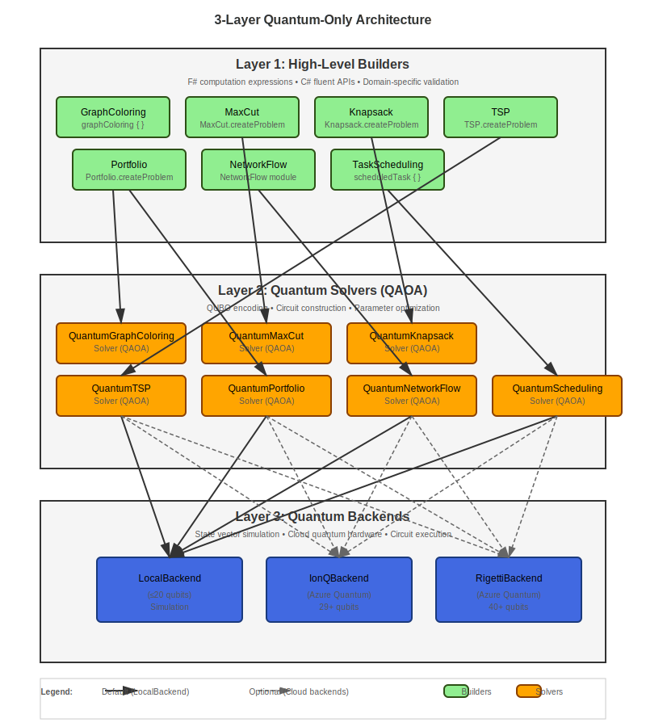

# FSharp.Azure.Quantum

**Quantum-First F# Library** - Solve combinatorial optimization problems using QAOA (Quantum Approximate Optimization Algorithm) with automatic backend selection.

[](https://www.nuget.org/packages/FSharp.Azure.Quantum/)
[](https://github.com/thorium/FSharp.Azure.Quantum/blob/master/LICENSE)

## 🚀 Quick Start

### F# Computation Expressions

```fsharp
open FSharp.Azure.Quantum

// Graph Coloring: Register Allocation
let problem = graphColoring {
    node "R1" ["R2"; "R3"]
    node "R2" ["R1"; "R4"]
    node "R3" ["R1"; "R4"]
    node "R4" ["R2"; "R3"]
    colors ["EAX"; "EBX"; "ECX"; "EDX"]
}

// Solve using quantum optimization (QAOA)
match GraphColoring.solve problem 4 None with
| Ok solution ->
    printfn "Colors used: %d" solution.ColorsUsed
    solution.Assignments 
    |> Map.iter (fun node color -> printfn "%s → %s" node color)
| Error msg -> 
    printfn "Error: %s" msg
```

### C# Fluent API

```csharp
using FSharp.Azure.Quantum;
using static FSharp.Azure.Quantum.CSharpBuilders;

// MaxCut: Circuit Partitioning
var vertices = new[] { "A", "B", "C", "D" };
var edges = new[] {
    (source: "A", target: "B", weight: 1.0),
    (source: "B", target: "C", weight: 2.0),
    (source: "C", target: "D", weight: 1.0),
    (source: "D", target: "A", weight: 1.0)
};

var problem = MaxCutProblem(vertices, edges);
var result = MaxCut.solve(problem, null);

if (result.IsOk) {
    var solution = result.ResultValue;
    Console.WriteLine($"Cut Value: {solution.CutValue}");
    Console.WriteLine($"Partition S: {string.Join(", ", solution.PartitionS)}");
    Console.WriteLine($"Partition T: {string.Join(", ", solution.PartitionT)}");
}
```

## 📦 Installation

```bash
dotnet add package FSharp.Azure.Quantum
```

## ✨ Features

### 🎯 7 Quantum Optimization Builders

**Production-ready quantum algorithms for common combinatorial problems:**

1. **Graph Coloring** - Register allocation, frequency assignment, scheduling
2. **MaxCut** - Circuit partitioning, community detection, load balancing
3. **Knapsack** - Resource allocation, cargo loading, project selection
4. **TSP** - Route optimization, delivery planning, logistics
5. **Portfolio** - Investment allocation, asset selection, risk management
6. **Network Flow** - Supply chain optimization, distribution planning
7. **Task Scheduling** - Manufacturing workflows, project management, resource allocation with dependencies

### 🧠 Quantum Machine Learning

**Apply quantum computing to machine learning:**

- ✅ **Variational Quantum Classifier (VQC)** - Supervised learning with quantum circuits
- ✅ **Quantum Kernel SVM** - Support vector machines with quantum feature spaces
- ✅ **Feature Maps** - ZZFeatureMap, PauliFeatureMap for data encoding
- ✅ **Variational Forms** - RealAmplitudes, EfficientSU2 ansatz circuits
- ✅ **Adam Optimizer** - Gradient-based training
- ✅ **Model Serialization** - Save/load trained models

**Examples:** `examples/QML/` (VQCExample, FeatureMapExample, VariationalFormExample)

### 📊 Business Problem Builders

**High-level APIs for business applications:**

- ✅ **AutoML** - Automated machine learning with quantum kernels
- ✅ **Anomaly Detection** - Security threat detection, fraud prevention
- ✅ **Binary Classification** - Fraud detection, spam filtering
- ✅ **Predictive Modeling** - Customer churn, demand forecasting
- ✅ **Similarity Search** - Product recommendations, semantic search

**Examples:** `examples/AutoML/`, `examples/AnomalyDetection/`, `examples/BinaryClassification/`, `examples/PredictiveModeling/`

### 🤖 HybridSolver - Optional Smart Routing

**Optional optimization layer for variable-sized problems:**

- ✅ **Analyzes problem size** - Routes small problems (< 20 variables) to classical fallback
- ✅ **Quantum-first** - Uses QAOA on LocalBackend/Cloud for >= 20 variables
- ✅ **Cost guards** - Budget limits prevent runaway quantum costs
- ✅ **Transparent reasoning** - Explains routing decision
- ✅ **Production-ready** - Useful when problem sizes vary significantly

**Recommendation:** Use direct quantum API (`GraphColoring.solve`, `MaxCut.solve`, etc.) for most cases. HybridSolver adds classical fallback optimization for very small problems.

**See:** [Getting Started Guide](getting-started) for detailed examples and decision criteria

### 🔬 QAOA Implementation

Quantum Approximate Optimization Algorithm with:
- ✅ Automatic QUBO encoding
- ✅ Advanced parameter optimization (COBYLA, SPSA, gradient-free)
- ✅ Configurable circuit depth and shot counts
- ✅ Solution validation and quality metrics
- ✅ Integer variable support

**Example:** `examples/QaoaParameterOptimizationExample.fsx`

### 🖥️ Multiple Execution Backends

## 🧭 Intent-First Algorithms (Why Some Algorithms Behave Differently Per Backend)

Some algorithms in this library are implemented as **intent → plan → execute** rather than as a fixed “gate circuit”. This allows the same algorithm to run correctly on:

- gate-native backends (state-vector simulation, common providers), and
- non-gate-native backends (e.g., topological / Majorana-style models).

This is mostly transparent to users: you call the same API, but the backend may choose a different execution strategy. See `docs/adr-intent-first-algorithms.md`.


- **LocalBackend** - Fast simulation (≤20 qubits, free)
- **IonQBackend** - Azure Quantum (29+ qubits simulator, 11 qubits QPU)
- **RigettiBackend** - Azure Quantum (40+ qubits simulator, 80 qubits QPU)
- **AtomComputingBackend** - Azure Quantum (100+ qubits, neutral atoms, all-to-all connectivity)
- **QuantinuumBackend** - Azure Quantum (20-32 qubits, 99.9%+ fidelity, trapped-ion)
- **DWaveBackend** - D-Wave quantum annealer (2000+ qubits, production hardware)

### 💻 Cross-Language Support

- **F# First** - Idiomatic computation expressions and type safety
- **C# Friendly** - Fluent API extensions with value tuples
- **Seamless Interop** - Works naturally in both languages

## 🎯 Problem Types & Examples

### Graph Coloring

```fsharp
open FSharp.Azure.Quantum

// Register allocation for compiler optimization
let problem = graphColoring {
    node "Task1" ["Task2"; "Task3"]
    node "Task2" ["Task1"; "Task4"]
    node "Task3" ["Task1"; "Task4"]
    node "Task4" ["Task2"; "Task3"]
    colors ["Slot A"; "Slot B"; "Slot C"]
    objective MinimizeColors
}

match GraphColoring.solve problem 3 None with
| Ok solution ->
    printfn "Valid coloring: %b" solution.IsValid
    printfn "Colors used: %d/%d" solution.ColorsUsed 3
    printfn "Conflicts: %d" solution.ConflictCount
| Error msg -> printfn "Error: %s" msg
```

### MaxCut

```fsharp
let vertices = ["A"; "B"; "C"; "D"]
let edges = [
    ("A", "B", 1.0)
    ("B", "C", 2.0)
    ("C", "D", 1.0)
    ("D", "A", 1.0)
]

let problem = MaxCut.createProblem vertices edges

match MaxCut.solve problem None with
| Ok solution ->
    printfn "Partition S: %A" solution.PartitionS
    printfn "Partition T: %A" solution.PartitionT
    printfn "Cut value: %.2f" solution.CutValue
| Error msg -> printfn "Error: %s" msg
```

### Knapsack

```fsharp
let items = [
    ("laptop", 3.0, 1000.0)   // (id, weight, value)
    ("phone", 0.5, 500.0)
    ("tablet", 1.5, 700.0)
    ("monitor", 2.0, 600.0)
]

let problem = Knapsack.createProblem items 5.0  // capacity = 5.0

match Knapsack.solve problem None with
| Ok solution ->
    printfn "Total value: $%.2f" solution.TotalValue
    printfn "Total weight: %.2f/%.2f" solution.TotalWeight problem.Capacity
    printfn "Items: %A" (solution.SelectedItems |> List.map (fun i -> i.Id))
| Error msg -> printfn "Error: %s" msg
```

### TSP

```fsharp
let cities = [
    ("Seattle", 0.0, 0.0)
    ("Portland", 1.0, 0.5)
    ("San Francisco", 2.0, 1.5)
    ("Los Angeles", 3.0, 3.0)
]

let problem = TSP.createProblem cities

match TSP.solve problem None with
| Ok tour ->
    printfn "Optimal route: %s" (String.concat " → " tour.Cities)
    printfn "Total distance: %.2f" tour.TotalDistance
| Error msg -> printfn "Error: %s" msg
```

### Portfolio

```fsharp
let assets = [
    ("AAPL", 0.12, 0.15, 150.0)  // (symbol, return, risk, price)
    ("GOOGL", 0.10, 0.12, 2800.0)
    ("MSFT", 0.11, 0.14, 350.0)
]

let problem = Portfolio.createProblem assets 10000.0  // budget

match Portfolio.solve problem None with
| Ok allocation ->
    printfn "Portfolio value: $%.2f" allocation.TotalValue
    printfn "Expected return: %.2f%%" (allocation.ExpectedReturn * 100.0)
    printfn "Risk: %.2f" allocation.Risk
    
    allocation.Allocations 
    |> List.iter (fun (symbol, shares, value) ->
        printfn "  %s: %.2f shares ($%.2f)" symbol shares value)
| Error msg -> printfn "Error: %s" msg
```

### Network Flow

```fsharp
let nodes = [
    NetworkFlow.SourceNode("Factory", 100)
    NetworkFlow.IntermediateNode("Warehouse", 80)
    NetworkFlow.SinkNode("Store1", 40)
    NetworkFlow.SinkNode("Store2", 60)
]

let routes = [
    NetworkFlow.Route("Factory", "Warehouse", 5.0)
    NetworkFlow.Route("Warehouse", "Store1", 3.0)
    NetworkFlow.Route("Warehouse", "Store2", 4.0)
]

let problem = { NetworkFlow.Nodes = nodes; Routes = routes }

match NetworkFlow.solve problem None with
| Ok flow ->
    printfn "Total cost: $%.2f" flow.TotalCost
    printfn "Fill rate: %.1f%%" (flow.FillRate * 100.0)
| Error msg -> printfn "Error: %s" msg
```

### Task Scheduling

```fsharp
open FSharp.Azure.Quantum

// Define tasks with dependencies
let taskA = scheduledTask {
    taskId "TaskA"
    duration (hours 2.0)
    priority 10.0
}

let taskB = scheduledTask {
    taskId "TaskB"
    duration (hours 1.5)
    after "TaskA"  // Dependency
    requires "Worker" 2.0
    deadline 180.0
}

let taskC = scheduledTask {
    taskId "TaskC"
    duration (minutes 30.0)
    after "TaskA"
    requires "Machine" 1.0
}

// Define resources
let worker = resource {
    resourceId "Worker"
    capacity 3.0
}

let machine = resource {
    resourceId "Machine"
    capacity 2.0
}

// Build scheduling problem
let problem = scheduling {
    tasks [taskA; taskB; taskC]
    resources [worker; machine]
    objective MinimizeMakespan
    timeHorizon 500.0
}

// Solve with quantum backend for resource constraints
let backend = BackendAbstraction.createLocalBackend()
match solveQuantum backend problem with
| Ok solution ->
    printfn "Makespan: %.2f hours" solution.Makespan
    solution.Schedule 
    |> List.iter (fun assignment ->
        printfn "%s: starts %.2f, ends %.2f" 
            assignment.TaskId assignment.StartTime assignment.EndTime)
| Error msg -> printfn "Error: %s" msg
```

## 🏗️ Architecture

**3-Layer Quantum-Only Design:**



**Design Philosophy:**
- ✅ **Quantum-Only**: No classical algorithms (pure quantum optimization library)
- ✅ **Clear Layers**: No leaky abstractions between layers
- ✅ **Type-Safe**: F# type system prevents invalid problem specifications
- ✅ **Extensible**: Easy to add new problem types following existing patterns

## 📚 Complete Documentation

### 🚀 Getting Started
- [Getting Started Guide](getting-started) - Installation, first steps, and basic examples
- [Quantum Computing Introduction](quantum-computing-introduction) - Comprehensive introduction to quantum computing for F# developers (no quantum background needed)
- [API Reference](api-reference) - Includes C# interop examples with fluent API

### 📖 Core Concepts
- [API Reference](api-reference) - Complete API documentation for all modules
- [Computation Expressions Reference](computation-expressions-reference) - Complete CE reference table with all custom operations (when IntelliSense fails)
- [Architecture Overview](architecture-overview) - Deep dive into 3-layer quantum-only design
- [Backend Switching](backend-switching) - Local vs Cloud vs D-Wave quantum execution
- [Local Simulation](local-simulation) - LocalBackend internals and performance characteristics

### 🔬 Advanced Topics
- [QUBO Encoding Strategies](qubo-encoding-strategies) - Problem-to-QUBO transformations for QAOA
- [Computation Expression Composition](computation-expression-composition) - Advanced CE patterns for loops and composition
- [Topological Quantum Computing](topological/) - Fault-tolerant quantum computing with anyons and braiding
- [Quantum Machine Learning](quantum-machine-learning) - VQC, Quantum Kernels, Feature Maps
- [Business Problem Builders](business-problem-builders) - AutoML, Fraud Detection, Anomaly Detection, Predictive Modeling
- [Error Mitigation](error-mitigation) - ZNE, PEC, REM strategies for NISQ hardware
- [Advanced Quantum Builders](advanced-quantum-builders) - Tree Search, Constraint Solver, Pattern Matcher, Shor's Algorithm, Phase Estimation
- [D-Wave Integration Guide](dwave-integration) - Using D-Wave quantum annealers (not yet available)
- [FAQ](faq) - Frequently asked questions and troubleshooting

### 🎯 Problem-Specific API Guides
- [Graph Coloring API](GraphColoring-API) - Register allocation, frequency assignment, scheduling
- [Quantum Chemistry API](QuantumChemistry-API) - VQE for molecular ground state energies
- [Task Scheduling API](TaskScheduling-API) - Constraint-based quantum scheduling

### 💡 Working Code Examples

**View source code on GitHub:**

#### Optimization Problems (QAOA)
- [**DeliveryRouting**](https://github.com/Thorium/FSharp.Azure.Quantum/tree/main/examples/DeliveryRouting) - TSP with 16-city NYC routing, HybridSolver
- [**InvestmentPortfolio**](https://github.com/Thorium/FSharp.Azure.Quantum/tree/main/examples/InvestmentPortfolio) - Portfolio optimization with constraints (F#)
- [**InvestmentPortfolio_CSharp**](https://github.com/Thorium/FSharp.Azure.Quantum/tree/main/examples/InvestmentPortfolio/CSharp) - Portfolio optimization (C# version)
- [**GraphColoring**](https://github.com/Thorium/FSharp.Azure.Quantum/tree/main/examples/GraphColoring) - Graph coloring with QAOA
- [**MaxCut**](https://github.com/Thorium/FSharp.Azure.Quantum/tree/main/examples/MaxCut) - Max-Cut problem with QAOA
- [**Knapsack**](https://github.com/Thorium/FSharp.Azure.Quantum/tree/main/examples/Knapsack) - 0/1 Knapsack optimization
- [**SupplyChain**](https://github.com/Thorium/FSharp.Azure.Quantum/tree/main/examples/SupplyChain) - Multi-constraint resource allocation
- [**JobScheduling**](https://github.com/Thorium/FSharp.Azure.Quantum/tree/main/examples/JobScheduling) - Task scheduling with dependencies

#### Advanced Quantum Algorithms
- [**QuantumChemistry**](https://github.com/Thorium/FSharp.Azure.Quantum/tree/main/examples/Chemistry) - VQE for molecular simulation
- [**PhaseEstimation**](https://github.com/Thorium/FSharp.Azure.Quantum/tree/main/examples/PhaseEstimation) - Quantum Phase Estimation (QPE)
- [**QuantumArithmetic**](https://github.com/Thorium/FSharp.Azure.Quantum/tree/main/examples/QuantumArithmetic) - QFT-based arithmetic operations
- [**CryptographicAnalysis**](https://github.com/Thorium/FSharp.Azure.Quantum/tree/main/examples/CryptographicAnalysis) - Shor's algorithm demonstrations

#### Interactive Demonstrations
- [**Gomoku**](https://github.com/Thorium/FSharp.Azure.Quantum/tree/main/examples/Gomoku) - Quantum vs Classical AI game (with Hybrid mode)
- [**Kasino**](https://github.com/Thorium/FSharp.Azure.Quantum/tree/main/examples/Kasino) - Quantum gambling game demonstrating superposition (F#)
- [**Kasino_CSharp**](https://github.com/Thorium/FSharp.Azure.Quantum/tree/main/examples/Kasino/CSharp) - Quantum gambling game (C# version)

## 🎯 When to Use This Library

### ✅ Use FSharp.Azure.Quantum When:

- You want to learn quantum optimization algorithms (QAOA)
- You're building quantum-enabled applications
- You need quantum solutions for combinatorial problems
- You're researching quantum algorithm performance
- You want to experiment with quantum computing

### 🔄 Consider Classical Libraries When:

- Problem size < 50 variables (classical is faster)
- You need immediate results (< 1 second)
- Cost is a primary concern
- Deterministic results required

**Best Practice**: 
- **Use direct quantum API** (`GraphColoring.solve`, `MaxCut.solve`, etc.) for consistent quantum experience across all problem sizes
- **Use HybridSolver** only if you need automatic classical fallback for very small problems (< 20 variables)
- **LocalBackend (default)** provides free, fast quantum simulation up to 20 qubits - ideal for development, testing, and many production use cases
- **Cloud backends** (IonQ, Rigetti) for larger problems or real quantum hardware experimentation

## 🔧 Backend Selection Guide

### LocalBackend (Default)

```fsharp
// Automatic: No backend parameter needed
match MaxCut.solve problem None with
| Ok solution -> printfn "Max cut value: %.2f" solution.CutValue
| Error msg -> printfn "Error: %s" msg
```

**Characteristics:**
- ✅ Free (local simulation)
- ✅ Fast (milliseconds)
- ✅ Up to 20 qubits
- ✅ Perfect for development and testing

### Azure Quantum (Cloud)

```fsharp
open FSharp.Azure.Quantum.Backends.AzureQuantumWorkspace

// Create workspace
let workspace = createDefault "subscription-id" "resource-group" "workspace-name" "eastus"

// IonQ Backend (trapped-ion)
let backend_ionq = BackendAbstraction.createFromWorkspace workspace "ionq.simulator"

// Rigetti Backend (superconducting)
let backend_rigetti = BackendAbstraction.createFromWorkspace workspace "rigetti.sim.qvm"

// Atom Computing Backend (neutral atoms, 100+ qubits, all-to-all connectivity)
let backend_atom = BackendAbstraction.createFromWorkspace workspace "atom-computing.sim"

// Quantinuum Backend (trapped-ion, highest fidelity)
let backend_quantinuum = BackendAbstraction.createFromWorkspace workspace "quantinuum.sim.h1-1sc"

// Pass to solver
match MaxCut.solve problem (Some backend_atom) with
| Ok solution -> printfn "Max cut value: %.2f" solution.CutValue
| Error msg -> printfn "Error: %s" msg
```

**Backend Characteristics:**

| Backend | Qubits | Technology | Best For |
|---------|--------|------------|----------|
| **IonQ** | 29+ (sim), 11 (QPU) | Trapped-ion | General gate-based algorithms |
| **Rigetti** | 40+ (sim), 80 (QPU) | Superconducting | Fast gate operations |
| **Atom Computing** | 100+ (sim/QPU) | Neutral atoms | Large-scale problems, all-to-all connectivity |
| **Quantinuum** | 20-32 (sim/QPU) | Trapped-ion | High-precision (99.9%+ fidelity) |

**Cost & Performance:**
- ⚡ Scalable (11-100+ qubits depending on backend)
- ⚡ Real quantum hardware available
- 💰 Paid service (~$10-100 per run, varies by provider)
- ⏱️ Slower (job queue, 10-60 seconds)

## 🤝 Contributing

Contributions welcome! See [GitHub Repository](https://github.com/thorium/FSharp.Azure.Quantum) for contribution guidelines.

**Areas we'd love help with:**
- New problem builders (SAT, Job Shop Scheduling, Vehicle Routing)
- QAOA warm-start strategies
- Alternative quantum algorithms (VQE, QASM)
- Additional cloud backend support (AWS Braket, IBM Quantum)
- Performance optimizations

## 🔗 Links

- [GitHub Repository](https://github.com/thorium/FSharp.Azure.Quantum)
- [NuGet Package](https://www.nuget.org/packages/FSharp.Azure.Quantum/)
- [Report Issues](https://github.com/thorium/FSharp.Azure.Quantum/issues)
- [API Documentation](api-reference)

## 📊 Performance Guidelines

| Problem Type | LocalBackend | Cloud Required |
|--------------|--------------|----------------|
| Graph Coloring | ≤20 nodes | 25+ nodes |
| MaxCut | ≤20 vertices | 25+ vertices |
| Knapsack | ≤20 items | 25+ items |
| TSP | ≤8 cities | 10+ cities |
| Portfolio | ≤20 assets | 25+ assets |
| Network Flow | ≤15 nodes | 20+ nodes |
| Task Scheduling | ≤15 tasks | 20+ tasks |

**Note:** LocalBackend supports up to 20 qubits. Larger problems require cloud backends.

## 📄 License

This project is licensed under the [Unlicense](https://unlicense.org/) - dedicated to the public domain.

---

**Status**: Production Ready - Quantum-only architecture with 7 problem builders

**Last Updated**: 2025-12-03
