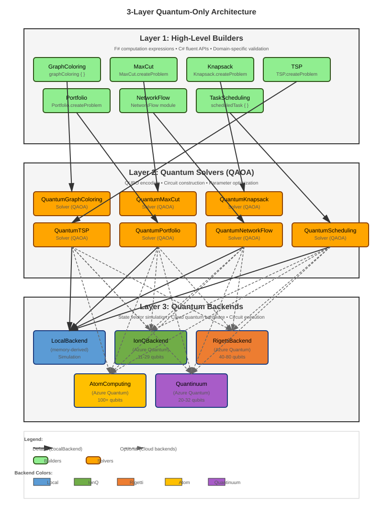

# FSharp.Azure.Quantum

**Quantum-First F# Library** - Solve combinatorial optimization problems with quantum algorithms (QAOA), run quantum algorithms and quantum machine learning, on a local simulator or on Azure Quantum hardware.

[](https://www.nuget.org/packages/FSharp.Azure.Quantum/)
[](https://github.com/Thorium/FSharp.Azure.Quantum/blob/main/LICENSE)

## Contents

- [Quick Start](#quick-start)
- [Problem Builders](#problem-builders)
- [Beyond Optimization](#beyond-optimization)
- [Backends](#backends)
- [Problem Size](#problem-size)
- [Documentation](#documentation)
- [Examples](#examples)
- [Project](#project)

## Quick Start

### Installation

```bash
dotnet add package FSharp.Azure.Quantum
```

In an F# script (`.fsx`), reference the package instead:

```
#r "nuget: FSharp.Azure.Quantum"
```

Requires .NET 10. The local simulator needs no account; cloud backends need an Azure Quantum workspace.

### F# Computation Expressions

```fsharp
open System.Threading
open FSharp.Azure.Quantum
open FSharp.Azure.Quantum.GraphColoring

// Graph Coloring: Register Allocation
let problem = graphColoring {
    node "R1" ["R2"; "R3"]
    node "R2" ["R1"; "R4"]
    node "R3" ["R1"; "R4"]
    node "R4" ["R2"; "R3"]
    colors ["EAX"; "EBX"; "ECX"; "EDX"]
}

// Solve using quantum optimization (QAOA) on the local simulator
task {
    match! GraphColoring.solveAsync problem 4 None CancellationToken.None with
    | Ok solution ->
        printfn "Colors used: %d" solution.ColorsUsed
        solution.Assignments
        |> Map.iter (fun node color -> printfn "%s → %s" node color)
    | Error err ->
        printfn "Error: %s" err.Message
}
```

Samples are `task` blocks: `await` them in an application, or end a script with `|> Async.AwaitTask |> Async.RunSynchronously`.

### C# Fluent API

```csharp
using System.Threading;
using FSharp.Azure.Quantum;
using static FSharp.Azure.Quantum.CSharpBuilders;

// MaxCut: Circuit Partitioning
var vertices = new[] { "A", "B", "C", "D" };
var edges = new[] {
    (source: "A", target: "B", weight: 1.0),
    (source: "B", target: "C", weight: 2.0),
    (source: "C", target: "D", weight: 1.0),
    (source: "D", target: "A", weight: 1.0)
};

var problem = MaxCutProblem(vertices, edges);
var result = await MaxCut.solveAsync(problem, null, CancellationToken.None);

if (result.IsOk) {
    var solution = result.ResultValue;
    Console.WriteLine($"Cut Value: {solution.CutValue}");
    Console.WriteLine($"Partition S: {string.Join(", ", solution.PartitionS)}");
    Console.WriteLine($"Partition T: {string.Join(", ", solution.PartitionT)}");
}
```

Passing `None` (or `null`) runs on the local simulator; pass a backend to run elsewhere. The [Getting Started guide](getting-started) walks through the rest.

## Problem Builders

Seven QAOA-based builders cover common combinatorial problems. Each encodes the problem as a QUBO, runs QAOA on a quantum backend and decodes and validates the answer. Full signatures are in the [API Reference](api-reference).

### Graph Coloring

**Use Case:** Register allocation, frequency assignment, exam and time-slot scheduling

```fsharp
open System.Threading
open FSharp.Azure.Quantum
open FSharp.Azure.Quantum.GraphColoring

// Tasks that conflict cannot share a time slot
let slots = graphColoring {
    node "Task1" ["Task2"; "Task3"]
    node "Task2" ["Task1"; "Task4"]
    node "Task3" ["Task1"; "Task4"]
    node "Task4" ["Task2"; "Task3"]
    colors ["Slot A"; "Slot B"; "Slot C"]
}

task {
    match! GraphColoring.solveAsync slots 3 None CancellationToken.None with
    | Ok solution ->
        printfn "Valid coloring: %b" solution.IsValid
        printfn "Colors used: %d/%d" solution.ColorsUsed 3
    | Error err -> printfn "Error: %s" err.Message
}
```

### MaxCut

**Use Case:** Circuit design, community detection, load balancing

[](https://github.com/Thorium/FSharp.Azure.Quantum/blob/main/examples/MaxCut/AdaptQaoaMaxCut.fsx)

```fsharp
let vertices = ["A"; "B"; "C"; "D"]
let edges = [
    ("A", "B", 1.0)
    ("B", "C", 2.0)
    ("C", "D", 1.0)
    ("D", "A", 1.0)
]

let cut = MaxCut.createProblem vertices edges

task {
    match! MaxCut.solveAsync cut None CancellationToken.None with
    | Ok solution ->
        printfn "Partition S: %A" solution.PartitionS
        printfn "Partition T: %A" solution.PartitionT
        printfn "Cut value: %.2f" solution.CutValue
    | Error err -> printfn "Error: %s" err.Message
}
```

### Knapsack (0/1)

**Use Case:** Resource allocation, cargo loading, project selection

```fsharp
let items = [
    ("laptop", 3.0, 1000.0)   // (id, weight, value)
    ("phone", 0.5, 500.0)
    ("tablet", 1.5, 700.0)
    ("monitor", 2.0, 600.0)
]

let knapsack = Knapsack.createProblem items 5.0  // capacity

task {
    match! Knapsack.solveAsync knapsack None CancellationToken.None with
    | Ok solution ->
        printfn "Total value: $%.2f" solution.TotalValue
        printfn "Items: %A" (solution.SelectedItems |> List.map (fun i -> i.Id))
    | Error err -> printfn "Error: %s" err.Message
}
```

### Traveling Salesperson Problem (TSP)

**Use Case:** Route optimization, delivery planning, logistics

[](https://github.com/Thorium/FSharp.Azure.Quantum/blob/main/examples/DeliveryRouting/DeliveryRouting.fsx)

```fsharp
let cities = [
    ("Seattle", 0.0, 0.0)
    ("Portland", 1.0, 0.5)
    ("San Francisco", 2.0, 1.5)
    ("Los Angeles", 3.0, 3.0)
]

task {
    match! TSP.solveAsync (TSP.createProblem cities) None CancellationToken.None with
    | Ok tour ->
        printfn "Route: %s" (String.concat " → " tour.Cities)
        printfn "Total distance: %.2f" tour.TotalDistance
    | Error err -> printfn "Error: %s" err.Message
}
```

### Portfolio Optimization

**Use Case:** Investment allocation, asset selection, risk management

```fsharp
let assets = [
    ("AAPL", 0.12, 0.15, 150.0)  // (symbol, return, risk, price)
    ("GOOGL", 0.10, 0.12, 2800.0)
    ("MSFT", 0.11, 0.14, 350.0)
]

task {
    match! Portfolio.solveAsync (Portfolio.createProblem assets 10000.0) None CancellationToken.None with
    | Ok allocation ->
        printfn "Portfolio value: $%.2f" allocation.TotalValue
        printfn "Expected return: %.2f%%" (allocation.ExpectedReturn * 100.0)
    | Error err -> printfn "Error: %s" err.Message
}
```

`Portfolio.createProblem` treats the assets as independent. `Portfolio.createProblemWithCovariance` (or `createProblemWithCorrelation`) adds the covariance: the QAOA objective then includes the correlations and the reported risk is sqrt(wᵀΣw).

### Network Flow

**Use Case:** Supply chain optimization, logistics, distribution planning

[](https://github.com/Thorium/FSharp.Azure.Quantum/tree/main/examples/SupplyChain/NetworkFlowOptimization)

```fsharp
let nodes = [
    NetworkFlow.createSource "Factory" 100 100      // id, supply, capacity
    NetworkFlow.createIntermediate "Warehouse" 80   // id, capacity
    NetworkFlow.createSink "Store1" 40              // id, demand
    NetworkFlow.createSink "Store2" 60
]

let routes = [
    NetworkFlow.createRoute "Factory" "Warehouse" 5.0   // from, to, cost
    NetworkFlow.createRoute "Warehouse" "Store1" 3.0
    NetworkFlow.createRoute "Warehouse" "Store2" 4.0
]

task {
    match! NetworkFlow.solveAsync (NetworkFlow.createProblem nodes routes) None CancellationToken.None with
    | Ok flow -> printfn "Total cost: $%.2f" flow.TotalCost
    | Error err -> printfn "Error: %s" err.Message
}
```

### Task Scheduling

**Use Case:** Manufacturing workflows, project management, resource allocation with dependencies

```fsharp
open System.Threading
open FSharp.Azure.Quantum
open FSharp.Azure.Quantum.TaskScheduling
open FSharp.Azure.Quantum.Core.BackendAbstraction
open FSharp.Azure.Quantum.Backends.LocalBackend

let taskA: ScheduledTask<unit> = scheduledTask {
    taskId "TaskA"
    duration (hours 2.0)
}

let taskB: ScheduledTask<unit> = scheduledTask {
    taskId "TaskB"
    duration (hours 1.5)
    after "TaskA"
    requires "Worker" 1.0
}

let worker: Resource<unit> = resource {
    resourceId "Worker"
    capacity 1.0
}

let schedule = scheduling {
    tasks [taskA; taskB]
    resources [worker]
    objective MinimizeMakespan
    timeHorizon (hours 4.0)
}

let backend = LocalBackend() :> IQuantumBackend

task {
    match! solveQuantumAsync backend schedule CancellationToken.None with
    | Ok solution -> printfn "Makespan: %.2f hours" solution.Makespan.TotalHours
    | Error err -> printfn "Error: %s" err.Message
}
```

## Beyond Optimization

| Area | What it provides | Guide |
|------|------------------|-------|
| Quantum algorithms | Grover search and amplitude amplification, QFT, phase estimation, Shor's period finding, HHL, quantum arithmetic, tree search, constraint solving | [Advanced builders](advanced-quantum-builders) |
| Machine learning | Variational quantum classifier, quantum kernel SVM, feature maps and variational forms | [Quantum machine learning](quantum-machine-learning) |
| Business builders | AutoML, anomaly detection, classification, predictive modeling, similarity search, social network and constraint scheduling | [Business builders](business-problem-builders) |
| Chemistry | Molecular Hamiltonians, VQE, ground-state energies by phase estimation, and integrals from external packages | [Bring your own Hamiltonian](bring-your-own-hamiltonian) |
| Error mitigation | Zero-noise extrapolation, probabilistic error cancellation, readout error mitigation | [Error mitigation](error-mitigation) |
| Hybrid routing | `HybridSolver` sends small problems to classical solvers and large ones to QAOA when you supply a backend, and reports why | [Getting Started](getting-started) |
| Topological computing | Anyon braiding simulation and magic-state distillation, in the separate `FSharp.Azure.Quantum.Topological` package | [Topological guide](topological/) |

The problem builders run on a quantum backend and never fall back to a classical solver without being asked. Classical solvers run only where you choose them, through `HybridSolver` or the classical solver modules. The [architecture overview](architecture-overview) describes the layers.



## Backends

| Backend | Access | Qubit limit the library enforces |
|---------|--------|----------------------------------|
| LocalBackend | In process, free | Derived from available memory, at most 30 |
| IonQ | Azure Quantum | Aria 25, Forte 36 |
| Quantinuum | Azure Quantum | H1 32, H2 56 |
| Rigetti | Azure Quantum | 84 |
| Atom Computing | Azure Quantum | 100 |
| IQM | Azure Quantum | 20 |
| Pasqal | Azure Quantum, analog neutral atoms | Runs Rydberg programs as Pulser sequences, not gate circuits |
| D-Wave | Annealer for QUBO problems | Mock annealer included for local runs |
| AWS Braket | Separate `FSharp.Azure.Quantum.Braket` package | Gate QPUs via OpenQASM 3.0, QuEra via AHS |

Provider simulator targets are capped at 20 qubits. Creating and switching backends is covered in [Backend Switching](backend-switching) and [Hardware Selection](Hardware-Selection-Guide).

On the gate-based cloud backends the solvers, algorithms and machine-learning builders build complete circuits and submit them as whole-circuit jobs, transpiled to each provider's native gates, and read their results from measured shots. Every job is billed and iterative algorithms submit many, so a `JobBudget` can cap the count. What a circuit job cannot do is an `Error`, not a guess: starting from a state other than |0…0⟩, continuing from a returned state gate by gate, or HHL regression, which needs signed amplitudes.

Circuits move in and out as OpenQASM 1.0, 2.0 or 3.0, so they can be exchanged with Qiskit, Cirq and Braket, and the library can emit QIR. The compilation tooling also estimates resources and routes qubits for a device's connectivity.

## Problem Size

A QAOA run needs as many qubits as its encoding has variables. The local simulator's state doubles with every qubit, so iterative algorithms are practical up to about 20 qubits.

| Problem | Qubits needed | About 20 qubits means |
|---------|---------------|-----------------------|
| Graph coloring | nodes × colors | 6 nodes, 3 colors |
| MaxCut | one per vertex | 20 vertices |
| Knapsack | one per item | 20 items |
| TSP | cities² | 4 cities |
| Portfolio | one per asset | 20 assets |
| Network flow | one per route | 20 routes |
| Task scheduling | tasks × time slots | 4 tasks, 5 slots |

For problems of this size a classical solver is usually faster and cheaper. The library is for learning, experimenting with and measuring quantum algorithms, and for building applications that can move to quantum hardware as it grows.

## Documentation

**Start here**
- [Getting Started](getting-started): installation, first programs, error handling
- [Quantum Computing Introduction](quantum-computing-introduction): the concepts, for F# developers with no quantum background
- [Glossary](glossary) and [Mathematical Foundations](Mathematical-Foundations)

**Reference**
- [API Reference](api-reference): every module, with F# and C# examples
- [Computation Expressions Reference](computation-expressions-reference): every builder's operations
- [Graph Coloring](GraphColoring-API), [Task Scheduling](TaskScheduling-API) and [QRNG](QRNG-API) APIs
- [FAQ](faq)

**Execution**
- [Local Simulation](local-simulation), [Local Azure Quantum Service](local-quantum-service), [Backend Switching](backend-switching), [Hardware Selection](Hardware-Selection-Guide)
- [Error Mitigation](error-mitigation)

**In depth**
- [Architecture Overview](architecture-overview) and [Intent-First Algorithms](adr-intent-first-algorithms)
- [QUBO Encoding Strategies](qubo-encoding-strategies)
- [Computation Expression Composition](computation-expression-composition) and the [QuantumResult builder](quantumresult-builder-guide)
- [Topological Quantum Computing](topological/) and its [program format](topological-format-spec)

## Examples

Runnable scripts and projects are in the [examples folder](https://github.com/Thorium/FSharp.Azure.Quantum/tree/main/examples); run any script with `dotnet fsi <script>.fsx`. A selection:

- **Drone fleets**: [fleet path planning](https://github.com/Thorium/FSharp.Azure.Quantum/tree/main/examples/Drones/FleetPathPlanning), [swarm task allocation](https://github.com/Thorium/FSharp.Azure.Quantum/tree/main/examples/Drones/SwarmTaskAllocation), [swarm choreography](https://github.com/Thorium/FSharp.Azure.Quantum/tree/main/examples/Drones/SwarmChoreography) and a [wildfire air bridge](https://github.com/Thorium/FSharp.Azure.Quantum/tree/main/examples/Drones/FireAirBridge). Each exports ArduPilot missions, and all four have been flown in ArduPilot's own simulator.
- **Optimization**: [delivery routing](https://github.com/Thorium/FSharp.Azure.Quantum/tree/main/examples/DeliveryRouting), [investment portfolio](https://github.com/Thorium/FSharp.Azure.Quantum/tree/main/examples/InvestmentPortfolio) ([C# version](https://github.com/Thorium/FSharp.Azure.Quantum/tree/main/examples/InvestmentPortfolio/CSharp)), [graph coloring](https://github.com/Thorium/FSharp.Azure.Quantum/tree/main/examples/GraphColoring), [MaxCut](https://github.com/Thorium/FSharp.Azure.Quantum/tree/main/examples/MaxCut), [knapsack](https://github.com/Thorium/FSharp.Azure.Quantum/tree/main/examples/Knapsack), [supply chain](https://github.com/Thorium/FSharp.Azure.Quantum/tree/main/examples/SupplyChain), [job scheduling](https://github.com/Thorium/FSharp.Azure.Quantum/tree/main/examples/JobScheduling)
- **Algorithms**: [chemistry](https://github.com/Thorium/FSharp.Azure.Quantum/tree/main/examples/Chemistry), [phase estimation](https://github.com/Thorium/FSharp.Azure.Quantum/tree/main/examples/PhaseEstimation), [quantum arithmetic](https://github.com/Thorium/FSharp.Azure.Quantum/tree/main/examples/QuantumArithmetic), [Shor's algorithm](https://github.com/Thorium/FSharp.Azure.Quantum/tree/main/examples/CryptographicAnalysis), [HHL](https://github.com/Thorium/FSharp.Azure.Quantum/tree/main/examples/LinearSystemSolver), [option pricing and risk](https://github.com/Thorium/FSharp.Azure.Quantum/tree/main/examples/FinancialRisk), [teleportation](https://github.com/Thorium/FSharp.Azure.Quantum/blob/main/examples/Protocols/QuantumTeleportationExample.fsx), [Trotter–Suzuki](https://github.com/Thorium/FSharp.Azure.Quantum/blob/main/examples/Algorithms/TrotterSuzukiExample.fsx), [quantum distributions](https://github.com/Thorium/FSharp.Azure.Quantum/tree/main/examples/QuantumDistributions), [statistical distributions](https://github.com/Thorium/FSharp.Azure.Quantum/blob/main/examples/Algorithms/StatisticalDistributionsExample.fsx)
- **Games**: [Gomoku](https://github.com/Thorium/FSharp.Azure.Quantum/tree/main/examples/Gomoku) and [Kasino](https://github.com/Thorium/FSharp.Azure.Quantum/tree/main/examples/Kasino) ([C# version](https://github.com/Thorium/FSharp.Azure.Quantum/tree/main/examples/Kasino/CSharp))

## Project

- Source: [github.com/Thorium/FSharp.Azure.Quantum](https://github.com/Thorium/FSharp.Azure.Quantum)
- Issues: [report a bug or request a feature](https://github.com/Thorium/FSharp.Azure.Quantum/issues)
- Package: [nuget.org/packages/FSharp.Azure.Quantum](https://www.nuget.org/packages/FSharp.Azure.Quantum/)
- Contributions are welcome, for example new problem builders, QAOA warm-start strategies, further cloud backends and performance work.
- Released under the [Unlicense](https://unlicense.org/), dedicated to the public domain.
