# Drone Fleet Path Planning

A TSP solver orders the waypoints, and the fleet flies them in range-safe
sorties from a base.

```bash
dotnet run --project examples/Drones/FleetPathPlanning
```

## Sorties

`FleetPlanner` splits the waypoints into sorties. Each sortie must fit the
whole flight into its drone's `MaxRangeKm` minus the battery reserve: out to
the first waypoint, the legs, and home again. Up to 12 waypoints the split is
exact. Every set of waypoints gets its shortest flight, found by dynamic
programming over the sets, and every way of sharing the waypoints among the
drones is tried. The split kept has:

1. The fewest sorties.
2. Then the shortest longest sortie, since the sorties fly at the same time.
3. Then the least distance in all.

Its longest sortie goes to the drone with the most range. Above 12 waypoints
the TSP tour is cut into sorties in fleet order. On the sample the exact split
is one sortie of 15.6 km, flown by the fixed-wing: cutting the tour in fleet
order gave two quad sorties of 10.4 and 10.1 km.

The run report shows the tour as if one aircraft flew it all, then the plan
itself: its sorties, the longest one's flight time and the battery energy all
of them use at rated range.

A waypoint that no drone can reach is reported, and planning carries on with
the rest.

The planner measures from the base. In the evidence tracks every aircraft has
its own pad on the ground, on a ring around the base. Neighbouring pads are at
least two minimum separations apart. An aircraft climbs vertically from its
pad to the base's altitude, and when it returns it descends vertically back
onto its pad. Its fallback also goes home to that pad. Aircraft waiting on
their pads before launch, or parked after landing, count in the separation
check, so a landing aircraft is compared with the ones parked next to it. The
pad offset and the vertical climb and descent add about a hundred metres per
flight, which fits inside the battery reserve. The pack's Assumptions give
the figures.

Drone rows with `max_range_km` or `cruise_speed_ms` at or below zero are
parse errors.

**Coming back is a mission decision.** With `--needs-return false` the
mission flies one way and the aircraft are written off. Where they come down
is not left to chance:

- The operator declares termination zones in `termination_zones.csv`: fields,
  a quarry, open water, each with a centre, an arrival height and a radius.
- Each one-way sortie ends with a leg to the zone nearest its last waypoint.
  That leg counts against its range.
- The aircraft then makes a controlled descent. The evidence checks that the
  descent's drift, at the maximum operating wind, stays inside the zone's
  radius.
- An aircraft that drops out mid-flight and can't get home still flies the RTL
  its failsafes command, and lands where the critical-battery failsafe finds
  it. The dropout check flies both: the RTL all the way home, and the RTL cut
  where the usable range runs out, with a landing there.

## C2 relay mesh

A 2.4 GHz link reaches about 2 km with a 10 dB fade margin. When the mission
reaches farther, the drone that lifts the most becomes the **relay carrier**
and leaves the mission fleet. "Farther" is judged on the sampled flown paths
of a trial plan with the whole fleet, not on the waypoints alone. A one-way
sortie's leg to its termination zone can leave the link circle even when
every waypoint is inside it. If no mesh can be planned (no candidate sites),
the evidence FAILs C2 and says why.

The relay carrier:

- It flies first and sets repeaters down on sites from `relay_sites.csv`.
- It places each repeater only once the node linking it in (the base or an
  earlier repeater) is already down, so the mesh grows outward and the carrier
  never leaves it.
- The chosen sites cover every point of every flown path, not only the
  waypoints, within `Swarm.maxMeshHops` hops. Link circles don't join into a
  convex area, so a leg between two covered waypoints can still leave
  coverage.

The sites are chosen exhaustively for up to 12 candidates, with a greedy
fallback above that. They are ranked in this order:

1. Full coverage.
2. As few points as possible that depend on a single repeater. Losing one
   repeater must not cut anyone off. Coverage is never given up for
   redundancy.
3. The fewest repeaters.
4. The shortest deployment flight: the order the carrier sets them down in
   is exact for up to 8 repeaters, by dynamic programming over the sites
   placed, and greedy above that (always the nearest site the mesh already
   links). On the sample the exact order flies 11.1 km where the greedy one
   flew 12.3 km.

With the sample sites the mesh uses 6 repeaters, and none is a single point of
failure. `--minimal-relays` skips step 2 and uses 3, but each of those is a
single point of failure, and the evidence FAILs to say so.

## Flying it on ArduPilot

`--mavlink` writes the plan as ArduPilot missions under `mavlink/`: the relay
carrier's deployment flight and one mission per sortie. Each mission flies
the track the evidence checked:

- Take off over the aircraft's own pad to the base's altitude, fly the legs,
  come back over the pad and land on it. A one-way sortie lands in its
  termination zone instead.
- **The relay carrier** flies between sites at the base's altitude, or 10 m
  above the highest site. At each site it descends to 1 m above it, hovers
  3 s, and opens that repeater's release servo as it climbs away: `SERVO9`
  for the first site, then `SERVO10`, and so on. The repeater counts as live
  from that moment.
- A fixed-wing flies as a QuadPlane: vertical take-off and landing on its pad,
  fixed-wing flight in between.

The flight model is the one ArduPilot flies. Every copter waypoint holds at
least 1 s, so the copter comes to rest there instead of carrying its speed
through the corner, and every leg is an S-curve from rest to rest with the
autopilot's acceleration and jerk limits.
It climbs at 2.5 m/s, descends at 1.5 m/s, lands the last metres at 0.5 m/s,
and spools up for 4 s at launch. A copter's RTL climbs to its layer but never
descends to it, so a fallback from above its layer returns at its own height,
and the dropout check flies it that way.

| File | Contents |
|---|---|
| `<drone>_mission.plan` | The mission for QGroundControl. |
| `<drone>.waypoints` | The same as a MAVLink waypoint file. |
| `<drone>.parm` | ArduPilot 4.7 parameters the mission relies on: speeds, waypoint radius, RTL at the sortie's own layer, lost link returns home, the carrier's release servos. |
| `mavlink_show.fsx` | The launcher shared by all four drone examples. |
| `plan.csv`, `plan_tracks.csv` | When each mission starts and ends, and where it is planned to be, second by second. |

The launcher checks each vehicle is the kind its mission is for, sets and
reads back every parameter, uploads and reads back every mission, and checks
each vehicle stands on its pad. It refuses to start on any difference. It
starts the carrier at T0 and each sortie at its launch time, once more
checking that the vehicle stands on its pad, writes
`telemetry.csv`, and exits when everything has landed.

```bash
dotnet run --project examples/Drones/FleetPathPlanning -- --mavlink --out runs/drone/fleet
```

```bash
dotnet fsi runs/drone/fleet/mavlink/mavlink_show.fsx --dry-run
```

### Flown in ArduPilot SITL

The default plan was flown in ArduPilot's own software-in-the-loop simulator,
with the generated launcher, on 29 September 2026: the relay carrier on
ArduCopter 4.7.1, the sortie on the fixed-wing as an ArduPlane 4.7.1
QuadPlane. The carrier set down all six repeaters, then the fixed-wing flew
all seven waypoints and came home. [SITL.md](../SITL.md) shows how to repeat
it.



| Measure | Result |
|---|---|
| Sortie launch | UAV004 at T0+1481.6 s, planned 1481 s |
| Every aircraft down and disarmed | T0+2229 s, planned 2218 s |
| Closest approach between airborne aircraft | 14.1 m, limit 5 m; the evidence predicts 14.1 m |
| Carrier from its planned track | at most 10.0 m, 95% of fixes within 9.5 m |
| Fixed-wing at each waypoint | within 4.1 s of its planned time, passing within 31 m |
| Fixed-wing from its planned path, whenever it got there | at most 88 m, 95% of fixes within 32 m |

A fixed-wing cannot turn on a point. At 25 m/s it turns on a circle of about
64 m, and the plan now draws its corners as ArduPlane flies them: a turn of up
to 90 degrees cuts the corner on an arc and rejoins the next leg, and a
sharper one swings outside the next leg before rejoining it. Against the
straight lines the plan drew before, 95% of fixes were within 37 m. The
largest distance, 88 m, is the transition from hover after take-off. At the
same moment, the fixed-wing was at most 147 m from its planned position, 95%
of fixes within 128 m: it ran up to 4 s ahead of or behind the plan along its
track, which at 25 m/s is 100 m.

The picture is animated: the 37-minute plan plays in 20 s, looping. Copters
show as quads and the fixed-wing as a plane.

## One-pilot-to-many permission evidence

`permission-evidence.md` and `.json` cover the plan as flown: the carrier
first, then every sortie.

| Check | What is evidenced |
|---|---|
| Coverage | Every waypoint is assigned to a sortie. |
| Separation | Exact closest approach between every pair of straight-line tracks. It is a closed form, not sampling, so two aircraft at one point at the same moment are caught at 0 m. Each aircraft flies from its own pad, and aircraft parked on their pads count. |
| Endurance | Every flight, including the carrier's, fits range minus reserve. |
| C2 | Every airborne second of every flight is within one link of a node that is live at that moment, within the hop limit. The carrier lifts every repeater. |
| Altitude | Waypoints, repeater sites and fallback layers stay under the ceiling. |
| Losing a drone before launch | Remove any one mission drone and re-plan: coverage, endurance, C2 and separation still hold. |
| Losing a repeater | No repeater is a single point of failure. |
| Losing the carrier | Another drone can deploy the mesh. |
| **Dropout in flight** | See below. |
| Pilot ratio | The pilots declared with `--pilots`. |
| Supervisor workload | Every dropout moment, repeater failure and pre-launch loss is a scenario. The fallback flight resolves itself. Diverting a neighbour after a knock-on conflict, and approving the follow-up sortie, are pilot decisions. The check fails when more decisions are needed at once than there are pilots. |

**A dropout in flight is expected, not a failure. What matters is that the
swarm absorbs it and doesn't fall like a house of cards.** Every 5 s along
every sortie, the aircraft leaves the plan while everyone else flies on
unchanged. Its fallback is to fly to its own RTL layer, straight to its pad, then
down. Each sortie's layer is `--rtl-step-m` above the previous one, starting at
`--rtl-base-m`. If the battery can't get it home, it descends in place instead.

The pack checks two things for each dropout moment:

- **No knock-on conflict.** The fallback never comes within minimum separation
  of another aircraft. If it did, the others would have to react, and that is
  how failures cascade.
- **The mission absorbs the loss.** The waypoints it never reached fit a
  follow-up sortie by the rest of the fleet after a battery swap.

In a crowded test plan the planned flights kept 16 m apart and passed. The
dropout check still failed: one fallback passed 2.3 m from a neighbour.

## Options

| Option | Default | Meaning |
|---|---|---|
| `--waypoints`, `--drones` | `_data/waypoints.csv`, `_data/drones.csv` | Mission and fleet |
| `--base <id>` | first waypoint | Centre of the ring of launch and landing pads, and the pilot station |
| `--launch-interval <s>` | 10 | Seconds between launches |
| `--needs-return <bool>` | true | `false` flies one way and expends the aircraft |
| `--relays <path>` | `_data/relay_sites.csv` | Candidate repeater sites |
| `--relay-mass-kg <m>` | 0.4 | Mass of one repeater |
| `--minimal-relays` | off | Fewest repeaters, accepting single points of failure |
| `--termination-zones <path>` | `_data/termination_zones.csv` | Accepted areas where one-way aircraft come down |
| `--rtl-base-m`, `--rtl-step-m` | 60, 10 | Fallback layers |
| `--pilots <n>` | 1 | Pilots declared in the evidence |
| `--method` | hybrid | `hybrid` or `quantum` TSP |
| `--mavlink` | off | Write ArduPilot missions and the launcher |
| `--home-alt <m>` | 0 | Ground at the base above mean sea level |

The limits are this example's working values from `DroneDomain.fs`, not any
authority's rules.
