# Drone Swarm Task Allocation

Tasks with dependencies, priorities and payloads, scheduled across a mixed
fleet: when each task runs, which aircraft flies it, and the flights in
between.

```bash
dotnet run --project examples/Drones/SwarmTaskAllocation
```

## Two methods

- **classical** (default): a dispatcher decides when each task runs and which
  aircraft flies it. It places tasks in dependency order, each on the aircraft
  that can start it first, and checks every sortie on the same flight model
  the evidence uses: the flight between tasks, payload, range, battery and
  separation from every other aircraft. A watch no single aircraft can hold,
  such as the 30-minute emergency task, is flown in relief shifts, the next
  aircraft arriving as the previous one leaves. Which ready task goes first
  is searched: passes start from most important first and from longest
  remaining chain first, then neighbouring tasks are swapped while that
  helps, up to 40 passes. The plan kept leaves the fewest tasks unflown, then
  finishes first. On the sample that is 125 minutes, where most important
  first alone takes 153: it makes a long chain of dependent tasks wait
  behind a short one.
- **quantum**: the library's QAOA scheduler decides when only. It books
  amounts of named resources and has no notion of "one of these drones". It
  needs tasks × time slots qubits: the sample's 8 tasks with a 5-task chain
  need 40, beyond the local simulator, and the program says so rather than
  sampling in vain.

## The flights

Every aircraft has its own pad on a ring around the base. A sortie launches so
that it reaches its first task at the task's start. It spools up, climbs
vertically over its pad, and flies straight legs between tasks. Over a task a
copter hovers and a fixed-wing circles at its turn radius. At the end it flies
back over its pad and lands vertically. Between two tasks an aircraft lands
for a fresh battery whenever the gap allows the round trip, and otherwise
waits at the next waypoint.

The flight model is the one ArduPilot flies:

- **A copter flies every leg from rest to rest.** Every copter waypoint
  holds at least 1 s, so the copter comes to rest there instead of carrying
  its speed through the corner. A leg is then an S-curve with the autopilot's
  acceleration and jerk limits, not constant speed.
- **Vertical legs** climb at 2.5 m/s and descend at 1.5 m/s, and the last
  metres of a landing go at 0.5 m/s. A launch starts with 4 s of spool-up.
- **The fixed-wing is a QuadPlane.** It takes off and lands vertically on its
  pad, like every fixed-wing in these examples, and cruises and circles as a
  fixed-wing.

These timings were checked against ArduPilot 4.7.1 SITL, the software-in-the-
loop simulator; see below.

## Flying it on ArduPilot

`--mavlink` writes the flights as ArduPilot missions under `mavlink/`, one per
sortie:

| File | Contents |
|---|---|
| `<drone>_s<n>_mission.plan` | The sortie for QGroundControl: take-off over the pad, the task waypoints with their holds (a copter) or circles (a QuadPlane), back over the pad, land. |
| `<drone>_s<n>.waypoints` | The same as a MAVLink waypoint file. |
| `<drone>_s<n>.parm` | ArduPilot 4.7 parameters the mission relies on: speeds, waypoint radius, RTL at the aircraft's own layer, lost link returns home. |
| `mavlink_show.fsx` | The launcher shared by all four drone examples. |
| `plan.csv`, `plan_tracks.csv` | When each sortie starts and ends, and where it is planned to be, second by second. |

The launcher connects to every vehicle and checks that it is the kind the
mission is for. It sets and reads back every parameter, uploads and reads back
the first sortie, and checks the vehicle stands on its pad. It refuses to start
on any difference. It then starts each sortie at its planned time, uploading
and verifying a later sortie as soon as the vehicle has landed and disarmed.
A later sortie starts only if the vehicle is back on its pad, and a sortie
more than 2 s late is not flown. The launcher writes
`telemetry.csv` and exits when everything has landed.

```bash
dotnet run --project examples/Drones/SwarmTaskAllocation -- --mavlink --out runs/drone/tasks
```

```bash
dotnet fsi runs/drone/tasks/mavlink/mavlink_show.fsx --dry-run
```

The parameter names are ArduPilot 4.7's. Earlier versions use other names for
several of them, and the launcher refuses a vehicle that lacks one.

### Flown in ArduPilot SITL

The default plan was flown in ArduPilot's own software-in-the-loop simulator,
with the generated launcher, on 30 September 2026. It used two ArduCopter
4.7.1 vehicles and one ArduPlane 4.7.1 QuadPlane: UAV002 has no task in this
plan. All nine sorties flew, the later ones uploaded and checked while their
aircraft stood on its pad. [SITL.md](../SITL.md) shows how to repeat it.



| Measure | Result |
|---|---|
| Sorties started on time | 9 of 9, each within 0.5 s of its planned time |
| Every aircraft down and disarmed | T0+7684 s, planned 7680 s |
| Closest approach between airborne aircraft | 9.96 m, limit 5 m; the evidence predicts 10.0 m |
| Copters from their planned tracks | at most 15.0 m, 95% of fixes within 3.1 m |
| QuadPlane from its planned track | at most 173 m, 95% of fixes within 134 m |

The QuadPlane's distance is its loiter circle. The plan cannot know where on
its 64 m circle the aircraft is, so the checks treat the whole circle as
occupied, and the flight stayed on it. It stayed airborne 9 to 14 s past
each planned landing. The picture is animated: the two hours play in 20 s,
looping. Copters show as quads and the fixed-wing as a plane.

## One-pilot-to-many permission evidence

`permission-evidence.md` and `.json` cover the flights as the missions fly
them: every task scheduled, placed and assigned; separation between every
pair of tracks; payload, range and battery per sortie; C2 range; the altitude
ceiling; losing any one aircraft before launch, with its tasks re-dispatched;
any aircraft dropping out mid-flight, flying its fallback to its own layer and
pad; and the pilots' workload.

## Options

| Option | Default | Meaning |
|---|---|---|
| `--tasks`, `--drones`, `--waypoints` | `_data/tasks.csv`, `_data/drones.csv`, `_data/waypoints.csv` | The mission, the fleet, the places |
| `--base <id>` | `WP001` | Centre of the pad ring and the pilot station |
| `--pilots <n>` | 1 | Pilots declared in the evidence |
| `--method` | classical | `classical` or `quantum` |
| `--c2-band <MHz>` | 900 | C2 radio band |
| `--mavlink` | off | Write ArduPilot missions and the launcher |
| `--home-alt <m>` | 0 | Ground at the base above mean sea level |
| `--out <dir>` | `runs/drone/swarm-task-allocation` | Output directory |
