# Supply Chain Examples

Both examples treat supply chain planning as **route activation**: one binary decision per route, and each open route carries one unit. They choose routes, not shipment volumes.

QAOA (p = 1, the solver's default angles) samples route sets from the `QuantumNetworkFlowSolver` QUBO on the LocalBackend. A sample is a valid flow when flow is conserved at every intermediate node and no node exceeds its capacity, supply or demand. Validity has no lower bound on service, so with positive route costs a single supplier-to-customer path is the cheapest valid flow. Among the valid samples the examples therefore take the one meeting the most demand, then the cheapest. `QuantumNetworkFlowSolver.solveAsync` in FSharp.Azure.Quantum 1.4.11 and earlier returned the cheapest valid sample, which usually serves only part of the demand; later versions rank by demand met first, as SupplyChain.fsx does.

## Multi-stage network (SupplyChain.fsx)

Suppliers, warehouses, distributors and customers: 9 nodes and 14 routes, so 14 qubits. From the repository root:

```bash
dotnet fsi examples/SupplyChain/SupplyChain.fsx
```

The script loads the NuGet package, so it samples and picks by itself, checks the picked route set against the flow rules, and compares it with an exhaustive search over all 2^14 route sets; the exhaustive optimum reaches all 3 customers at cost 139. It also prints the cheapest valid sample. In ten runs at the default 1000 shots the picked flow was always valid and reached all 3 customers, at cost 139 in three runs, 141 in two, 143 in four and 144 once. With `--shots 3000` all ten runs reached all 3 customers (cost 139 in seven, 140 in three). The cheapest valid sample reached only 1 customer, at cost 42 to 46. The demand fill rate is 0.2% (3 of 1250 units), since each route carries one unit. A sample run is in [output/expected_output.txt](output/expected_output.txt).

## Network Flow Optimization (MVP-style)

This example compares:

- Classical baseline: greedy route activation
- Quantum: `QuantumNetworkFlowSolver.solveWithShotsAsync`, built against this repository's library, which ranks valid samples by demand met, then cost

It reports two measures:

- **Customers served**: customers whose whole demand is delivered.
- **Demand fill rate**: delivered units over demanded units, one unit per open route, capped at each customer's demand.

The included tiny dataset is intentionally small to fit local simulation (8 routes, 8 qubits).

### Run

From the repository root:

```bash
dotnet run --project examples/SupplyChain/NetworkFlowOptimization/NetworkFlowOptimization.fsproj -- \
  --nodes examples/SupplyChain/_data/nodes_tiny.csv \
  --routes examples/SupplyChain/_data/routes_tiny.csv \
  --out runs/supplychain/networkflow \
  --shots 1000
```

### Picture



The picture puts both answers on the same network and opens their routes stage by stage, with dots for the units moving. The greedy baseline serves both customers at cost 33, and so does QAOA (cost 33 in seven of eight runs, 34 once). QAOA samples differ from run to run. Regenerate it from the repository root:

```bash
dotnet run --project examples/SupplyChain/NetworkFlowOptimization/NetworkFlowOptimization.fsproj -- --svg
```
