# FSharp.Azure.Quantum.Topological

**Topological Quantum Computing Library for F#**

A standalone library for topological quantum computing, implementing anyon models, fusion rules, and braiding operators. This project is architecturally independent from the gate-based quantum computing library (`FSharp.Azure.Quantum`), as topological quantum computing is fundamentally different - like combining airplanes and submarines.

## 🎯 Features

### Anyon Species (`AnyonSpecies.fs`)
- **Particle Types**: Vacuum, Sigma (Ising), Psi (Ising), Tau (Fibonacci)
- **Anyon Theories**: Ising (Microsoft Majorana), Fibonacci, SU(2)_k
- **Quantum Dimensions**: φ (golden ratio) for Fibonacci, √2 for Sigma
- **Anti-particles & Frobenius-Schur Indicators**

### Fusion Rules (`FusionRules.fs`)
- **Ising Fusion**: σ × σ = 1 + ψ (non-abelian, qubit encoding)
- **Fibonacci Fusion**: τ × τ = 1 + τ (universal braiding)
- **Fusion Algebra**: Multiplicity, channels, tensor representation
- **Axiom Verification**: Identity, commutativity, anti-particle

### Braiding Operators (`BraidingOperators.fs`)
- **R-matrices**: Braiding phases (e.g., e^(iπ/8) for Ising)
- **F-matrices**: Fusion basis transformations
- **Unitarity**: All operators preserve quantum information
- **Pentagon & Hexagon Equations**: Mathematical consistency

## 📦 Installation

```bash
# Build the library
dotnet build src/FSharp.Azure.Quantum.Topological/FSharp.Azure.Quantum.Topological.fsproj

# Run tests
dotnet test tests/FSharp.Azure.Quantum.Topological.Tests/FSharp.Azure.Quantum.Topological.Tests.fsproj
```

## 🚀 Quick Start

```fsharp
open FSharp.Azure.Quantum.Topological

// Define Ising anyons
let sigma = AnyonSpecies.Particle.Sigma
let ising = AnyonSpecies.AnyonType.Ising

// Fuse two sigma anyons (non-abelian!)
let outcomes = FusionRules.fuse sigma sigma ising
// Result: [Vacuum; Psi] - two possible outcomes!

// Get braiding phase
let R = BraidingOperators.element sigma sigma AnyonSpecies.Particle.Vacuum ising
// Result: e^(iπ/8) - topological phase from braiding

// Check quantum dimension
let d = AnyonSpecies.quantumDimension sigma
// Result: √2 ≈ 1.414
```

## 🧪 Test Coverage

**166 unit tests** covering:
- ✅ Quantum dimension calculations (AnyonSpecies - 30 tests)
- ✅ Fusion algebra axioms (FusionRules - 28 tests)
- ✅ R-matrix unitarity (BraidingOperators - 24 tests)
- ✅ F-matrix Pentagon equation (FusionTree - 22 tests)
- ✅ Braiding operations (TopologicalOperations - 18 tests)
- ✅ Backend execution (TopologicalBackend - 27 tests)
- ✅ Computation expressions (TopologicalBuilder - 3 tests)
- ✅ Format parsing/serialization (TopologicalFormat - 14 tests)
- ✅ Mathematical consistency across all modules

```bash
# Run tests
dotnet test tests/FSharp.Azure.Quantum.Topological.Tests/

# Expected output:
# Passed!  - Failed:     0, Passed:   166, Skipped:     0, Total:   166
```

## 🏗️ Architecture

### System Overview

```mermaid
graph TB
    subgraph "User Layer"
        User["👤 User Code"]
        Builder["TopologicalBuilder<br/>(Computation Expression)"]
        Format["TopologicalFormat<br/>(.tqp Parser/Serializer)"]
    end
    
    subgraph "Execution Layer"
        Backend["ITopologicalBackend<br/>(Interface)"]
        Simulator["SimulatorBackend<br/>(Implementation)"]
        Future["Future Backends<br/>(Azure Quantum Majorana)"]
    end
    
    subgraph "Operations Layer"
        Operations["TopologicalOperations<br/>(Braiding, Measurement, F-moves)"]
        FusionTree["FusionTree<br/>(State Representation)"]
    end
    
    subgraph "Mathematical Foundation"
        Anyon["AnyonSpecies<br/>(Ising, Fibonacci, SU(2)_k)"]
        Fusion["FusionRules<br/>(σ×σ = 1+ψ, τ×τ = 1+τ)"]
        Braiding["BraidingOperators<br/>(R-matrices, F-matrices)"]
    end
    
    subgraph "Error Handling"
        Result["TopologicalResult<T><br/>(Result<T, TopologicalError>)"]
        Error["TopologicalError<br/>(Categorized Errors)"]
    end
    
    User --> Builder
    User --> Format
    Builder --> Backend
    Format --> Backend
    Backend --> Simulator
    Backend -.-> Future
    Simulator --> Operations
    Operations --> FusionTree
    FusionTree --> Fusion
    FusionTree --> Anyon
    Operations --> Braiding
    Fusion --> Anyon
    Braiding --> Anyon
    Backend --> Result
    Result --> Error
    
    style User fill:#e1f5ff
    style Builder fill:#fff4e1
    style Format fill:#fff4e1
    style Backend fill:#ffe1f5
    style Simulator fill:#f5e1ff
    style Operations fill:#e1ffe1
    style FusionTree fill:#e1ffe1
    style Anyon fill:#ffe1e1
    style Fusion fill:#ffe1e1
    style Braiding fill:#ffe1e1
    style Result fill:#f0f0f0
    style Error fill:#f0f0f0
```



### Architecture Layers Explained

**1. User Layer** (How users interact)
- **TopologicalBuilder**: F# computation expression for readable quantum programs
- **TopologicalFormat**: Import/export `.tqp` files (human-readable format)

**2. Execution Layer** (Backends)
- **ITopologicalBackend**: Interface with `Initialize`, `Braid`, `Measure`, `Execute` methods
- **SimulatorBackend**: Classical simulator for Ising/Fibonacci anyons
- **Future Backends**: Azure Quantum Majorana hardware (when available)

**3. Operations Layer** (Quantum operations)
- **TopologicalOperations**: High-level operations (braiding, measurement, F-moves)
- **FusionTree**: Quantum state representation as fusion tree structures

**4. Mathematical Foundation** (Theory)
- **AnyonSpecies**: Particle types and quantum dimensions
- **FusionRules**: Fusion algebra (σ×σ = 1+ψ, τ×τ = 1+τ)
- **BraidingOperators**: R-matrices (phases) and F-matrices (basis changes)

**5. Error Handling** (Type-safe errors)
- **TopologicalResult<T>**: Railway-oriented programming with `Result<T, TopologicalError>`
- **TopologicalError**: Categorized errors (Validation, Backend, Simulation, NotImplemented)

### Data Flow Example: Bell State Creation

```mermaid
sequenceDiagram
    participant User
    participant Builder as TopologicalBuilder
    participant Backend as SimulatorBackend
    participant Operations as TopologicalOperations
    participant FusionTree
    participant Fusion as FusionRules
    
    User->>Builder: topological { ... }
    Builder->>Backend: Initialize(Ising, 4)
    Backend->>FusionTree: create(4 sigma anyons)
    FusionTree->>Fusion: validate fusion rules
    Fusion-->>FusionTree: Ok(valid)
    FusionTree-->>Backend: Ok(initialState)
    Backend-->>Builder: Ok(state)
    
    Builder->>Backend: Braid(0)
    Backend->>Operations: braidAdjacentAnyons(0, state)  // returns Superposition
    Operations->>Fusion: get fusion channels
    Fusion-->>Operations: [Vacuum, Psi]
    Operations-->>Backend: Ok(braidedState)
    Backend-->>Builder: Ok(state)
    
    Builder->>Backend: Measure(1)
    Backend->>Operations: measureFusion(1, state)
    Operations->>Fusion: fuse sigma × sigma
    Fusion-->>Operations: [(Vacuum, 0.5), (Psi, 0.5)]
    Operations-->>Backend: Ok(outcome, collapsedState)
    Backend-->>Builder: Ok(result)
    Builder-->>User: Bell state created!
```



### Why a Separate Project?

Topological quantum computing is **fundamentally different** from gate-based quantum computing:

| Gate-Based (FSharp.Azure.Quantum) | Topological (This Library) |
|-----------------------------------|----------------------------|
| Qubits, gates, circuits | Anyons, braiding, fusion |
| Hamiltonian evolution | Topological invariants |
| Error-prone (needs QEC) | Topologically protected |
| Azure Quantum integration | Standalone mathematical foundation |

### Namespace Structure

```
FSharp.Azure.Quantum.Topological
├── AnyonSpecies           (RequireQualifiedAccess)
├── FusionRules            (RequireQualifiedAccess)
├── BraidingOperators      (public module)
├── FusionTree             (RequireQualifiedAccess)
├── TopologicalOperations  (RequireQualifiedAccess)
├── TopologicalBackend     (ITopologicalBackend + SimulatorBackend)
├── TopologicalBuilder     (Computation Expression)
└── TopologicalFormat      (Parser/Serializer)
```

**No name conflicts** with gate-based library - clean separation of concerns.

## 📚 Background: Topological Quantum Computing

### What are Anyons?

Anyons are quasiparticles in 2D systems with **exotic exchange statistics** - neither bosonic nor fermionic. When you braid anyons around each other, the quantum state accumulates a **topological phase** that depends only on the braid pattern, not the specific path.

### Key Theories Implemented

1. **Ising Anyons (SU(2)₂)**
   - Microsoft's Majorana zero mode approach
   - Particles: {1, σ, ψ}
   - Clifford gates only (needs magic states for universality)
   - Physically realizable!

2. **Fibonacci Anyons**
   - Universal for quantum computation
   - Particles: {1, τ}
   - Golden ratio φ appears everywhere
   - Not yet physically realized

### Fusion vs. Measurement

In topological QC:
- **Fusion** ≈ Measurement (collapses superposition)
- **Braiding** ≈ Gate operation (unitary evolution)
- **Topological protection** ≈ Natural error correction

## ✅ Implemented Features

### Core Functionality (Complete)
- ✅ **Fusion Trees**: State representation for topological qubits
- ✅ **Topological Backend**: `ITopologicalBackend` interface with SimulatorBackend
- ✅ **Computation Expression**: `topological { ... }` builder for readable programs
- ✅ **Import/Export**: `.tqp` file format (Parser/Serializer)
- ✅ **Error Handling**: Railway-oriented programming with `TopologicalResult<T>`
- ✅ **Examples**: 4 working examples (BasicFusion, BellState, BackendComparison, FormatDemo)

### Documentation (Complete)
- ✅ **Format Specification**: `docs/topological-format-spec.md`
- ✅ **Examples README**: `examples/TopologicalSimulator/README.md`
- ✅ **Test Suite**: 166 comprehensive unit tests

## 🔬 Future Work

### Next Implementations
- **Magic State Distillation**: Achieve universality for Ising anyons
- **Azure Quantum Majorana**: Hardware integration (when available)
- **Circuit Optimization**: Braiding sequence optimization
- **Visualization**: Braiding diagram generation
- **JSON Format**: Machine-to-machine `.tqp` alternative

### Research Extensions
- SU(2)_k for k > 2 (currently supports k=2 Ising only)
- Metaplectic anyons
- Doubled theories (Drinfeld center)
- Modular tensor categories
- Quantum algorithm library (Shor's, Grover's in topological form)

## 📖 References

1. **Topological Quantum** by Steven H. Simon (Chapters 9-10)
2. **Anyons in an exactly solved model and beyond** - Kitaev (2006)
3. **Non-Abelian Anyons and Topological Quantum Computation** - Nayak et al. (2008)
4. **Microsoft Quantum Documentation** - Majorana-based quantum computing

## 📄 License

Same as parent project (FSharp.Azure.Quantum)

## 🤝 Contributing

Since this is a **separate project** with isolated tests:
- Fast iteration (no need to rebuild entire Azure Quantum library)
- Independent versioning
- Clear architectural boundaries
- Easy to test in isolation

Run tests frequently:
```bash
dotnet test tests/FSharp.Azure.Quantum.Topological.Tests/ --verbosity minimal
```

---

**Built with F# for mathematical elegance and type safety in quantum computing** ⚛️
